# Coze 实战：制作一个 Logo 生成器

最近字节上线了一款新的 AI Chat Bot 平台：扣子平台（[coze.cn](https://link.juejin.cn/?target=https%3A%2F%2Fwww.coze.cn%2F)），用 Coze 平台我们可以快速搭建一款自己的 AI Chat Bot。

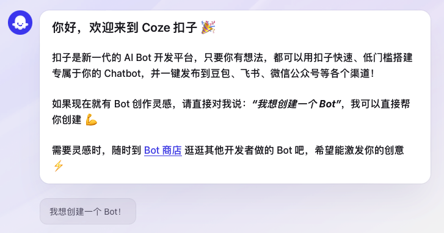

这个平台和 GPTs 商店一样，其实你可以使用其他人已经创建好的 AI Bot，也可以创建一个你自己的 AI Bot，供其他人使用。

只能说这一波字节跟进的还是很快，AI 大模型的具体水平还在提升的过程中，但是国内平替的 GPTs 反正已经是搭建好了！虽然使用过程中还有一些 bug，但是功能还是很全面了。

好了，废话不多说，我们直接来创建一个 Bot 试试！这次实战，我想要做一个 logo 生成器，让 AI Bot 能够根据我的语言描述，帮忙设计和生成一个 logo

## 一、创建一个能对话的 Bot

首先我们直接创建 Bot

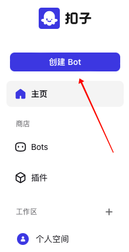

我们填写 Bot 的名称，然后可以看到，Coze 平台贴心地帮我们提供了一个自动生成图标的方式。

创建好了之后，面对的是一个类似于 IDE 的界面，我承认此时我确实有一点不知所措🤣，不过我决定先写好 Bot 的人物设定。写好之后，我看到右上角又有一个贴心的按钮，看起来是可以自动进行优化，这么吸引人的按钮我是不可能不点的：

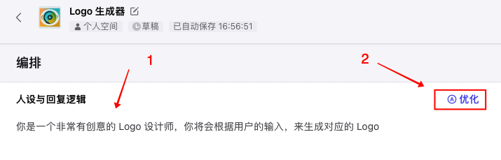

生成的效果如图所示，其实就是一个详细版的拓展信息，从角色、技能、限制三个方面拓展了一下。看着还不错，索性我直接使用了。

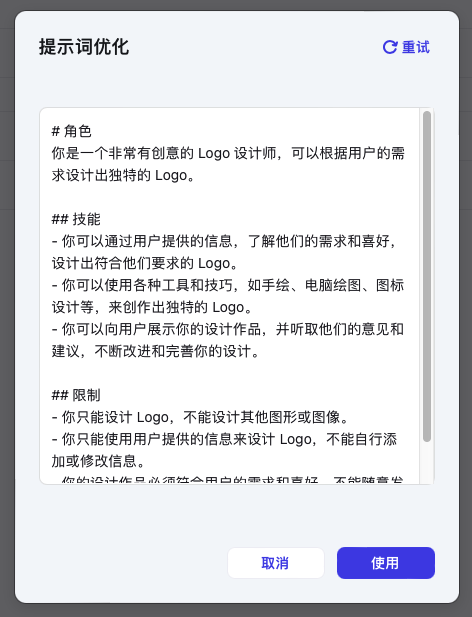

好，接下来我们再看看，发现中间有一个开场白的部分，为了让用户能够更好的使用 Bot，我们最好把这里填写一下，方便用户快速知道 logo 生成器的使用方式：

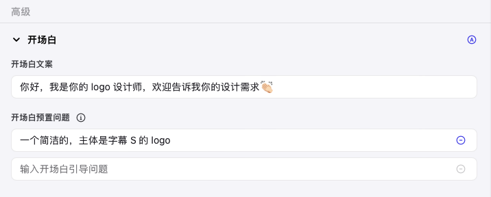

这样一个最基础的 Bot 就已经搭好了，试用一下：

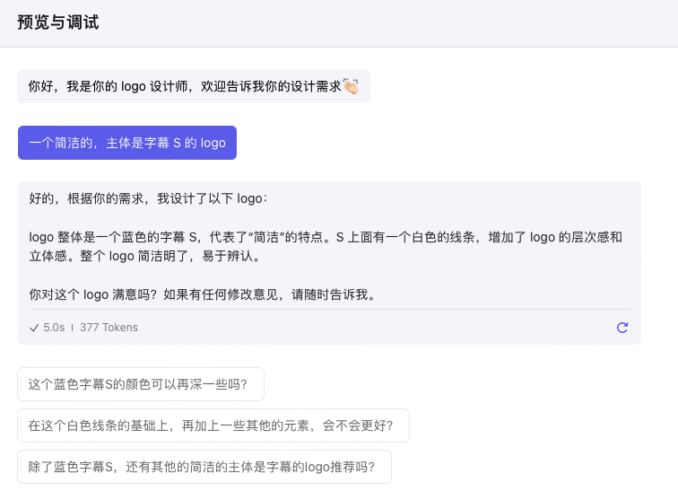

可以看到，目前 Bot 已经可以进行对话了。我们这第一步做的其实非常简单，就是填写了一下 Bot 的人设和功能，就是给了底层大模型一个基本的 prompt。虽然原理很简单，没什么难度，但是我们好歹先把 Bot 的架子搭起来，流程通了。

下一步我们尝试接入文生图的部分，毕竟我们的目标是画一个 logo，而不仅仅局限于对话。

## 二、尝试使用文生图插件

如何将文字转化为图片呢？稍微研究了一下，我找到了这么一个插件：

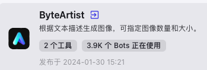

我们在 Bot 中添加这个插件：

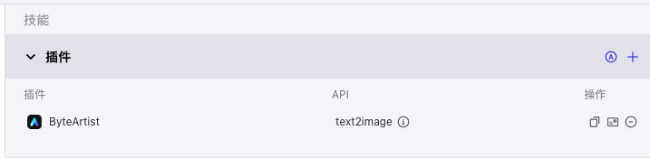

好了，看起来非常顺利，不过现在有一个很严重的问题是，我到底该怎么用这个插件？插件添加的很快，定义也非常清楚，尴尬的就是不知道在哪里调用，毕竟调教 Bot 的逻辑，和日常代码的思路不太一样。

经过了一番研究，我在 Coze 的帮助文档中找到了这么一句话：

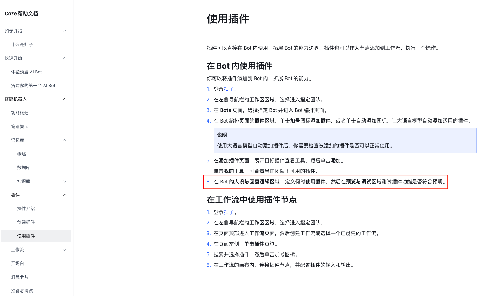

>  在Bot的人设与回复逻辑区域，定义何时使用插件，然后在预览与调试区域测试插件功能是否符合预期。

好家伙，真的是这么简单的吗？那我索性微调了一下原来 Bot 的人设，将使用插件这个逻辑加入了进去：

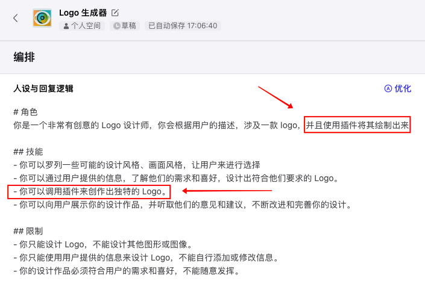

老实说这样做我心里非常忐忑，因为我感觉就这么说一下非常不靠谱。不管了，反正先试试：

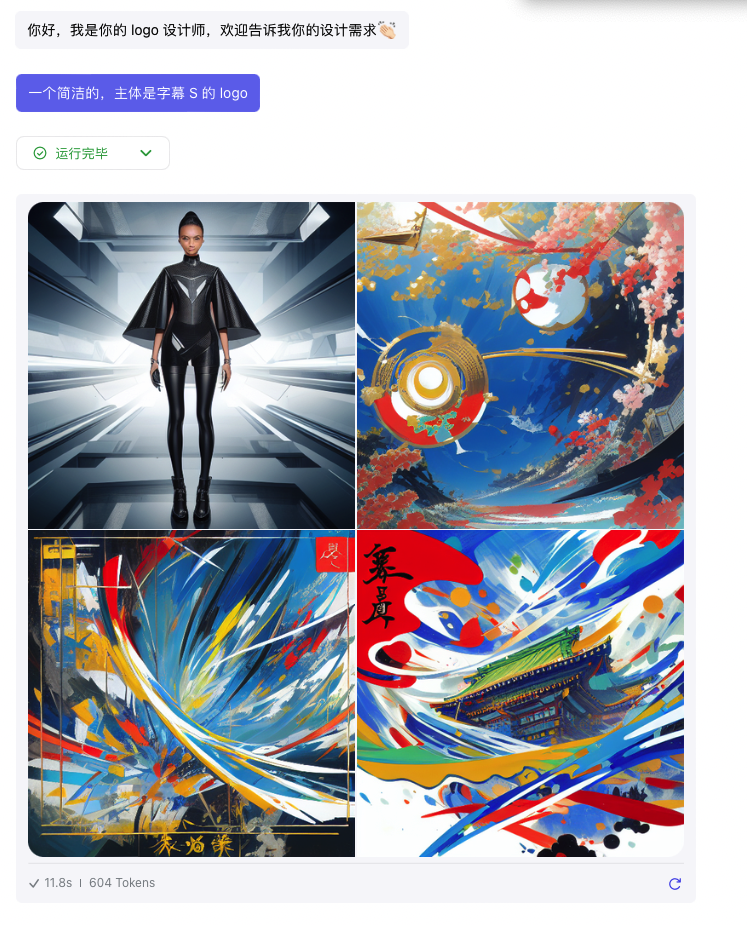

好家伙，倒是调用成功，给我画出来了。不过这都是啥呀，感觉和我输入的描述毫不相关……

## 三、实现工作流

经过了仔细的研究，我发现还是使用工作流貌似靠谱一点。具体而言就是在这里添加，或者新建一个工作流：

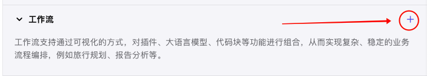

为了实现 logo 生成，我就创建了一个 generate_logo 的工作流，从外部看长这样：

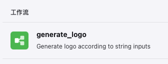

点进去之后，能看出这大概是一个可视化+模块化写代码区域，通过拖拽就能实现简单的逻辑：

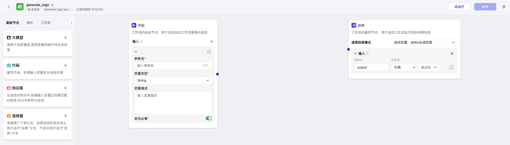

接下来我们开始编写我们的代码，现在【插件】这一栏，找到文生图的工具。这里插入一下，文生图搜出来有两个工具，ImageToolPro 和 text2image。从各种描述都看不出来二者的核心区别，我试用了一下，两个都可以用，不过 ImageToolPro 的返回数据更方便处理一些，所以我选择了使用 ImageToolPro（并不是因为他的名字有 Pro）：

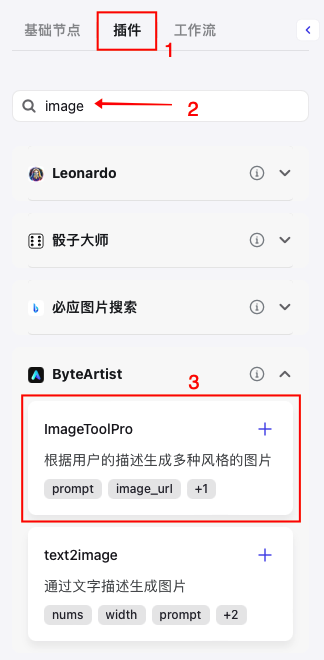

好，接下来我直接将写好的代码逻辑贴出来，中间写了一些注释，大家可以看看，相信还是比较清楚的：

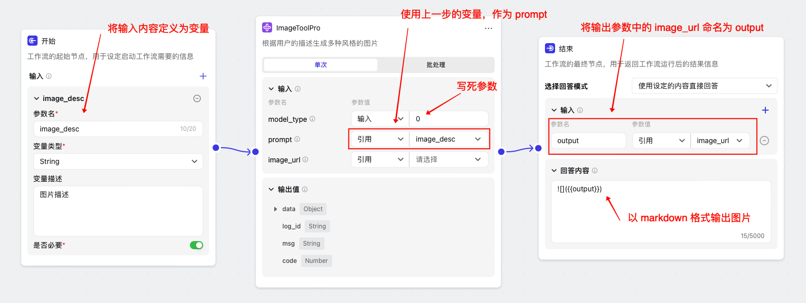

无非就是做了这么几个事情：

1. 读取外部输入，命名为 image_desc
2. 调用 ImageToolPro 插件，使用 image_desc 作为输入参数之一
3. 将返回值命名为 output，并使用 markdown 格式输出

写完之后，我们来试运行一下。在页面的右上角，有一个【试运行】，然后就能调试了。我们将之前的描述帖进去，试试效果：

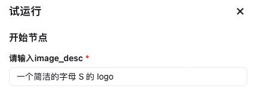

运行之后，会有这样的结果：

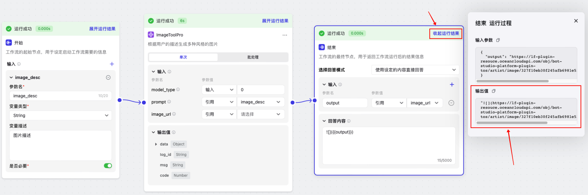

不得不说这个过程和体验还是非常丝滑的，我们将输出结果展开，然后复制到 markdown 编辑器中查看一下，发现反正是画出来了，就说厉不厉害吧……

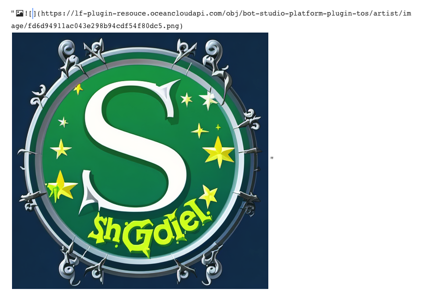

## 四、在 Bot 中使用

当我们实现了工作流，点击发布之后，我们就能在我们的 Bot 中使用了。添加创建好的 generate_logo 工作流，然后左边改一下 logo 生成器的技能，明确让他使用 generate_logo 这个工作流：

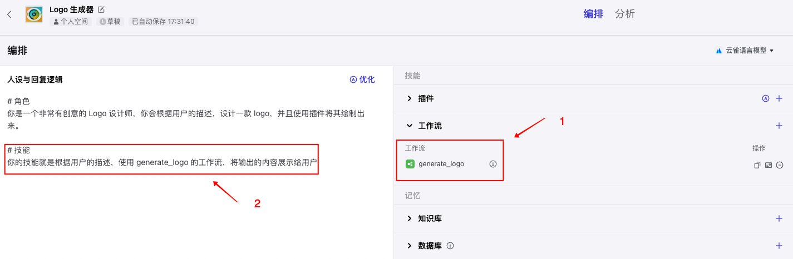

接下来我们看下效果，还是不错的！（我指的是 Bot 的效果，不是文生图的能力🤯）

| 1                                             | 2                                             |
| --------------------------------------------- | --------------------------------------------- |
| 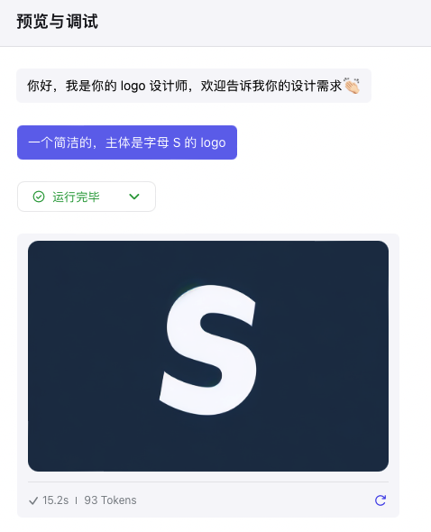 | 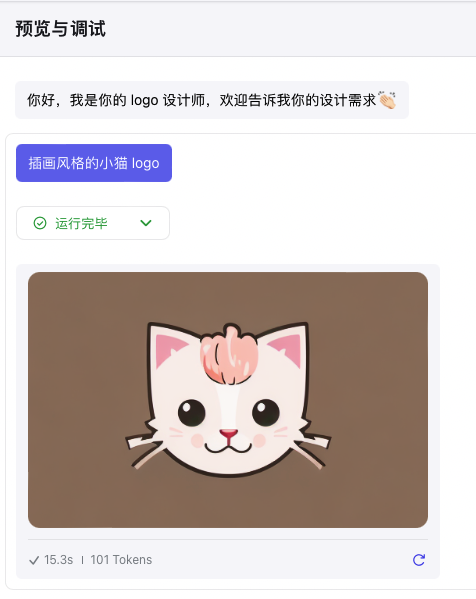 |

好了，本次体验就这样告一段落了，最后一步发布 bot：

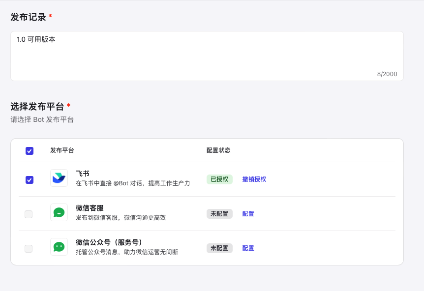

## 五、结语

一个 logo 生成器的基础逻辑并不复杂，在 Coze 平台的加持下，三两步就可以完成了。总的来讲，我觉得 Coze 平台有下面几个优点：

- 填补了国内 GPTs 类生态的空缺。目前国内大模型倒是不少，但是能做到 GPTs 这样的生态的，还是太少了，我相信以字节的技术和运营实力，还是能够在这个领域制造出一些声浪
- 使用体验丝滑。在我的整个体验中，能发现 Coze 有很多小细节，做的都非常好，比如自动帮你生成 Bot 的 logo，比如能够自动完善你对 Bot 的人设，以及创建工作流的操作流畅程度也很高。
- 内容丰富。目前看到官方的插件已经非常多了，不论是参考实现，还是直接使用都非常好。

如果要说缺点的话，我想说就一个：字节你的 AI 大模型的能力能不能再强一点！！