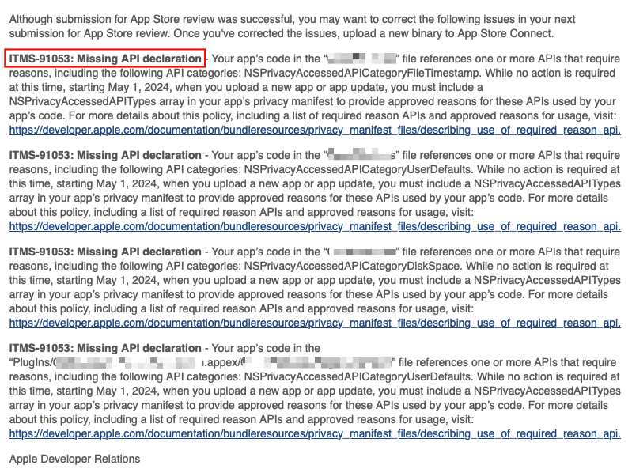
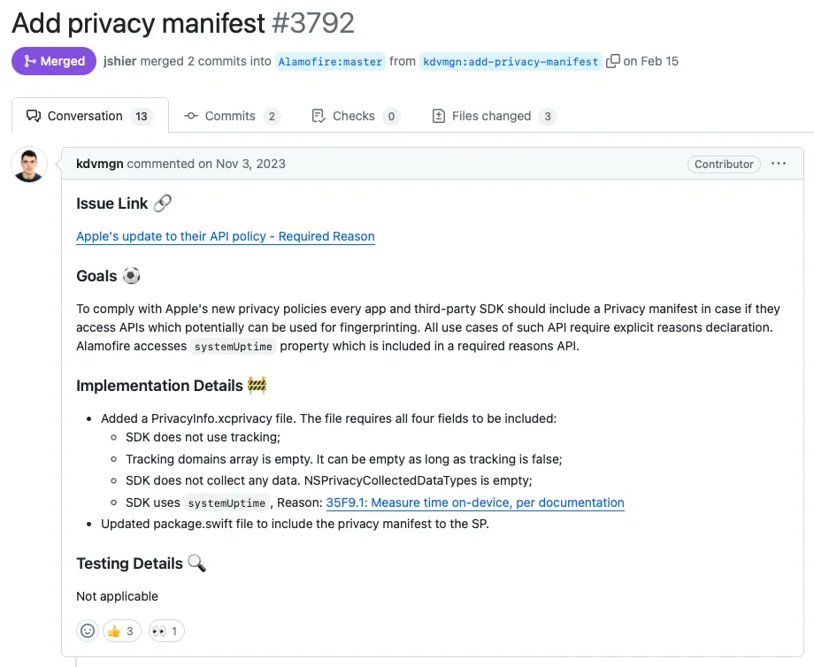
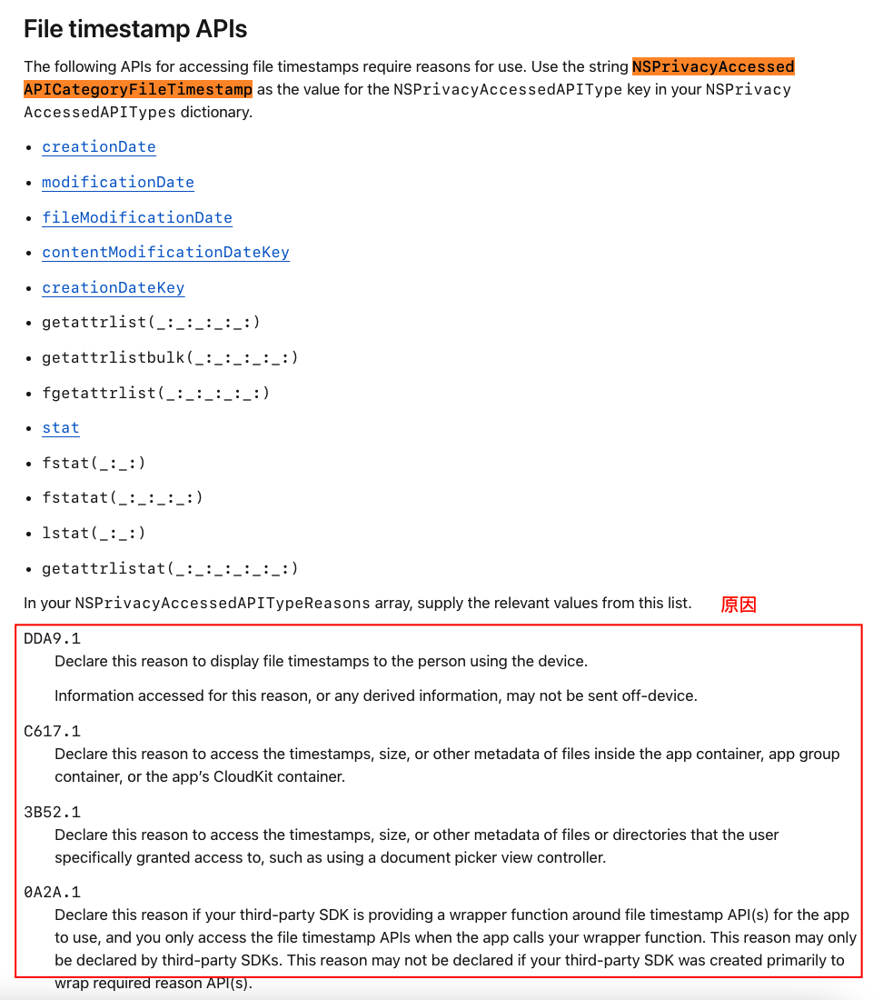
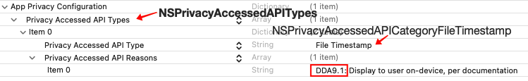

# AppStore 上架解决 ITMS-91053 问题

## 问题背景

最近上架新版本 iColors 的时候，收到了这样的邮件提醒：

虽然说本次提审并没有收到任何影响，但是截止期限就在 2024.5.1，时间其实也很紧迫了。

按照说明提示，本次违规的是 **ITMS-91053: Missing API declaration** 这个条款，具体来说就是 App 是用了一些 API，包括下面几个类别：

- NSPrivacyAccessedAPICategoryFileTimestamp
- NSPrivacyAccessedAPICategoryUserDefaults
- NSPrivacyAccessedAPICategoryDiskSpace
- NSPrivacyAccessedAPICategoryUserDefaults（这个和第二个重复了，实际上是 App Widget 使用的，也被算了一次）

而我们要做的就是必须在之后的 App 二进制包中提供这些 API 的使用原因，具体形式就是在 privacy manifest 这个文件中通过 NSPrivacyAccessedAPITypes 数组来一一列举。

以上都是 Apple 最新的隐私相关政策所规定需要完成的内容，很遗憾邮件中的链接地址点开是个空页面，所以我们只得来自行搜索

## 问题原因：新增的隐私政策

这实际上是 Apple 在 WWDC 2023 年新增的一个隐私政策条约，最新的声明在这里：[关于 App Store 提交的隐私更新](https://developer.apple.com/cn/news/?id=3d8a9yyh)

> 在 WWDC23 上，我们宣布了针对常用第三方 SDK 的新[隐私清单和签名](https://developer.apple.com/cn/support/third-party-SDK-requirements/)，并宣布开发者将需要在其 App 的隐私清单中声明[使用一组 API 的批准原因 (英文)](https://developer.apple.com/documentation/bundleresources/privacy_manifest_files/describing_use_of_required_reason_api)。这些变更有助于开发者更好地了解第三方 SDK 如何使用数据、保护软件依赖项并为用户提供额外的隐私保护。

简单来说就是 Apple 对 App 进行【**用户数据收集和使用**】的又一次监管升级，这次主要是针对第三方 SDK。

## 如何解决

### 1. 升级目前使用的第三方 SDK 到最新版本

目前绝大部分 SDK 都已经适配了最新的隐私政策（比如下图是 Alamofire 的升级 MR），我们只需要升级到最新版本就可以了

### 2. 创建 PrivacyInfo.xcprivacy 文件

当我们升级完 SDK 之后，就可以创建和填写 PrivacyInfo.xcprivacy 文件了。在 Xcode 中新建文件，选择 App Privacy 的模板，命名为 PrivacyInfo 就可以了

### 3. 理解权限类型、分析原因

接下来就是进行填写了，到这一步其实每个人都不一样。按照我之前邮件里的提示，我需要提供的是这几个权限的说明，我需要说明我的 App 使用他们的原因：

- NSPrivacyAccessedAPICategoryFileTimestamp
- NSPrivacyAccessedAPICategoryUserDefaults
- NSPrivacyAccessedAPICategoryDiskSpace

并且最终把他们放到 NSPrivacyAccessedAPITypes 数组之中。那么这几个 key 到底是什么意思呢？

首先是NSPrivacyAccessedAPITypes 这个大类，具体可以参考 [Privacy manifest files](https://developer.apple.com/documentation/bundleresources/privacy_manifest_files#4284009) 之中的说明，整个隐私要求一共有四个大类，分别是：

- **NSPrivacyTracking**：Bool 类型，APP 或第三方SDK是否根据 App Tracking Transparency 框架的定义使用 Tracking Data。

- **NSPrivacyTrackingDomains**：一个字符串列表，包含 App 或第三方SDK连接的用于追踪的互联网域名。若未获得用户授权，这些域名的网络请求将失败并报错。

- **NSPrivacyCollectedDataTypes**：一个字典数组，记录 App 或第三方SDK所收集的数据类型。

- **NSPrivacyAccessedAPITypes**：一个字典数组，描述 APP 或第三方SDK所访问的特定API类型，这些API需要提供访问理由。

那我的报错属于NSPrivacyAccessedAPITypes 这个类别，也就是要罗列使用这几个 API 的具体原因和理由，可以参考 Apple 的文档：

- [Describing data use in privacy manifests](https://developer.apple.com/documentation/bundleresources/privacy_manifest_files/describing_data_use_in_privacy_manifests)
- [Describing use of required reason API](https://developer.apple.com/documentation/bundleresources/privacy_manifest_files/describing_use_of_required_reason_api)

你需要根据具体的 key，找到对应的说明，然后选择对应的原因就行了。

### 4. 填写 PrivacyInfo.xcprivacy 文件

找到原因之后，我们就可以填写 PrivacyInfo.xcprivacy 了。这里我以自己的 NSPrivacyAccessedAPICategoryFileTimestamp 这一个权限为例。

首先我们在 Apple 文档中找到对应的说明：

根据文档描述，这就是是用了文档日期相关的 API，我们在原因列表中选取对应的理由就行了。比如我的 App 中只是使用了文件的时间戳，并没有用到 size 或者其他的 metadata，那么我就可以只填写 DDA9.1 就行了。

注意，格式如下：

接下来我们只要按照格式，把所有对应的都填写完就可以了！！
