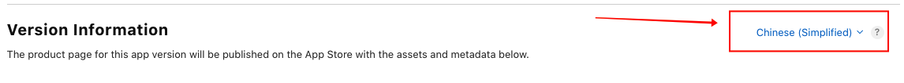
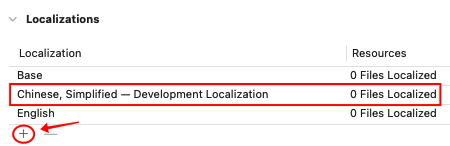
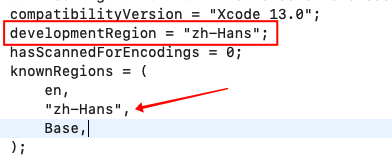
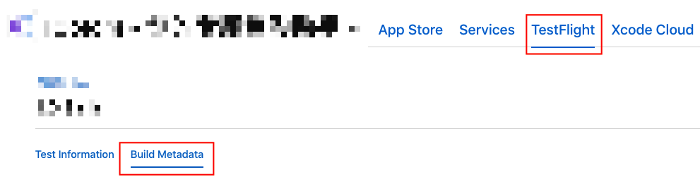
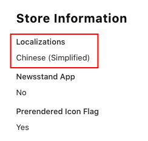

# 解决 App Store 默认语言设置的问题

## 问题背景

一个很奇怪的问题，在没有支持多语言的时候，明明在 App Store Connect 上选择了 Primary Language 为 Chinese，为什么在 App Store 页面上还是显示主要语言为英文？

## 问题解决

实际上在做 App 多语言适配之前，除了 App Store Connect 上需要选择对应的 Primary Language 以外，代码配置上也仍然需要做一些配置，将中文设置为默认语言。

首先在本地化 Locallization 处增加新语言，位于 **Project -- Info -- Localizations**：

> 注意下图是增加成功之后的结果，这一步只需要增加新语言就行了，不需要关注 Development Localization 是具体哪个语言

第二步是找到 project.pbxproj 文件（右键点击 .xcodeproj 项目文件，然后 show package contents，参考：[stack overflow - Vladimir's Answer](https://stackoverflow.com/a/3054073)），并修改其中的 **developmentRegion** 字段。

如果上一步中成功增加了新的语言，那么在 **knownRegions** 处就能找到对应的。

## 问题验证

上面这么修改一番之后，其实已经成功了，那么接下来正常发版就可以生效了。不过在发版之前，最好可以提前检查一次：

在 App Store Connect -- TestFlight 中找到对应修改过后的包，然后找到 Build Metadata：

然后找到 Localizations，如果这里的语言更新成功，那么就代表没问题了！

