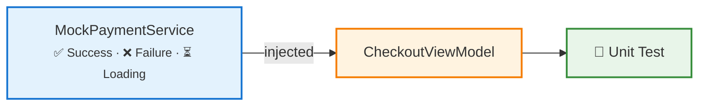
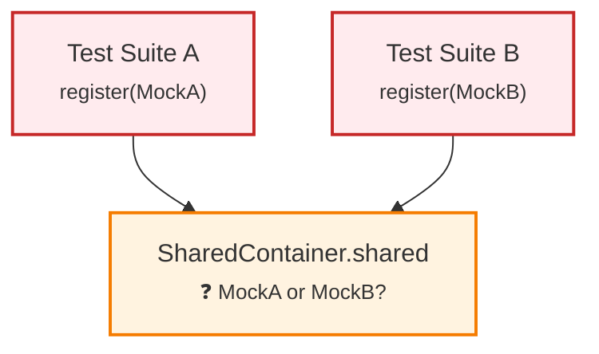
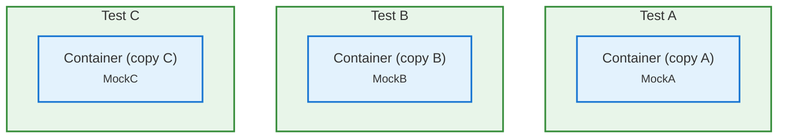

# Solving DI Race Conditions in Swift Testing

## 🎬 The Flickering Test

You write a unit test for your checkout flow. It passes locally. Every time. You push to CI and it fails.

You re-run the pipeline. It passes. Next PR, it fails again, on a *different* test this time.

Sound familiar? Your team starts hitting "re-run" on autopilot, CI trust erodes, and real bugs slip through the cracks. We spent weeks chasing this. The culprit turned out to be something we didn't suspect at first: our tests were **sharing mutable state** through the dependency injection container. Run them in parallel, and they step on each other.

This post covers what we found, why it happens, and the pattern we use now to prevent it.

## 🔁 A Quick Recap: Why Dependency Injection Matters

If you're doing MVVM on iOS, you already know DI. I'll keep this brief.

### The Untestable ViewModel

```swift
final class CheckoutViewModel {
    private let paymentService = PaymentService()  // Hardcoded dependency

    func placeOrder() async throws {
        try await paymentService.charge(amount: 99.99)
    }
}
```

This ViewModel *owns* its dependency. Want to swap `PaymentService` with a mock in a test? You can't.

### The Testable ViewModel

```swift
final class CheckoutViewModel {
    private let paymentService: PaymentServiceProtocol

    init(paymentService: PaymentServiceProtocol) {
        self.paymentService = paymentService
    }

    func placeOrder() async throws {
        try await paymentService.charge(amount: 99.99)
    }
}
```

Now we can inject a mock in tests and a real service in production:

```swift
// Production
let vm = CheckoutViewModel(paymentService: StripePaymentService())

// Test
let vm = CheckoutViewModel(paymentService: MockPaymentService())
```

In production, the ViewModel talks to real services. In tests, mocks take their place:

**Production:**


**Testing:**



Simple enough. Works great for small projects. Then your app grows.

## 💥 The MVVM Dependency Problem

### Initializer Injection Doesn't Scale

Real ViewModels don't have one dependency. They accumulate them:

```swift
init(
    paymentService: PaymentServiceProtocol,
    orderRepository: OrderRepositoryProtocol,
    analyticsTracker: AnalyticsTrackerProtocol,
    authService: AuthServiceProtocol,
    featureFlagService: FeatureFlagServiceProtocol
) { ... }
```

And if a parent ViewModel creates child ViewModels, the parent needs to know *all* of its children's dependencies. Add one dependency three levels deep, and you're editing files all the way up.

### SwiftUI's @Environment Doesn't Help

SwiftUI has a built-in DI mechanism, `@Environment`:

```swift
struct CheckoutView: View {
    @Environment(\.paymentService) var paymentService  // Works!
}
```

Nice. Except `@Environment` only works inside `View` bodies. Your ViewModel? Out of luck:

```swift
class CheckoutViewModel {
    @Environment(\.paymentService) var paymentService  // Compiler error
}
```

So we need something that works like `@Environment` but outside the view layer.

## 🏭 Factory: DI That Works with MVVM

[Factory](https://github.com/hmlongco/Factory) is a lightweight DI framework that does exactly this. ViewModels *pull* dependencies from a container using `@Injected`:

```swift
final class CheckoutViewModel {
    @Injected(\.paymentService) private var paymentService
    @Injected(\.orderRepository) private var orderRepository

    func placeOrder() async throws {
        let order = try await orderRepository.createOrder()
        try await paymentService.charge(amount: order.total)
    }
}
```

No init parameters. No dependency chains. The container knows how to create each service, `@Injected` resolves them at runtime, and your ViewModel doesn't care where they come from.

Factory sits in the middle and decides what to provide based on the context:

**Production:**


**Testing:**


The ViewModel just asks for what it needs. Factory figures out the rest.

### Containers: The Dependency Registry

A **Container** is where you define how each dependency is created:

```swift
extension Container {
    var paymentService: Factory<PaymentServiceProtocol> {
        self { StripePaymentService() }
    }

    var orderRepository: Factory<OrderRepositoryProtocol> {
        self { OrderRepository() }
    }
}
```

In production, `@Injected(\.paymentService)` resolves to `StripePaymentService()`. In tests, you can override it:

```swift
Container.shared.paymentService.register { MockPaymentService() }
```

### SharedContainer: Organizing Dependencies by Module

One global `Container` works for small apps. In a modular codebase with dozens of services, it becomes a junk drawer. Factory provides `SharedContainer` to split things up by module:

```
PaymentSharedContainer
├── paymentService
└── paymentGateway

OrderSharedContainer
├── orderRepository
└── orderValidator

AuthSharedContainer
├── authService
└── tokenStorage
```

Each module owns its container. Clear boundaries, clear ownership:

```swift
public final class PaymentSharedContainer: SharedContainer {
    public static var shared = PaymentSharedContainer()
    public let manager = ContainerManager()

    public var paymentService: Factory<PaymentServiceProtocol> {
        self { StripePaymentService() }
    }

    public var paymentGateway: Factory<PaymentGatewayProtocol> {
        self { PaymentGateway() }
    }
}
```

Usage in a ViewModel:

```swift
final class CheckoutViewModel {
    @Injected(\PaymentSharedContainer.paymentService)
    private var paymentService
}
```

This all works well. Until you start running tests in parallel.

## 🐛 The Core Problem: Parallel Tests and Shared Mutable State

OK. Now we get to the actual problem.

### A Typical Test Setup

```swift
@Suite
struct CheckoutViewModelTests {
    let mockPayment: PaymentServiceProtocolSpy
    let sut: CheckoutViewModel

    init() {
        mockPayment = PaymentServiceProtocolSpy()
        PaymentSharedContainer.shared.paymentService.register { mockPayment }
        sut = CheckoutViewModel()
    }

    @Test func placeOrder_chargesCorrectAmount() async throws {
        try await sut.placeOrder()
        #expect(mockPayment.chargeCallCount == 1)
    }
}
```

Looks correct. And it works, when this test suite runs alone.

### What Happens in Parallel

Swift Testing runs tests concurrently by default. This is great for CI speed, but it means multiple test suites execute simultaneously, all sharing the same `PaymentSharedContainer.shared` instance:



**Suite A** registers `MockA`. **Suite B** registers `MockB` on the *same* container. When Suite A resolves its dependency, it might get `MockB`. Or vice versa. Depends on thread scheduling. Which is non-deterministic. Which means your tests are now a coin flip.

### It Gets Worse: Intra-Suite Races

Even tests *within the same suite* can race. Swift Testing doesn't guarantee serial execution of `@Test` methods:

```swift
@Suite
struct OrderViewModelTests {
    let mockRepo: OrderRepositoryProtocolSpy
    let sut: OrderViewModel

    init() {
        mockRepo = OrderRepositoryProtocolSpy()
        OrderSharedContainer.shared.orderRepository.register { mockRepo }
        sut = OrderViewModel()
    }

    @Test func fetchOrders_success() async {
        mockRepo.fetchOrdersResult = [Order.sample]
        await sut.fetchOrders()
        #expect(sut.orders.count == 1)
    }

    @Test func fetchOrders_empty() async {
        mockRepo.fetchOrdersResult = []
        await sut.fetchOrders()
        #expect(sut.orders.isEmpty)
    }
}
```

Both tests configure the *same* `mockRepo` instance. Run them concurrently and one test's configuration bleeds into the other. The test expecting an empty list sees one item. Or doesn't. Depends on the day.

### The Symptoms

If any of this sounds familiar:

- Tests pass locally but fail on CI (different machine, different timing)
- Re-running a failed pipeline makes it pass
- Adding or removing unrelated tests causes failures elsewhere
- Tests that worked for months suddenly become unreliable

The root cause is the same: **shared mutable state in the DI container**.

## 🔐 The Solution: Container Isolation with @TaskLocal

The fix: give each test its own **isolated copy** of the container. No sharing, no races.

### Understanding @TaskLocal

Before we get to the fix, a quick detour. `@TaskLocal` is a Swift Concurrency primitive that gives each `Task` its own copy of a value. Other tasks can't see it:

```swift
enum Scope {
    @TaskLocal static var currentUser: String = "default"
}

// Task A sees "Alice"
Task {
    Scope.$currentUser.withValue("Alice") {
        print(Scope.currentUser)  // "Alice"
    }
}

// Task B sees "Bob", completely independent
Task {
    Scope.$currentUser.withValue("Bob") {
        print(Scope.currentUser)  // "Bob"
    }
}
```

Each task has its own `currentUser`. No locks, no races, no shared state.

### Applying @TaskLocal to Containers

You can probably see where this is going. Make the container's `shared` property `@TaskLocal`, and each test task gets its own container:

```swift
public final class PaymentSharedContainer: SharedContainer {
    @TaskLocal public static var shared = PaymentSharedContainer()
    // ^^^^^^^^^ This is the magic line

    public let manager = ContainerManager()

    public var paymentService: Factory<PaymentServiceProtocol> {
        self { StripePaymentService() }
    }
}
```

That's it. One annotation. When a test runs inside a `Task` that binds a fresh container to `$shared`, every `@Injected` resolution sees the test-specific container, not the global one.

### Factory's Built-in Support: Container Traits

You *could* do the `$shared.withValue(...)` binding manually, but that's tedious. Factory (via `FactoryTesting`) provides **Container Traits** that handle this for you. They plug right into Swift Testing's `@Suite` and `@Test` attributes.

#### Defining a Container Trait

For each SharedContainer, you define a trait in your test support module:

```swift
import Testing
import FactoryTesting

// Helper: configure sensible test defaults
private func configurePaymentDefaults(_ container: PaymentSharedContainer) {
    container.paymentService.register { PaymentServiceProtocolSpy() }
    container.paymentGateway.register { PaymentGatewayProtocolSpy() }
}

// Suite-level trait: isolates the entire suite
extension SuiteTrait where Self == ContainerTrait<PaymentSharedContainer> {
    static var paymentContainer: ContainerTrait<PaymentSharedContainer> {
        let container = PaymentSharedContainer()
        configurePaymentDefaults(container)
        return .init(shared: PaymentSharedContainer.$shared, container: container)
    }
}

// Test-level trait: allows per-test overrides
extension TestTrait where Self == ContainerTrait<PaymentSharedContainer> {
    static func paymentContainer(
        _ configure: @escaping (PaymentSharedContainer) -> Void
    ) -> ContainerTrait<PaymentSharedContainer> {
        let container = PaymentSharedContainer()
        configurePaymentDefaults(container)
        configure(container)  // Apply test-specific overrides
        return .init(shared: PaymentSharedContainer.$shared, container: container)
    }
}
```

#### Using Traits in Tests

**Suite-level isolation.** Every test in the suite gets its own container:

```swift
@Suite(.paymentContainer, .orderContainer)
struct CheckoutViewModelTests {
    let mockPayment: PaymentServiceProtocolSpy
    let sut: CheckoutViewModel

    init() {
        // Register test-specific mocks on the ISOLATED container
        let spy = PaymentServiceProtocolSpy()
        PaymentSharedContainer.shared.paymentService.register { spy }
        mockPayment = spy
        sut = CheckoutViewModel()
    }

    @Test func placeOrder_chargesOnce() async throws {
        try await sut.placeOrder()
        #expect(mockPayment.chargeCallCount == 1)
    }

    @Test func placeOrder_passesCorrectAmount() async throws {
        try await sut.placeOrder()
        #expect(mockPayment.lastChargedAmount == 99.99)
    }
}
```

Both tests can run in parallel safely. Each gets its own `PaymentSharedContainer` instance.

**Test-level overrides.** You can customize specific values for individual tests:

```swift
@Suite(.paymentContainer)
struct DiscountTests {
    @Test(
        "Applies 20% discount for premium users",
        .paymentContainer { $0.discountRate.register { 0.20 } }
    )
    func premiumDiscount() async {
        let vm = CheckoutViewModel()
        let price = vm.calculateFinalPrice(for: 100.0)
        #expect(price == 80.0)
    }

    @Test("No discount for regular users")
    func noDiscount() async {
        let vm = CheckoutViewModel()
        let price = vm.calculateFinalPrice(for: 100.0)
        #expect(price == 100.0)  // Uses suite default (no discount)
    }
}
```

### How It All Fits Together

With container traits, each test gets its own isolated container. No cross-talk:



No shared state. No races. No flakes.

## 📋 Putting It All Together: A Checklist

The pattern we follow for every module:

**1. Mark SharedContainer with `@TaskLocal`:**

```swift
public final class OrderSharedContainer: SharedContainer {
    @TaskLocal public static var shared = OrderSharedContainer()
    public let manager = ContainerManager()
    // ... dependencies
}
```

**2. Create a trait helper in your test support module:**

```swift
// OrderMocks/ContainerTraits.swift
private func configureOrderDefaults(_ container: OrderSharedContainer) {
    container.orderRepository.register { OrderRepositoryProtocolSpy() }
    container.orderValidator.register { OrderValidatorProtocolSpy() }
}

extension SuiteTrait where Self == ContainerTrait<OrderSharedContainer> {
    static var orderContainer: ContainerTrait<OrderSharedContainer> {
        let container = OrderSharedContainer()
        configureOrderDefaults(container)
        return .init(shared: OrderSharedContainer.$shared, container: container)
    }
}
```

**3. Apply traits in your test suites:**

```swift
@Suite(.orderContainer, .paymentContainer)
struct OrderFlowTests {
    // Each test gets isolated containers, safe for parallel execution
}
```

## ✅ The Result

We rolled this out across our test suites. The flaky tests stopped. Not "got better." Stopped.

Tests that had been randomly failing for months became stable. When something fails now, it's a real bug, not a scheduling artifact. And writing new tests got simpler because the trait pattern gives you a clear, repeatable setup.

The lesson we took away: **DI containers are shared mutable state**. We just didn't think of them that way. Once you do, `@TaskLocal` is the obvious fix.

## 🧭 Key Takeaways

1. **DI is for testability.** If you can't swap dependencies, you can't write reliable unit tests.
2. **Factory solves the MVVM + DI gap** that SwiftUI's `@Environment` leaves open.
3. **Parallel tests + shared containers = race conditions.** This is the most common cause of flaky tests in DI-heavy codebases.
4. **`@TaskLocal` container isolation eliminates the problem** by giving each test its own container instance.
5. **Container Traits make it practical.** Define once per module, apply declaratively in every test suite.

If your project has mysterious flaky tests, look at your DI container. Seriously. It might be one `@TaskLocal` away from stable.
