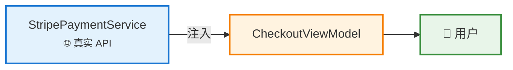
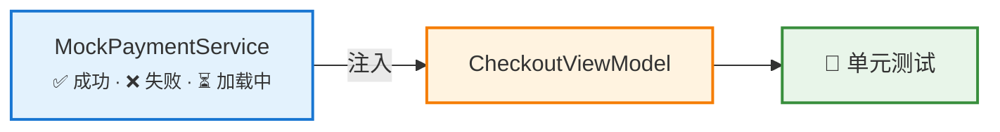
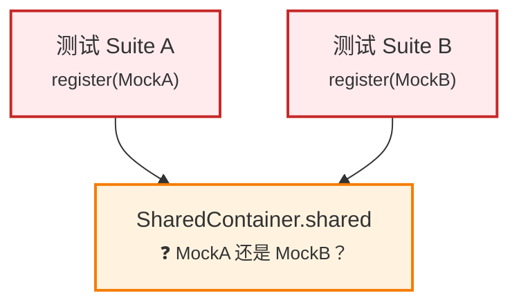
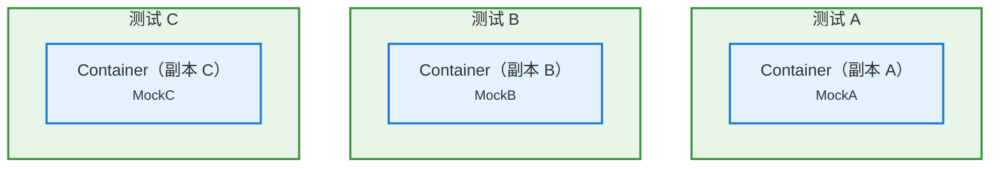

# 解决 Swift Testing 中 DI 容器的竞态条件

## 🎬 背景：单元测试不稳定

当项目逐渐扩大，Unit Test 越来越多的时候，必然会出现问题：某些单元测试有时能通过，有时又不行。最麻烦的是有些时候本地运行能通过，在 CI Pipeline 中又通过不了。

通常来讲本地设备和 CI 设备确实很不一样，一个常见的问题就是存在静态条件（Race Condition）的问题，本篇就尝试从根本上解决这类似的问题，并且从原理层面也讲清楚来龙去脉。

## 🔁 快速回顾：为什么 DI 很重要

如果是在 SwiftUI 上使用 MVVM 的架构，那 DI （Dependency Injection 依赖注入）对你来说肯定不陌生。这里简单回顾一下，为什么要用 DI

### 不可测试的 ViewModel

```swift
final class CheckoutViewModel {
    private let paymentService = PaymentService()  // 硬编码的依赖

    func placeOrder() async throws {
        try await paymentService.charge(amount: 99.99)
    }
}
```

这个 ViewModel 直接持有了它的依赖。想在测试中把 `PaymentService` 换成 mock？根本换不了。

### 可测试的 ViewModel

```swift
final class CheckoutViewModel {
    private let paymentService: PaymentServiceProtocol

    init(paymentService: PaymentServiceProtocol) {
        self.paymentService = paymentService
    }
    func placeOrder() async throws {
        try await paymentService.charge(amount: 99.99)
    }
}
```

现在我们可以在测试中注入 mock，在生产环境中使用真实服务了：

```swift
// 生产环境
let vm = CheckoutViewModel(paymentService: StripePaymentService())
// 测试
let vm = CheckoutViewModel(paymentService: MockPaymentService())
```

生产环境中，ViewModel 连接真实服务。测试中，由 mock 替代：

**生产环境：**



**测试环境：**



道理很简单，小项目用着也没问题。但随着 app 不断膨胀，事情就开始变味了。

## 💥 MVVM 的依赖问题

### 构造器注入复杂度爆炸

现实中的 ViewModel 不可能只有一个依赖，随着业务迭代它们只会越来越多：

```swift
init(
    paymentService: PaymentServiceProtocol,
    orderRepository: OrderRepositoryProtocol,
    analyticsTracker: AnalyticsTrackerProtocol,
    authService: AuthServiceProtocol,
    featureFlagService: FeatureFlagServiceProtocol
) { ... }
```

而且如果父级 ViewModel 需要创建子级 ViewModel，那父级就必须知道子级的全部依赖。往下嵌套三层之后再新增一个依赖，你就得一路往上改文件……

### SwiftUI 的 @Environment 帮不上忙

SwiftUI 有一个内置的 DI 机制，`@Environment`：

```swift
struct CheckoutView: View {
    @Environment(\.paymentService) var paymentService  // 可以！
}
```

看起来挺好。但问题是 `@Environment` 只能在 `View` 的 body 里用，不适用于 ViewModel：

```swift
class CheckoutViewModel {
    @Environment(\.paymentService) var paymentService  // 编译报错
}
```

所以我们需要一个像 `@Environment` 一样好用，但能在 View 层之外工作的方案。

## 🏭 Factory：适配 MVVM 的 DI 框架

[Factory](https://github.com/hmlongco/Factory) 是一个轻量级的 DI 框架，刚好解决了这个问题。ViewModel 通过 `@Injected` 主动从容器中拉取依赖：

```swift
final class CheckoutViewModel {
    @Injected(\.paymentService) private var paymentService
    @Injected(\.orderRepository) private var orderRepository

    func placeOrder() async throws {
        let order = try await orderRepository.createOrder()
        try await paymentService.charge(amount: order.total)
    }
}
```

不用传 init 参数，也不用维护依赖链。容器负责创建每个服务，`@Injected` 在运行时自动解析，ViewModel 压根不需要关心依赖从哪来。

Factory 就像个中间人，根据当前环境决定注入什么：

**生产环境：**


**测试环境：**


ViewModel 只管说"我要什么"，Factory 负责"给你什么"。

### Container：依赖注册中心

**Container** 是你定义每个依赖创建方式的地方：

```swift
extension Container {
    var paymentService: Factory<PaymentServiceProtocol> {
        self { StripePaymentService() }
    }
    var orderRepository: Factory<OrderRepositoryProtocol> {
        self { OrderRepository() }
    }
}
```

在生产环境中，`@Injected(\.paymentService)` 解析为 `StripePaymentService()`。在测试中，你可以覆盖它：

```swift
Container.shared.paymentService.register { MockPaymentService() }
```

### SharedContainer：按模块组织依赖

一个全局 `Container` 小项目够用。但在拥有几十个服务的模块化工程里，它很快就变成了大杂烩。Factory 提供了 `SharedContainer`，让你按模块拆分管理，就像是文件夹一样：

```
PaymentSharedContainer
├── paymentService
└── paymentGateway

OrderSharedContainer
├── orderRepository
└── orderValidator

AuthSharedContainer
├── authService
└── tokenStorage
```

每个模块管好自己的容器，边界清晰，各司其职：

```swift
public final class PaymentSharedContainer: SharedContainer {
    public static var shared = PaymentSharedContainer()
    public let manager = ContainerManager()

    public var paymentService: Factory<PaymentServiceProtocol> {
        self { StripePaymentService() }
    }
    public var paymentGateway: Factory<PaymentGatewayProtocol> {
        self { PaymentGateway() }
    }
}
```

在 ViewModel 中使用：

```swift
final class CheckoutViewModel {
    @Injected(\PaymentSharedContainer.paymentService)
    private var paymentService
}
```

到这里一切都很美好，直到你开始并行跑测试（尤其是 Swift Testing 默认就是并行模式）。

## 🐛 核心问题：并行测试与共享可变状态

好，现在终于说到重点了。

### 一个典型的测试配置

```swift
@Suite
struct CheckoutViewModelTests {
    let mockPayment: PaymentServiceProtocolSpy
    let sut: CheckoutViewModel

    init() {
        mockPayment = PaymentServiceProtocolSpy()
        PaymentSharedContainer.shared.paymentService.register { mockPayment }
        sut = CheckoutViewModel()
    }

    @Test func placeOrder_chargesCorrectAmount() async throws {
        try await sut.placeOrder()
        #expect(mockPayment.chargeCallCount == 1)
    }
}
```

看着没毛病，单独跑这个测试 Suite 的时候确实也没问题。

### 并行执行时发生了什么

Swift Testing 默认并发执行测试。这对 CI 速度来说是好事，但这意味着多个测试 Suite 同时执行，且**共享同一个** `PaymentSharedContainer.shared` 实例：



**Suite A** 注册了 `MockA`，**Suite B** 在同一个容器上注册了 `MockB`。当 Suite A 解析依赖时，它可能拿到的是 `MockB`，反过来也一样。最终结果完全取决于线程调度顺序，而线程调度本身就是不确定的。换句话说，你的测试结果现在全凭运气。

### 更糟糕的是：Suite 内部的竞态

即使是同一个 Suite 内部的测试，也可能产生竞态。Swift Testing 并不保证 `@Test` 方法按顺序执行：

```swift
@Suite
struct OrderViewModelTests {
    let mockRepo: OrderRepositoryProtocolSpy
    let sut: OrderViewModel

    init() {
        mockRepo = OrderRepositoryProtocolSpy()
        OrderSharedContainer.shared.orderRepository.register { mockRepo }
        sut = OrderViewModel()
    }

    @Test func fetchOrders_success() async {
        mockRepo.fetchOrdersResult = [Order.sample]
        await sut.fetchOrders()
        #expect(sut.orders.count == 1)
    }

    @Test func fetchOrders_empty() async {
        mockRepo.fetchOrdersResult = []
        await sut.fetchOrders()
        #expect(sut.orders.isEmpty)
    }
}
```

两个测试配置的是同一个 `mockRepo` 实例。并发运行时，一个测试的配置会影响到另一个，本来期望拿到空列表的测试，结果却看到了一条数据，显然这样会影响最终的测试结果。

### 最终症状

- 测试本地通过但 CI 上失败（不同机器，不同时序）
- 重跑失败的流水线就能通过
- 添加或删除不相关的测试导致其他地方失败
- 稳定运行很长时间的测试突然变得不可靠

根本原因都是一样的：**DI 容器中的共享可变状态，导致 Race Condition**

## 🔐 解决方案：使用 @TaskLocal 实现容器隔离

思路很简单：给每个测试分配自己的**独立容器副本**。不共享，自然就不会有竞态。

### 理解 @TaskLocal

在讲方案之前，先简单科普一下 `@TaskLocal`。这是 Swift Concurrency 提供的一个属性，它能让每个 `Task` 持有自己的 copy，互相之间完全隔离：

```swift
enum Scope {
    @TaskLocal static var currentUser: String = "default"
}

// Task A 看到 "Alice"
Task {
    Scope.$currentUser.withValue("Alice") {
        print(Scope.currentUser)  // "Alice"
    }
}

// Task B 看到 "Bob"，完全独立
Task {
    Scope.$currentUser.withValue("Bob") {
        print(Scope.currentUser)  // "Bob"
    }
}
```

每个 Task 有自己的 `currentUser`。无需加锁，没有竞态，没有共享状态。

### 将 @TaskLocal 应用到容器

聪明的你大概已经猜到了，把容器的 `shared` 属性标记为 `@TaskLocal`，每个测试任务就能拿到自己的容器了：

```swift
public final class PaymentSharedContainer: SharedContainer {
    @TaskLocal public static var shared = PaymentSharedContainer()
    // ^^^^^^^^^ 就是这行代码

    public let manager = ContainerManager()

    public var paymentService: Factory<PaymentServiceProtocol> {
        self { StripePaymentService() }
    }
}
```

就这么一行代码的事。当测试运行在一个绑定了新容器到 `$shared` 的 `Task` 里时，所有 `@Injected` 解析拿到的都是当前测试专属的容器，而不是全局那个。

### Factory 的内置支持：Container Traits

当然，你也可以手动调用 `$shared.withValue(...)`，但写起来实在太啰嗦了。Factory（通过 `FactoryTesting`）提供了 **Container Traits** 来帮你搞定这些样板代码，可以直接嵌入 Swift Testing 的 `@Suite` 和 `@Test` 属性。

#### 定义 Container Trait

为每个 SharedContainer 在测试支持模块中定义一个 trait：

```swift
import Testing
import FactoryTesting

// 辅助方法：配置测试默认值
private func configurePaymentDefaults(_ container: PaymentSharedContainer) {
    container.paymentService.register { PaymentServiceProtocolSpy() }
    container.paymentGateway.register { PaymentGatewayProtocolSpy() }
}

// Suite 级别的 trait：隔离整个 Suite
extension SuiteTrait where Self == ContainerTrait<PaymentSharedContainer> {
    static var paymentContainer: ContainerTrait<PaymentSharedContainer> {
        let container = PaymentSharedContainer()
        configurePaymentDefaults(container)
        return .init(shared: PaymentSharedContainer.$shared, container: container)
    }
}

// Test 级别的 trait：允许单个测试覆盖配置
extension TestTrait where Self == ContainerTrait<PaymentSharedContainer> {
    static func paymentContainer(
        _ configure: @escaping (PaymentSharedContainer) -> Void
    ) -> ContainerTrait<PaymentSharedContainer> {
        let container = PaymentSharedContainer()
        configurePaymentDefaults(container)
        configure(container)  // 应用测试专属的配置
        return .init(shared: PaymentSharedContainer.$shared, container: container)
    }
}
```

#### 在测试中使用 Traits

**Suite 级别的隔离。** Suite 中的每个测试都获得自己的容器：

```swift
@Suite(.paymentContainer, .orderContainer)
struct CheckoutViewModelTests {
    let mockPayment: PaymentServiceProtocolSpy
    let sut: CheckoutViewModel

    init() {
        // 在隔离的容器上注册测试专属的 mock
        let spy = PaymentServiceProtocolSpy()
        PaymentSharedContainer.shared.paymentService.register { spy }
        mockPayment = spy
        sut = CheckoutViewModel()
    }

    @Test func placeOrder_chargesOnce() async throws {
        try await sut.placeOrder()
        #expect(mockPayment.chargeCallCount == 1)
    }

    @Test func placeOrder_passesCorrectAmount() async throws {
        try await sut.placeOrder()
        #expect(mockPayment.lastChargedAmount == 99.99)
    }
}
```

这样两个测试就可以放心地并行跑了，各自都有独立的 `PaymentSharedContainer` 实例，互不干扰。

**Test 级别的覆盖。** 还可以针对某个测试单独定制配置：

```swift
@Suite(.paymentContainer)
struct DiscountTests {
    @Test(
        "高级用户享受 20% 折扣",
        .paymentContainer { $0.discountRate.register { 0.20 } }
    )
    func premiumDiscount() async {
        let vm = CheckoutViewModel()
        let price = vm.calculateFinalPrice(for: 100.0)
        #expect(price == 80.0)
    }

    @Test("普通用户没有折扣")
    func noDiscount() async {
        let vm = CheckoutViewModel()
        let price = vm.calculateFinalPrice(for: 100.0)
        #expect(price == 100.0)  // 使用 Suite 默认值（无折扣）
    }
}
```

### 整体运作方式

用上 Container Traits 之后，每个测试都拥有自己的独立容器，彼此之间完全隔离：



不再有共享状态，不再有竞态，单元测试从此稳定！

## 📋 完整实践清单

我们在每个模块中遵循的模式：

**1. 为 SharedContainer 标记 `@TaskLocal`：**

```swift
public final class OrderSharedContainer: SharedContainer {
    @TaskLocal public static var shared = OrderSharedContainer()
    public let manager = ContainerManager()
    // ... 依赖定义
}
```

**2. 在测试支持模块中创建 trait 辅助方法：**

```swift
// OrderMocks/ContainerTraits.swift
private func configureOrderDefaults(_ container: OrderSharedContainer) {
    container.orderRepository.register { OrderRepositoryProtocolSpy() }
    container.orderValidator.register { OrderValidatorProtocolSpy() }
}

extension SuiteTrait where Self == ContainerTrait<OrderSharedContainer> {
    static var orderContainer: ContainerTrait<OrderSharedContainer> {
        let container = OrderSharedContainer()
        configureOrderDefaults(container)
        return .init(shared: OrderSharedContainer.$shared, container: container)
    }
}
```

**3. 在测试Suite中应用 traits：**

```swift
@Suite(.orderContainer, .paymentContainer)
struct OrderFlowTests {
    // 每个测试都获得隔离的容器，可安全并行执行
}
```

## 🧭 核心要点

1. **DI 的本质是为了可测试性**
2. **Factory 填补了 MVVM + DI 的空白**，解决了 SwiftUI `@Environment` 无法覆盖的场景
3. **并行测试 + 共享容器（Shared Container） = 竞态条件（Race Condition）** 
4. **`@TaskLocal` 容器隔离从根本上解决了问题**，为每个测试提供独立的容器实例
5. **Container Traits 让方案切实可行**， 每个模块定义一次，在每个测试Suite中声明式地应用
