# 从零到一开发贪吃蛇游戏

本项目是用于 Swift 初学者的一个教学练习项目，我们最终的目的是基于 Swift 做出下面这样的一个贪吃蛇小游戏。

完整 Demo 地址：[RickeyBoy/SnakeGame](https://github.com/RickeyBoy/SnakeGame)

我的笔记文章合集地址：[RickeyBoy/Rickey-iOS-Notes](https://github.com/RickeyBoy/Rickey-iOS-Notes)

如果大家感兴趣，欢迎点个收藏~


## 目标

基于 Swift 一个贪吃蛇游戏！通过截图和 Gif 可以略窥一二。

| Screenshot                                                   | Video                                  |
| ------------------------------------------------------------ | -------------------------------------- |
| 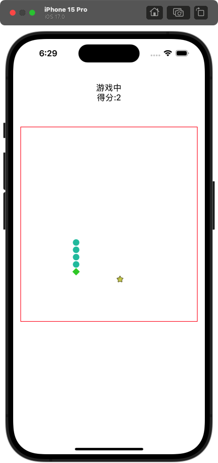 | 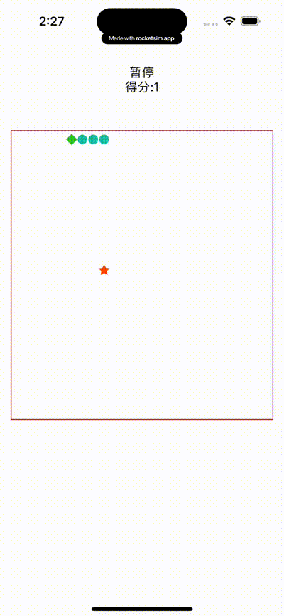 |


## 提前声明

### 你可以学到的

我会假设你已经是一个有一些基础的 iOS 开发者，不是完全从零开始的一个小白，所以这一个教学项目并不会完全专注于最基础的编程知识。

首先我认为最重要的是：开发软件所需要的思路。我希望通过这个相对完整的项目，能够让 Swift 初学者完整体验开发一个软件所需要的思路，从问题拆解到实现过程，从而在此后具备独立完成完整项目的能力。

其次当然就是，iOS 软件开发的一些基础知识，和 Swift 语言基础知识，这是整个项目的基石。当然这个项目里也会有一些相对深度一些的内容，比如 Swift 语言的一些高阶语法和妙用，以及架构上的一些精巧设计。


## 前期构思

在开始实际编码之前，我们需要对项目进行前期构思，这包括理解游戏规则、明确需求，并将其拆解为可实现的任务。构思是项目的基石，直接影响到后续开发的效率和项目的可维护性。

### 1. 游戏规则

贪吃蛇游戏的核心玩法非常简单，但对功能设计有一些要求。我们需要在项目开发之前对需求有清晰的定义：

- **蛇的移动**：玩家通过滑动手势控制蛇的方向，包括上、下、左、右四个方向。蛇的移动具有一定的速度，不断向前方行进。
- **食物生成**：随机生成食物的坐标。当蛇吃到食物时，得分增加，蛇的长度加一，食物消失并重新生成。
- **游戏结束**：当蛇撞到墙壁或自身时，游戏结束，显示最终得分并提供重新开始的选项。

### 2. 功能拆解

为方便实现和管理，我们将游戏的各个功能模块化。主要功能模块包括：

**UI 部分：**

1. 顶部当前游戏状态展示
2. 中间红色方框内的游戏区域
   1. 地图（隐形方格）
   2. 贪吃蛇本身
   3. 食物

**逻辑部分：**

1. 贪吃蛇在棋盘内能够自由移动
2. 吃到食物后的表现：产生新的食物、蛇边长等
3. 游戏结束的判定：撞墙、撞到自己等

**操作部分：**

1. 通过滑动手势操作蛇的转向
2. 单机手势暂停、恢复

### 3. 最终的项目架构的样子

这里我先插入一下最终项目完成之后的样子，可以看到如果我们能提前进行规划，那么在整个项目开发完成后，我们能将代码按功能划分为几个清晰的模块文件夹，以便维护和扩展。

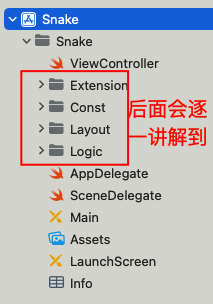

- ViewController：核心控制类，负责用户界面逻辑和交互处理

- Layout：UI 相关文件的存放位置，包括界面布局和设计资源

- Logic：包含应用程序的逻辑控制类文件，处理游戏规则和逻辑

- Const：预定义的状态和常量，用于统一管理应用程序状态

- Extension：提供代码拓展功能，简化代码结构和提高可重用性


## 第一步：引入第三方库

### 引入第三方库的三种方法

引入好用的第三方库是必须要学会的技能。通常我们会有几种引入方式，分别是 CocoaPods、Carthage 和 Swift Package Manager

1. **CocoaPods**：
   - CocoaPods 是一个流行的依赖管理工具，专为 Swift 和 Objective-C 项目设计。
   - 它使用一个名为 `Podfile` 的文件来定义项目依赖，并通过 `pod install` 命令安装依赖。
   - CocoaPods 拥有一个庞大的开源库社区，易于搜索和集成第三方库。
2. **Carthage**：
   - Carthage 允许开发者在不使用 Xcode 项目的方式下引入框架。
   - 它通过 `Cartfile` 来管理依赖，使用 `carthage update` 命令来获取和构建依赖。
   - Carthage 不修改 Xcode 项目文件，因此与 CocoaPods 相比，它提供了更多的灵活性，但集成到项目中的流程可能更复杂。
3. **Swift Package Manager (SPM)**：
   - SPM 是 Swift 的原生包管理器，集成在 Xcode 中，无需额外安装。
   - 它使用 `Package.swift` 文件来定义和管理依赖，支持 Swift 项目的依赖和模块化。
   - SPM 支持跨平台的 Swift 项目，是苹果官方推荐的依赖管理方式。

总而言之，大型公司和项目都会使用 CocoaPods 进行三方库的管理，而小型项目可以使用 SPM，SPM 和 CocoaPods 也可以结合使用，互相不冲突。


### SnapKit 的介绍和引入

本次我们要引入的是 [SnapKit](https://github.com/SnapKit/SnapKit)，通过 SnapKit 来学习第三方库的使用。SnapKit 是一个 Swift 语言的自动布局框架，他有不少优点：

1. 简洁的语法：简化 Auto Layout 的代码编写 —— 如果你用过最基础的基于 frame 布局进行的开发，就知道 SnapKit 会有多好用了
2. 强类型：减少运行时错误，提升代码质量
3. 链式调用：提高代码的可读性和易用性
4. 兼容性：支持 iOS、tvOS、macOS 和 watchOS

上述三种引入方式他都是支持的。为了方便我们直接使用 Swift Package Manager 进行引入。具体步骤如下：

1. 打开 Xcode 项目。
2. 选择项目文件，点击 "File" -> "Swift Packages" -> "Add Package Dependency"
3. 输入 SnapKit 的 Git 仓库地址：`https://github.com/SnapKit/SnapKit.git`
4. 选择所需的版本，然后点击 "Next"
5. 确认依赖信息，点击 "Add Package"

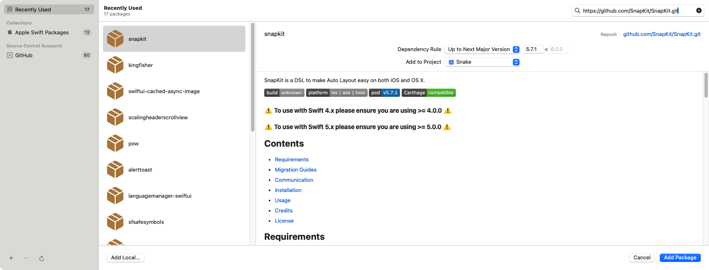


## 第二步：写 UI 相关的代码

### 步骤 1：UI 代码框架搭建

接下来我们先写 UI 相关的代码，也就是 Layout 文件夹中的部分

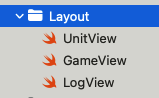

最终会需要新建这么三个文件：

- GameView：游戏区域
- UnitView：游戏区域中每个单位小格子
- LogView：上方的信息展示区域

用最终的截图来展示的话就能很一目了然了：

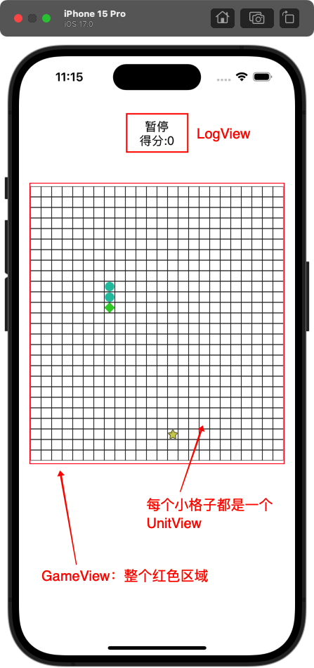

### 步骤 2：详细讲解 UnitView

对于每一个小方格而言，核心会有两个属性。

首先会必须要有一个坐标的概念，代表他所处的具体的位置。

其次，一个小格子一共有四种展示情况，这四种情况分别展示不同的图片样式：

1. 蛇头：展示绿色菱形
2. 蛇身：展示绿色圆形
3. 食物：展示星星
4. 空白格子：不展示任何图片

这里我们根据需要，可以判断样式需要使用 enum

```swift
/// UnitView 类型
enum UnitViewType {
    case snakeHead /// 蛇头
    case snakeBody /// 蛇身
    case food /// 食物
    case normal /// 空白格子
}
```

而坐标需要使用使用 struct 来定义：

```swift
/// 坐标
struct Pos {
    var x: Int
    var y: Int
}
```

所以 UnitView 的情况是（简化版）：

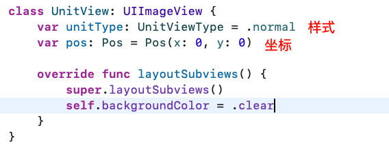

### 知识点：Swift 中的结构体和枚举

这里穿插讲一个刚才涉及到的知识点。我们可以注意到刚才的代码中，UnitView 类型使用的是enum 枚举类型，而坐标 Pos 使用的是 struct 结构体。那这两个类型有什么异同呢？

在 Swift 中，除了我们最熟悉的 Class 之外，struct 和 enum 这两种类型也经常被使用：

- **struct (结构体)**：用于定义自定义数据类型，可以包含多个属性和方法。
- **enum (枚举)**：用于定义一个有固定数量的常量集合，可以有原始值，也可以关联值。枚举可以定义方法。

| 特性   | struct         | enum                                         |
| ------ | -------------- | -------------------------------------------- |
| 类型   | 自定义数据类型 | 固定数量的常量集合                           |
| 存储   | 值类型         | 值类型（默认）或引用类型（如果定义为 class） |
| 属性   | 可以有多个属性 | 通常没有属性，但可以扩展                     |
| 方法   | 可以定义方法   | 可以定义方法                                 |
| 原始值 | 不适用         | 可以有，用于存储额外信息                     |
| 关联值 | 不适用         | 可以有，每个枚举案例可以关联不同的数据类型   |
| 继承   | 不能被继承     | 不能被继承                                   |
| 构造器 | 可以有构造器   | 可以有构造器                                 |

Swift 中的 `enum` 可以非常强大，可以拥有方法、原始值和关联值，使它们在某些情况下可以替代 `struct`。然而，`struct` 由于是引用类型，通常用于定义更复杂的数据结构。

那么刚才的代码里为什么要这样使用呢？

`UnitViewType` 使用 `enum` 是因为它语义上表达了一组固定的离散状态（如蛇头、蛇身等），明确、直观。`Pos` 使用 `struct` 是因为坐标是一个简单的数据结构，语义上表示一组绑定的值（x, y），便于封装和操作。

所以简单总结，我们可以得到这样的概括：

**`enum` 的应用场景**：用来定义有限的选项集（状态、类型、选项等），语义明确且类型安全。

**`struct` 的应用场景**：适合表示简单的数据结构（属性集合），支持值语义且更轻量。


### 知识点：直接给 enum 增加方法来简化代码

在 Swift 语言中，`enum`（枚举）是一种非常强大的数据类型，它不仅可以定义一组相关的值，还可以为这些值添加方法，从而实现代码的模块化和简化。

这里我们以 UnitViewType 为例来，体会一下给 enum 增加方法的好处。`UnitViewType`枚举被用于定义游戏中不同单元格的类型，我们可以增加方法（添加一个`generateImage`方法）根据类型获取对应展示的图片：

- 蛇头（`snakeHead`）展示绿色菱形
- 蛇身（`snakeBody`）展示浅蓝色圆形
- 食物（`food`）随机展示一张食物图片
- 空白格子（`normal`）什么都不展示

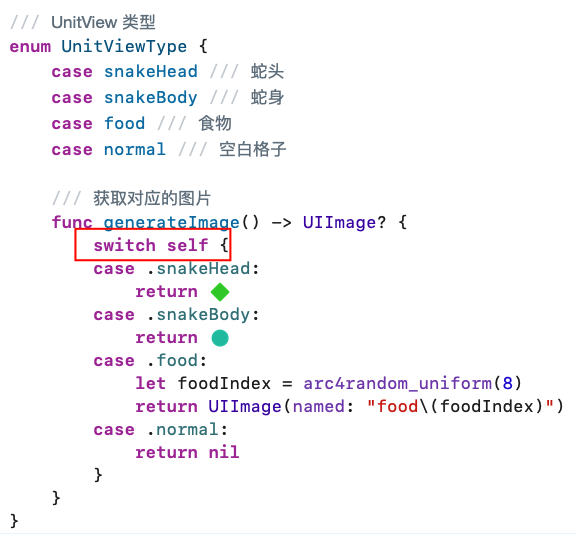

这种方法的好处是，它将图片生成的逻辑封装在了`UnitViewType`枚举内部，这样在使用的时候就能直接调用了，不用再关心具体的逻辑，减少了代码量，也使得代码更加清晰和易于维护：

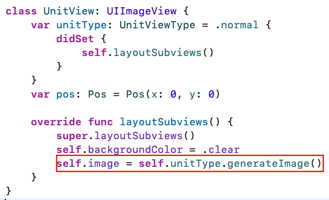

当然，Swift 中的 enum 是一个非常强大的类型，强烈推荐大家学习后多应用，这里列举几个：

- 定义关联值 (Associated Values)：为每个 `case` 携带不同类型的数据。：为每个 `case` 指定统一类型的默认值。
- 实现协议 (Protocol Conformance)：让 `enum` 遵循协议如 `Codable` 或 `Equatable`。
- 扩展功能 (Extensions)：添加方法或计算属性扩展功能。
- 使用泛型 (Generics)：可以通过泛型提升 enum 的通用性


### 知识点：通过 \#imageLiteral 在代码中引用图片

在 Swift 中，图片可以直接展示在代码中，这样非常的简洁清晰：

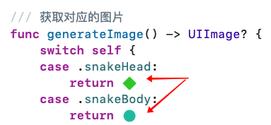

那么要如何触发呢，我们如何实现这样的效果呢？其实注释掉这段代码就发现秘密了，需要使用 \#imageLiteral 关键字：

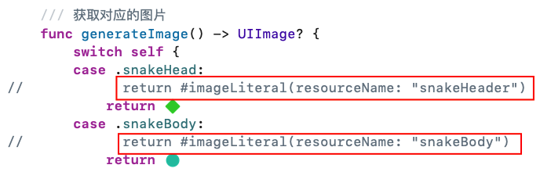

我非常推荐在小型项目中使用 `#imageLiteral`，从而在代码中直接引用图片资源，这是一种非常便捷且直观的方法。这不仅提高了代码的可读性，也能避免在项目中查找和引用资源文件的麻烦，以及出现错误的情况。


### 步骤 3：完善 GameView

具体的过程，可以下载项目之后看具体的注释。可以稍微看一下下图的构造，可以看到第一个标记点，整个棋盘中的元素都是基于刚才写的 UnitView 基本单元格。

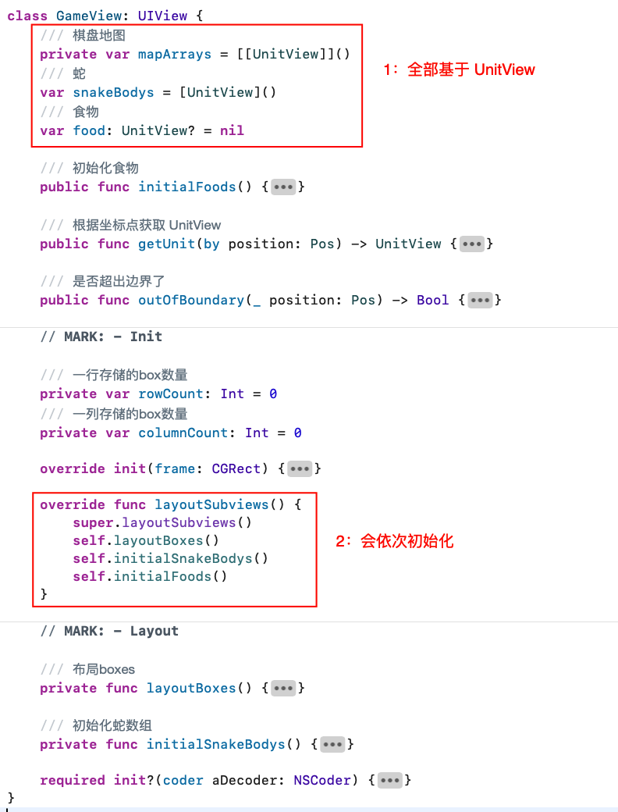

简单讲解一下代码，GameView 作为游戏的核心视图类，它的主要职责就是管理整个游戏棋盘的布局。

GameView 的初始化主要分为三个步骤:

1. 布局棋盘 (layoutBoxes)
   1. 计算行列数量
   2. 计算边距确保居中显示
   3. 创建并布局每个 UnitView 单元格
   4. 将所有单元格存储在 mapArrays 中

2. 初始化蛇 (initialSnakeBodys)
   1. 在固定位置(7,5)创建蛇头
   2. 添加两个蛇身体节点(6,5)和(5,5)
   3. 设置对应的 unitType

3. 初始化食物 (initialFoods)
   1. 随机生成食物的位置坐标
   2. 将对应位置的 UnitView 标记为食物


### 知识点：Swift 中的权限管理

在 Swift 中，一共有这样几种访问权限：

| 访问级别      | 定义     | 访问范围       |
| ------------- | -------- | -------------- |
| `public`      | 公开     | 跨模块访问     |
| `internal`    | 内部     | 模块内访问     |
| `private`     | 私有     | 源文件内访问   |
| `fileprivate` | 文件私有 | 定义文件内访问 |

可以注意到，在上面的文件中，部分地方我使用了 public，部分地方我用了 private，这是因为内部的方法我不希望给其他 Class 调用。

那么我们为什么要进行权限控制呢？权限控制的主要目的是为了封装和安全性：

- **封装**：隐藏实现细节，只暴露必要的接口，使得代码更易于维护和理解。
- **安全性**：限制对敏感数据和功能的访问，防止意外或恶意的修改。
- **模块化**：促进代码的模块化，每个模块只关注其内部的职责，降低模块间的耦合。


### 知识点：注释的技巧

可以看到我在代码中使用了`// MARK: -` 标记，这是一种非常好用的注释方式：

1. **组织代码**：通过添加 `// MARK: -` 来标记代码的不同部分，使得代码结构更加清晰，便于阅读和维护。
2. **导航辅助**：许多代码编辑器和 IDE 会使用这些标记来提供更好的导航功能，允许开发者快速跳转到特定的代码段。
3. **文档生成**：在生成文档时，`// MARK: -` 可以帮助文档工具组织和分类内容。

比如这里的导航辅助，我们点击文件上方导航栏：

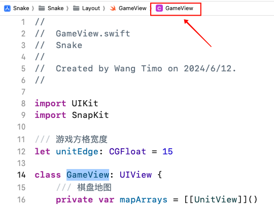

就可以看到使用 `// MARK: -` 标记的部分：

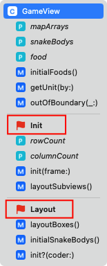

类似的方法还有：

- **`// TODO:`** 标记遗留的 todo
- **`// FIXME:`** 标记需要修复的错误

效果如下图：

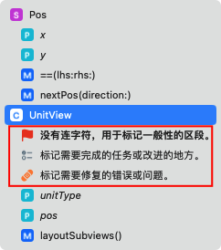


### 步骤 4：在 ViewController 中放置这一系列 UI

这一步的流程还是很简单的，看途中注解就可以比较方便的理解这个流程。

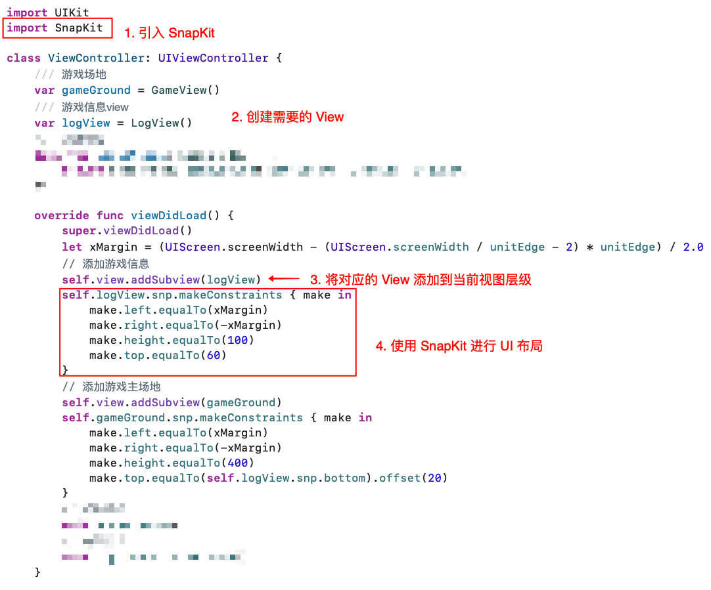

接下来我们详细说一下每一个步骤，对该文件详细解析，帮助理解其结构和功能：

**引入必要的库**

首先，我们需要引入UIKit和SnapKit库。SnapKit 我们之前说了，是一个用于简化Auto Layout的第三方库，使得布局代码更加简洁和易读

```swift
import SnapKit
```

**初始化视图组件**

在ViewController类中，我们定义了几个重要的视图组件：

- gameGround：这是游戏的主要视图，负责显示游戏的棋盘。这也是我们之前讲过实现的部分

- logView：用于显示游戏信息的视图，例如分数和状态。

**视图的添加与布局**

然后在viewDidLoad方法中，我们开始添加和布局这些视图。viewDidLoad是UIViewController的生命周期方法之一，在视图加载完成后调用，适合进行视图的初始化和布局。

我们将logView和gameGround添加到主视图中，并使用SnapKit进行布局。这里以 logView 为例：我们为logView设置了左右边距和高度，并指定了顶部距离为60。

```swift
self.view.addSubview(logView)
self.logView.snp.makeConstraints { make in
  make.left.equalTo(xMargin)
  make.right.equalTo(-xMargin)
  make.height.equalTo(100)
  make.top.equalTo(60)
}
```

在 ViewController 中放置UI的步骤非常直接且简单，同时Swift的代码风格相比Objective-C更为简洁，使得这一过程更加清晰易懂。


### 知识点：ViewController 的生命周期

注意这里我们重写了 ViewController 的 viewDidLoad 方法，这是 ViewController 众多生命周期中最经常被使用的一个。

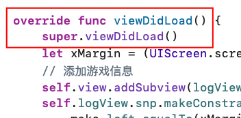

生命周期是指从它被创建到被销毁的整个过程，其中包含了一系列的时机。理解ViewController的生命周期对于管理内存、更新UI和处理用户交互至关重要。正确地在这些方法中执行相应的操作可以提高应用的性能和用户体验。最常见的比如：

1. **init**：这是ViewController的初始化方法，用于创建ViewController的实例。在这个过程中，我们可以设置一些初始状态或者进行一些准备工作。
2. **loadView**：这个方法在init之后被调用，用于加载ViewController的视图。默认情况下，它会创建一个空白的UIView，但我们可以重写这个方法来提供一个自定义的视图。
3. **viewDidLoad**：当视图控制器的视图被加载后，viewDidLoad会被调用。这是进行UI设置和初始化代码的理想位置，比如添加子视图、设置约束、注册通知等。
4. **viewWillAppear**：在视图即将出现在屏幕上时调用。这是一个设置状态和更新UI以反映即将展示的视图的好时机，比如恢复之前的滚动位置或者更新数据。
5. **viewDidAppear**：当视图已经出现在屏幕上时调用。此时，可以执行依赖于视图尺寸的操作，或者进行动画效果的设置。
6. **viewWillDisappear**：在视图即将从屏幕上消失时调用。这里可以做一些清理工作，比如停止计时器、取消网络请求等。
7. **viewDidDisappear**：当视图已经从屏幕上消失后调用。这是进行更多清理工作的地方，比如释放资源或者保存用户设置。
8. **dealloc**：当ViewController被销毁时调用。这是一个释放资源和取消所有剩余活动的最后机会，比如移除观察者、断开数据库连接等。


## 第三步：写 Logic 相关的代码

逻辑代码是游戏的核心部分，负责处理游戏的规则和玩家的交互。接下来我们拆分讲讲每一步需要如何去完成。


### 步骤 1：使用 Timer 驱动蛇的移动

游戏的逻辑部分首先需要实现蛇的移动。为了让贪吃蛇移动起来，通常通过一个定时器（Timer）来实现，每隔一定时间（例如0.3秒）更新蛇的位置。

Timer 可以在指定的时间间隔后重复或单次执行代码块，使用 Timer 可以模拟时间相关的功能，如倒计时、游戏循环等。

在贪吃蛇的这种场景下，我们会创建一个定时器，设置间隔时间（0.3s）和需要重复（repeats==true），并指定每次定时器触发时调用的方法：timerAction。其中 timerAction 内包含蛇的移动逻辑。

使用方法如下：

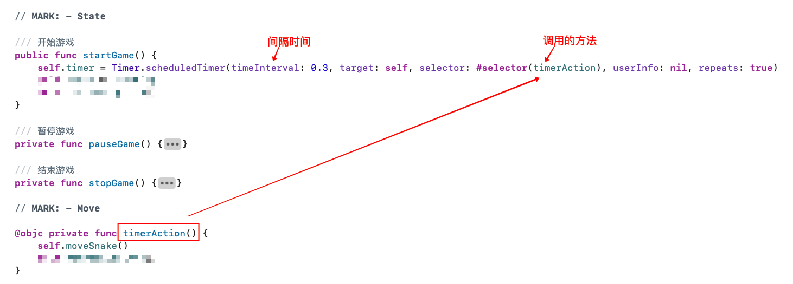

### 知识点：为什么要使用 @objc

注意，为什么这里的方法需要额外加一个 @objc 的标记？

因为 @objc 属性用于桥接 Swift 和 Objective-C 之间的方法调用，被标记了之后的 Swift 类、属性、方法或其他成员，就可以在 Objective-C 代码中使用。

而 `Timer` 类实际上源自 Objective-C 运行时，因为 `Timer` 是 `NSObject` 的子类。所以为了能够将 Swift 的方法作为目标方法传递给 Objective-C 的 `Timer`，就必须加上 @objc关键字


### 步骤 2：判断游戏结束的条件

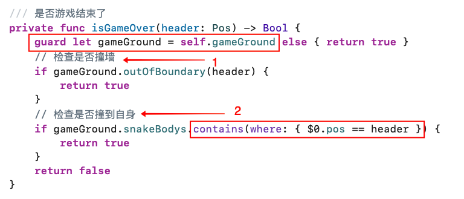

具体的逻辑很简单，但是涉及一个核心知识点：

### 知识点：Swift 中的 optional（可选类型）

`optional`（可选类型）是一个特殊的类型，用来表示某个位置可能包含一个值，或者根本没有值。在声明时，会加上问号来标记可选类型。比如下图，就代表这个 gameGround 可能是一个 GameView 的，也可能是一个 nil（空值）

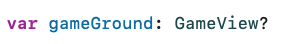

因此，我们在使用的时候，可以使用感叹号来强制解析，不过一般我们推荐使用可选绑定（`if let` 或 `guard let`）来安全地解包，比如上图里使用的 guard let 方法。


### 步骤 3：核心逻辑函数 moveSnake

比较复杂，可以看源代码仔细研究

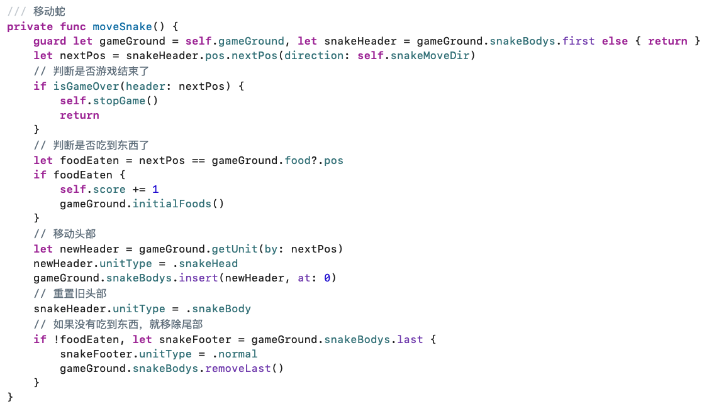


## 其他知识点：

懒加载

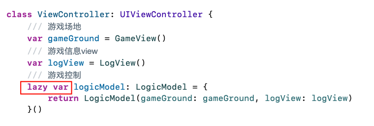

通过 extension 来简化代码

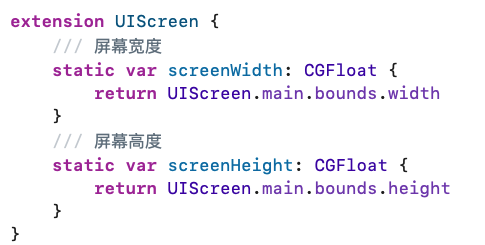

实现 Equatable 来支持使用双等号判断

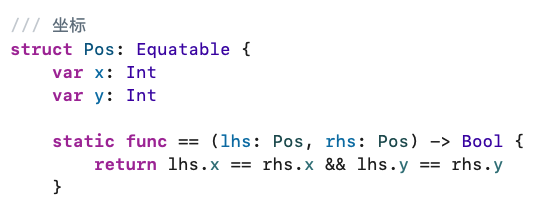

Swift 变量的 didSet 用法

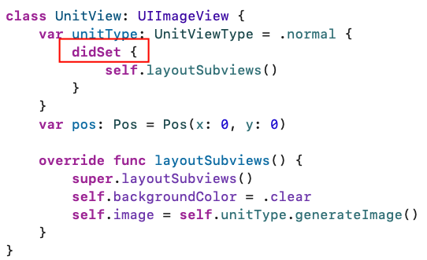

通过使用 weak 避免循环引用：

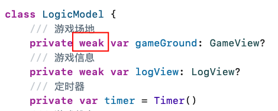

高阶函数 contains，以及 $0 的语法糖使用


