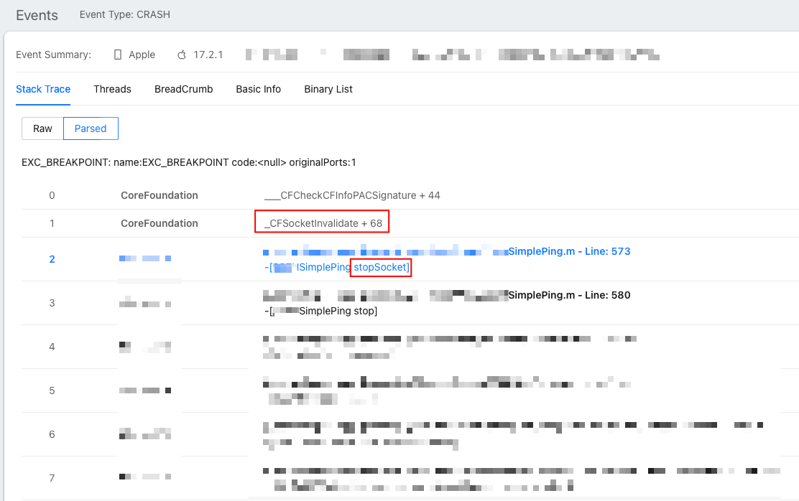
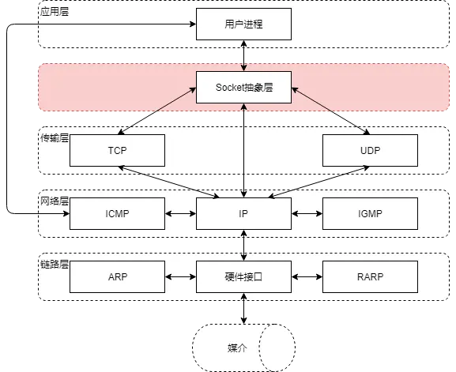

# CFSocketInvalidate 多线程导致的 Crash 问题


## 背景

Crash 图示：




## 初步分析

首先我们根据堆栈信息，定位到 stopSocket 代码位置：

```objective-c
@property (nonatomic, strong, readwrite, nullable) CFSocketRef socket __attribute__ ((NSObject));

- (void)stopSocket {
    if (self.socket != NULL) {
        CFSocketInvalidate(self.socket);
        self.socket = NULL;
    }
}
```

由于这里的代码比较简单，crash 发生在 CFSocketInvalidate 方法内部中，所以高度怀疑是多线程导致的 crash。不过为了确认这个可能性，我们需要进一步了解一下什么是 Socket，以及 CFSocket 到底是什么东西。


## 什么是 Socket

Socket是一种用于在计算机网络中进行通信的编程接口。

它提供了一种机制，使得不同计算机之间可以通过网络传输数据。通过Socket，应用程序可以建立连接、发送数据、接收数据和关闭连接。

我们通常对 TCP 协议、UDP 协议比较熟悉，而 Socket 是基于这些通信协议的一套接口规范，只有通过 Socket 才能使用 TCP 等协议。



如果想要更清楚地了解什么是 Socket，推荐一个 B 站视频，讲解的非常清楚：[Socket 到底是什么 - 小白debug](https://www.bilibili.com/video/BV12A411X7gY/)


## CoreFoundation 中的实现：CFSocket

我们可以在这里 [CFSocket.c](https://opensource.apple.com/source/CF/CF-476.17/CFSocket.c.auto.html) 看到 CoreFoundation 中相关的源码，感兴趣的同学可以仔细地进行阅读。我们这里只是摘取它的定义部分，摘取部分内容进行解读。

```c
struct __CFSocket {
    CFRuntimeBase _base;
    struct {
        unsigned client:8;	// flags set by client (reenable, CloseOnInvalidate)
        unsigned disabled:8;	// flags marking disabled callbacks
        unsigned connected:1;	// Are we connected yet?  (also true for connectionless sockets)
        unsigned writableHint:1;  // Did the polling the socket show it to be writable?
        unsigned closeSignaled:1;  // Have we seen FD_CLOSE? (only used on Win32)
        unsigned unused:13;
    } _f;
    CFSpinLock_t _lock;
    CFSpinLock_t _writeLock;
    CFSocketNativeHandle _socket;	/* immutable */
    SInt32 _socketType;
    SInt32 _errorCode;
    CFDataRef _address;
    CFDataRef _peerAddress;
    SInt32 _socketSetCount;
    CFRunLoopSourceRef _source0;	// v0 RLS, messaged from SocketMgr
    CFMutableArrayRef _runLoops;
    CFSocketCallBack _callout;		/* immutable */
    CFSocketContext _context;		/* immutable */
    CFMutableArrayRef _dataQueue;	// queues to pass data from SocketMgr thread
    CFMutableArrayRef _addressQueue;
	
	struct timeval _readBufferTimeout;
	CFMutableDataRef _readBuffer;
	CFIndex _bytesToBuffer;			/* is length of _readBuffer */
	CFIndex _bytesToBufferPos;		/* where the next _CFSocketRead starts from */
	CFIndex _bytesToBufferReadPos;	/* Where the buffer will next be read into (always after _bytesToBufferPos, but less than _bytesToBuffer) */
	Boolean _atEOF;
    int _bufferedReadError;
	
	CFMutableDataRef _leftoverBytes;
};
```

如果仔细阅读，我们在定义中其实能看出一些端倪。比如 Socket 的作用就是实现两个设备/进程之间通信，因此会有地址的记录 `_address` 和 `_peerAddress`，又比如读写缓冲区的实现 `_readBuffer`。

还有一个细节，就是 CFSocket 对象也关联了 runloop 列表，和一个 source0，这是什么作用呢？


## CFSocket 为什么要绑定 Runloop

```c
struct __CFSocket {
  // ...
    CFRunLoopSourceRef _source0;	// v0 RLS, messaged from SocketMgr
    CFMutableArrayRef _runLoops;
  // ...
};
```

我们在学习 Runloop 的时候，肯定了解过 Source 的概念。Source 是输入源的抽象类（protocol），RunLoop 定义了两种类型 source：

- Source0：处理 app 内部事件，系统触发：UIEvent、CFSocket 等
  - 只包含了一个回调（函数指针），它并不能主动触发事件
  - 不可唤醒 RunLoop，只能等待 RunLoop wakeup 之后被处理
- Source1：RunLoop 内核管理，Mach Port 驱动
  - 包含了一个 mach_port 和一个回调（函数指针）
  - 用于通过内核和其他线程相互发送消息
  - 可唤醒 RunLoop

这里是不是就串起来了，当创建一个 CFSocket 对象时，可以将其与 Runloop 关联起来。

CFSocket 就可以将网络事件（如连接建立、数据到达）作为 Runloop 的 Source0 输入源，当有事件发生时，Runloop 会自动唤醒并调用相应的回调函数来处理事件。

这样通过 Runloop 事件驱动的方式来处理网络事件，提高了效率并降低了资源消耗。


## CFSocketInvalidate 代码详解（可跳过）

回到我们崩溃的方法 CFSocketInvalidate，我进行了非常详细的注释，感兴趣的同学可以仔细阅读以下，对理解 CFSocket 的原理很有帮助。

当然如果没有兴趣，跳过这段代码也没有影响。只需要知道，如果是在多线程的情况下，这段代码会有可能导致 crash 就对了。

```C
void CFSocketInvalidate(CFSocketRef s) {
    CHECK_FOR_FORK(); // 多进程环境下，检查是否进行了进程分叉（fork）
    UInt32 previousSocketManagerIteration;
    __CFGenericValidateType(s, __kCFSocketTypeID); // 确保 s 是 CFSocketRef 类型
#if defined(LOG_CFSOCKET)
    fprintf(stdout, "invalidating socket %d with flags 0x%x disabled 0x%x connected 0x%x\n", s->_socket, s->_f.client, s->_f.disabled, s->_f.connected);
#endif
    CFRetain(s); // 增加引用计数，确保执行期间 s 不会被释放
    __CFSpinLock(&__CFAllSocketsLock); // 自旋锁，对所有 Socket 列表进行加锁
    __CFSocketLock(s); // 对 s 加锁
    if (__CFSocketIsValid(s)) {
        SInt32 idx;
        CFRunLoopSourceRef source0; // 用于保存 Runloop 循环源
        void *contextInfo = NULL;
        void (*contextRelease)(const void *info) = NULL;
      // ↓ 清除标志位
        __CFSocketUnsetValid(s);
        __CFSocketUnsetWriteSignalled(s);
        __CFSocketUnsetReadSignalled(s);
      // ↑ 清除标志位
        __CFSpinLock(&__CFActiveSocketsLock); // 自旋锁，对所有活跃的 Socket 列表进行加锁
      
      // 在 WriteSockets 列表中查找 s 的 idx，找到的话就进行清除
        idx = CFArrayGetFirstIndexOfValue(__CFWriteSockets, CFRangeMake(0, CFArrayGetCount(__CFWriteSockets)), s);
        if (0 <= idx) {
            CFArrayRemoveValueAtIndex(__CFWriteSockets, idx);
            __CFSocketClearFDForWrite(s);
        }
      
      // 在 ReadSockets 列表中查找 s 的 idx，找到的话就进行清除
        // No need to clear FD's for V1 sources, since we'll just throw the whole event away
        idx = CFArrayGetFirstIndexOfValue(__CFReadSockets, CFRangeMake(0, CFArrayGetCount(__CFReadSockets)), s);
        if (0 <= idx) {
            CFArrayRemoveValueAtIndex(__CFReadSockets, idx);
            __CFSocketClearFDForRead(s);
        }
      
        previousSocketManagerIteration = __CFSocketManagerIteration;
        __CFSpinUnlock(&__CFActiveSocketsLock); // 自旋锁，释放活跃的 Socket 列表
        CFDictionaryRemoveValue(__CFAllSockets, (void *)(uintptr_t)(s->_socket)); // 从全局列表中移除 s
      // 关闭 s
        if ((s->_f.client & kCFSocketCloseOnInvalidate) != 0) closesocket(s->_socket);
        s->_socket = INVALID_SOCKET;
      // 释放 s 的地址、数据队列、队列地址
        if (NULL != s->_peerAddress) {
            CFRelease(s->_peerAddress);
            s->_peerAddress = NULL;
        }
        if (NULL != s->_dataQueue) {
            CFRelease(s->_dataQueue);
            s->_dataQueue = NULL;
        }
        if (NULL != s->_addressQueue) {
            CFRelease(s->_addressQueue);
            s->_addressQueue = NULL;
        }
        s->_socketSetCount = 0;
      // 唤醒 Runloop
        for (idx = CFArrayGetCount(s->_runLoops); idx--;) {
          // 为了确保在调用 CFSocketInvalidate 后，关联的运行循环能够及时注意到 CFSocketRef 对象的无效状态，并相应地更新事件处理机制
            CFRunLoopWakeUp((CFRunLoopRef)CFArrayGetValueAtIndex(s->_runLoops, idx));
        }
      // 继续清除 s 的上下文信息等
        CFRelease(s->_runLoops);
        s->_runLoops = NULL;
        source0 = s->_source0;
        s->_source0 = NULL;
        contextInfo = s->_context.info;
        contextRelease = s->_context.release;
        s->_context.info = 0;
        s->_context.retain = 0;
        s->_context.release = 0;
        s->_context.copyDescription = 0;
        __CFSocketUnlock(s); // 解锁 S
        if (NULL != contextRelease) {
            contextRelease(contextInfo);
        }
        if (NULL != source0) {
          // 如果 s 绑定过 Runloop，那么需要终止和释放这个 runloop
            CFRunLoopSourceInvalidate(source0);
            CFRelease(source0);
        }
    } else {
        __CFSocketUnlock(s);
    }
    __CFSpinUnlock(&__CFAllSocketsLock); // 解锁全局 socket 列表
    CFRelease(s);
}

```

这里再多说一句，为什么需要执行 CFRunLoopWakeUp 这一步操作呢？

```c
CFRunLoopWakeUp((CFRunLoopRef)CFArrayGetValueAtIndex(s->_runLoops, idx));
```

因为 `CFSocketInvalidate` 方法会将 `CFSocketRef` 对象标记为无效，表示其不再可用，需要将这个状态通知给关联的 Runloop，这样才能能够相应地更新其状态和事件处理机制。

在某些情况下，运行循环可能处于休眠状态，等待事件的发生。如果在这种情况下调用 `CFSocketInvalidate`，运行循环可能会继续等待，而不会立即注意到 `CFSocketRef` 对象的无效状态。为了解决这个问题，需要调用 `CFRunLoopWakeUp` 函数来唤醒休眠中的运行循环，以便它能够立即注意到 `CFSocketRef` 对象的无效状态，并相应地更新事件处理机制。


## CFSocketInvalidate Crash 原因分析

首先一个最简单的情况，就是当进入 CFSocketInvalidate 方法时，参数 CFSocketRef s 已经被释放了。在这种情况下下面这段类型检查代码肯定就不会通过：

```c
__CFGenericValidateType(s, __kCFSocketTypeID); // 确保 s 是 CFSocketRef 类型
```

从众多 crash 中，也能找到崩溃在 `__CFGetNonObjCTypeID` 这里的，可以和上面这一行代码对应的起来，可以确认就是这个原因。


不过另外一种 crash 在 `___CFCheckCFInfoPACSignature ` 位置的，没有看到比较明确的说明。姑且认为可能是加锁时 CFSocketRef s 已经被释放相关。


## 解决办法

目前先进行加锁即可，注意两种互斥锁方法，优先选择声明 lock 而不是 @synchronized，因为 stopSocket 的场景可能会高频调用。

```objective-c
- (void)stopSocket {
    [self.lock lock];
    // CFSocketInvalidate 多线程执行时，有可能导致重复释放
    if (self.socket != NULL) {
        CFSocketInvalidate(self.socket);
        self.socket = NULL;
    }
    [self.lock unlock];
}
```


## 参考资料：

- [什么是 Socket? - 简书](https://www.jianshu.com/p/01b9a454de5a)
- [Socket 到底是什么 - 小白debug](https://www.bilibili.com/video/BV12A411X7gY/?spm_id_from=333.337.search-card.all.click&vd_source=7074e07f84aac597b607f038400f3e4e)
- [CFSocket.c 源码](https://opensource.apple.com/source/CF/CF-476.17/CFSocket.c.auto.html)
- [Run Loops - Apple Documentation](https://developer.apple.com/library/archive/documentation/Cocoa/Conceptual/Multithreading/RunLoopManagement/RunLoopManagement.html#//apple_ref/doc/uid/10000057i-CH16-SW26)
- [CFRunloop的多线程隐患 - 黑超熊猫 zuik](https://juejin.cn/post/6844903582656004109)
- [SimplePing.m 源码](https://github.com/xamarin/XamarinComponents/blob/main/iOS/SimplePing/externals/SimplePing/Common/SimplePing.m)