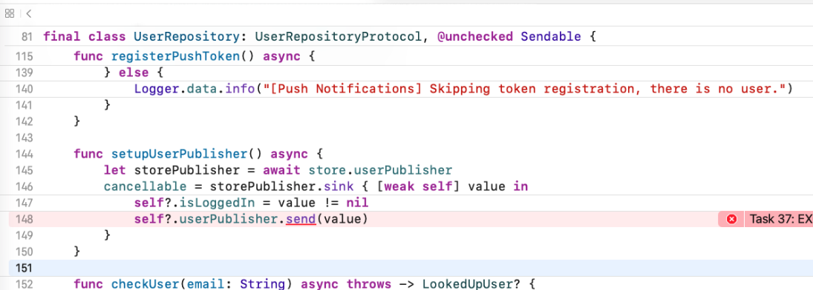
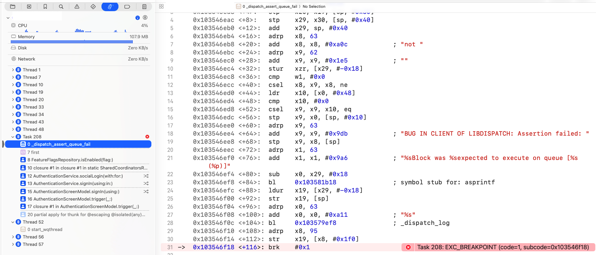
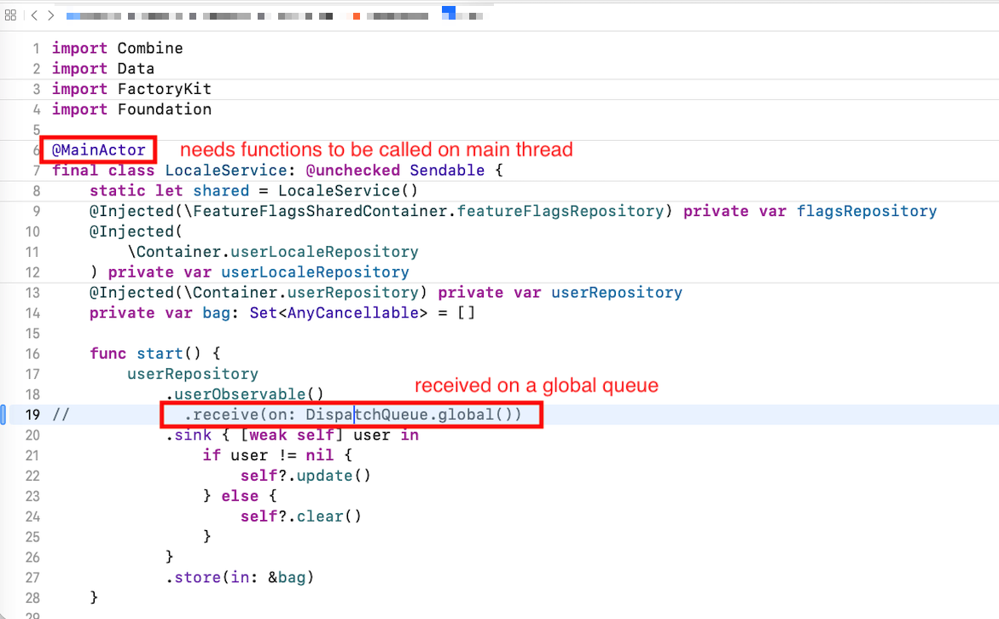
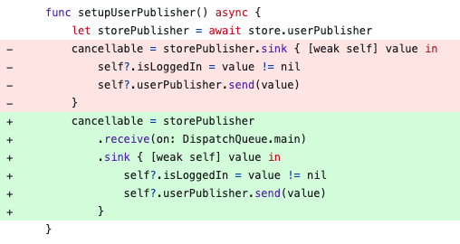
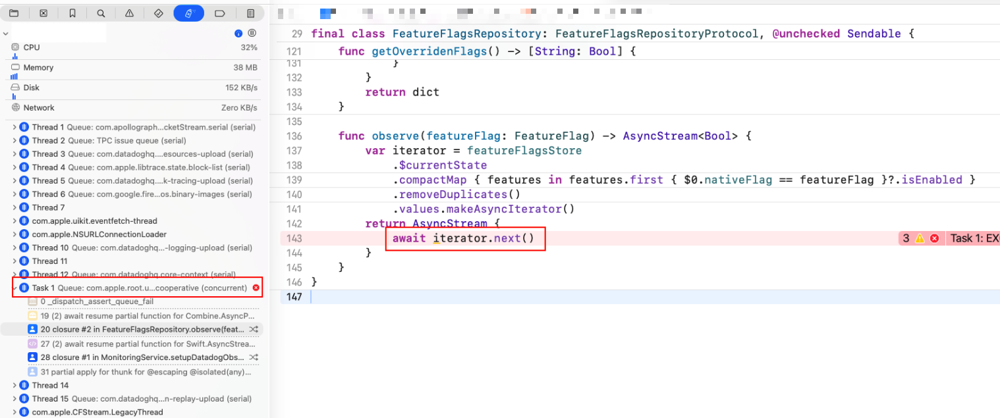
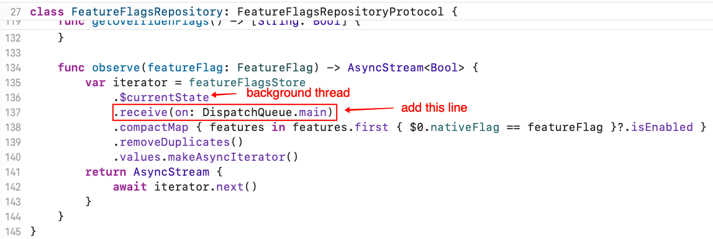

# Swift 6 迁移 常见 crash _dispatch_assert_queue_fail

最近在迁移到 Swift 6 的过程中，解决了好几个相似的 crash。关键字如下

```
_dispatch_assert_queue_fail

"%sBlock was %sexpected to execute on queue [%s (%p)]

Task 208: EXC_BREAKPOINT (code=1, subcode=0x103546f18)
```

在这里记录和分享，希望遇到相似的问题之后能够更快的解决。

## Crash 1 信息





## 原因与解决 1

首先根据 crash 的提示，可以清楚地知道：Block 预期在一个线程上执行，而实际在另一个线程上执行。第一反应：大概率是主线程 vs 后台线程之间的不一致导致的。

如果经常熟练处理 Swift 6 升级的小伙伴就知道，一定是有地方标记了 `@MainActor`，也就意味着相对应的方法一定是要在主线程上执行的；而实际阴差阳错，在后台线程执行了。

所以接下来可能需要找，到底哪里线程不一致呢？我们根据代码来寻找即可。



不难找到，根据 Combine 调用链，可以发现其中一处对于 `userPublisher` 的监听时，选择了在 `global` 上去执行后面的操作，所以这里需要将这一个逻辑去掉。

于此同时，对于 `userPublisher` 的发布，我们也最好将其默认放在主线程上，因为他是和 UI 相关的，所以需要做这样的改动：



## 坑点

目前是不是觉得好像这个类型的 crash 不算很难解决？没错，这个 crash 的提示相对清楚，知道大概原因后去找就相对容易了。

不过需要注意的是，当使用 Combine 框架遇上这类型的 crash 时，crash 断点只会发生在 `Publisher` 而不是 `Observer` 处，所以我们需要自己去寻找调用方，看下在哪里出现了线程使用不一致的问题。

## Crash 2 信息

好的，那么同类型的一个 crash 再来看看：



报错信息就不贴了，和上一个 crash 是一样的，都是：`"%sBlock was %sexpected to execute on queue [%s (%p)]`

这里可以看到，crash 断点处在子线程，也是在 AsyncStream 发布处断点。那么根据经验推断，可以大概知道原因：

1. 此处发布的时候，处在子线程
2. 下游调用方，一定有某个地方要求在主线程
3. 实际线程与要求线程不一致，所以导致 crash

## 原因与解决 2

这里寻找过程就不赘述了。原来的发布者是处在子线程，而后面的监听者处在主线程，因此需要改在主线程发布。



