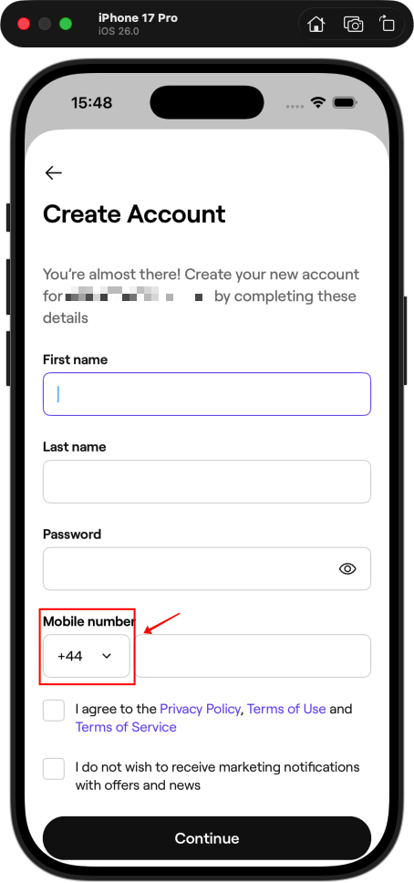
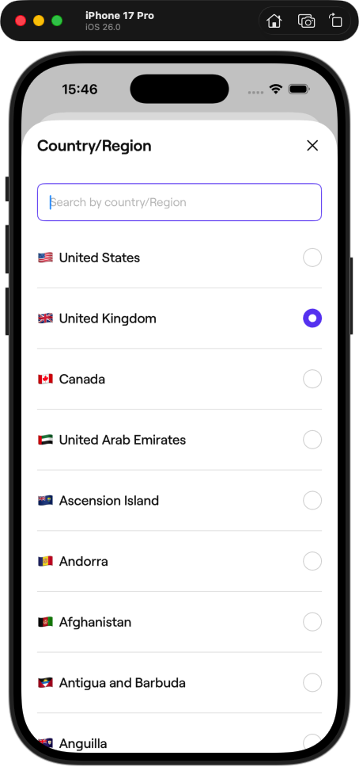
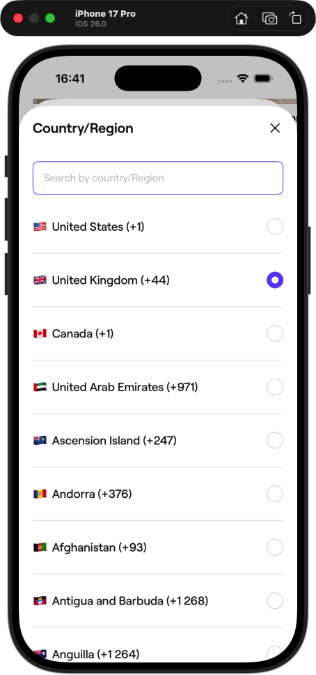
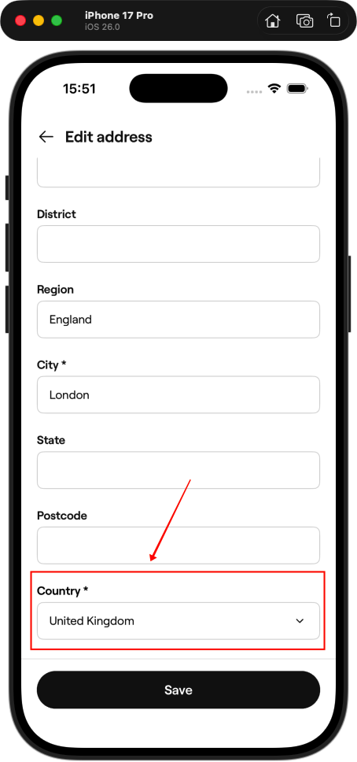
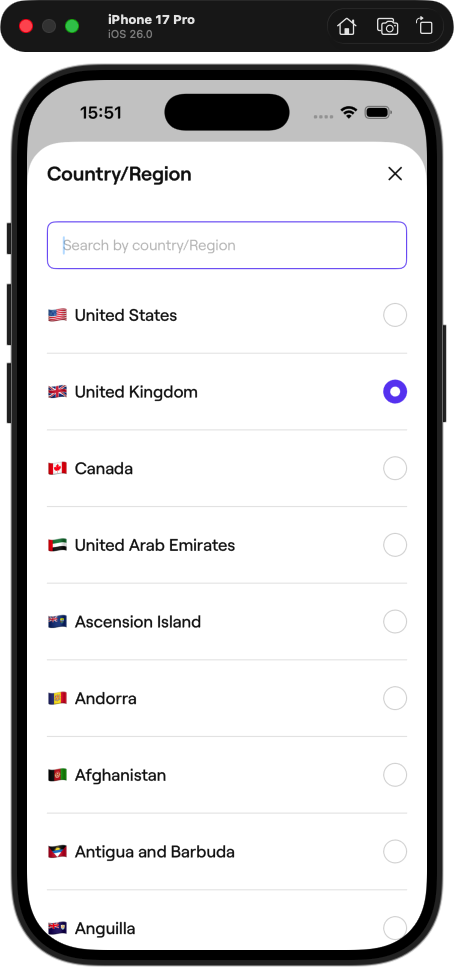

# The Hidden Danger of @retroactive: Swift’s Duplicate Conformance Trap

## The Original Issue: A Simple Feature That Wouldn't Work

We were building a phone number input screen. Users needed to select their country from a dropdown to get the correct phone code prefix (like +86 for China, +44 for UK, etc.).

| Step 1                                                       | Step 2: missing code!                                        | What we want                                                 |
| ------------------------------------------------------------ | ------------------------------------------------------------ | ------------------------------------------------------------ |
|  |  |  |

### The Problem

We needed to show countries in a dropdown with their phone codes, like: "🇬🇧 United Kingdom (+44)"

So we added this extension in the **User module**:

```swift
extension Country: @retroactive DropdownSelectable {
    public var id: String {
        code
    }

    public var displayValue: String {
        emoji + "\t\(englishName) (\(phoneCode))"
    }
}
```

But **it didn't work**. The phone code `(\(phoneCode))` wasn't showing up in the dropdown. Just the country name: "🇬🇧 United Kingdom"

The code compiled. Tests passed. No warnings. But the feature was broken in production.

> BTW, what's DropdownSelectable?
> 
> `DropdownSelectable` is a protocol in our DesignSystem module that makes any type work with our dropdown UI component:

```swift
protocol DropdownSelectable {
    var id: String { get }           // Unique identifier
    var displayValue: String { get } // What shows in the dropdown
}
```

## Part 1: When Good Extensions Go Bad

### The Discovery

After debugging, we discovered the root cause: **the Addresses module already had a similar extension**:

```swift
// In Addresses module
extension Country: @retroactive DropdownSelectable {
    public var displayValue: String {
        emoji + "\t\(englishName)"  // NO phone code
    }
}
```

| Step 1                                                       | Step 2                                                       |
| ------------------------------------------------------------ | ------------------------------------------------------------ |
|  |  |

The Addresses module didn't need phone codes, just the country name. That makes sense for address forms.

But here's the kicker: **the Addresses extension was overwriting our User extension at runtime**. We thought we were using the User module's extension (with phone code), but Swift was randomly picking the Addresses one (without phone code) instead.

And that's where things got interesting (and frustrating).

### Dilemma: Two Extensions at One Time

Here's what we found in our codebase:

**In the User module (what we thought we were using):**

```swift
extension Country: @retroactive DropdownSelectable {
    public var id: String {
        code
    }
    public var displayValue: String {
        emoji + "\t\(englishName) (\(phoneCode))"  // ✅ With phone code
    }
}
```

**In the Addresses module (what was actually being used):**

```swift
extension Country: @retroactive DropdownSelectable {
    public var id: String {
        code
    }
    public var displayValue: String {
        emoji + "\t\(englishName)"  // ❌ Without phone code
    }
}
```

Both modules had legitimate reasons for their implementations:
- **User module**: Needed phone codes for the phone number input screen
- **Addresses module**: Didn't need phone codes, just country names for address forms

Each developer added what they needed. The code compiled without warnings. Tests passed. Everything seemed great.

And of course it seemed great. Swift allow same extensions in different modules. So what was happening and how did we solve this?


## Part 2: Why This Happens - Swift's Module System Explained

To understand why this is a problem, we need to understand how Swift's module system works. The interesting thing is: **normally, having the same extension in different modules is perfectly fine**. But protocol conformances are a special case.

### The Normal Case: Extensions Usually Work Fine Across Modules

Let's say you add a helper method to a type:

```swift
// In UserModule
extension Country {
    var displayValue: String {
        return emoji + "\t\(englishName) (\(phoneCode))"
    }
}
// In AddressesModule
extension Country {
    var displayValue: String {
        return emoji + "\t\(englishName)"
    }
}
```

This works perfectly! Each module sees its own extensions:
- Code in UserModule can call `displayValue` and it's with `phoneCode`
- Code in AddressesModule can call `displayValue` and gets the result without `phoneCode`

**Why it works:** Regular extension methods are resolved at compile time based on which modules you import. Swift knows exactly which method to call based on the current module's imports.

### The Special Case: Protocol Conformances Are Global

But protocol conformances work differently. When you write:

```swift
extension Country: DropdownSelectable {
    var displayValue: String { ... }
}
```

You're not just adding a method. You're making a **global declaration**: "For the entire app, Country conforms to DropdownSelectable."

So when you create two same conformances, it will cause **Duplicate Conformance Error**

```swift
// In UserModule
extension Country: DropdownSelectable {
    var displayValue: String {
        return emoji + "\t\(englishName) (\(phoneCode))"
    }
}
// In AddressesModule
extension Country: DropdownSelectable {
    var displayValue: String {
        return emoji + "\t\(englishName)"
    }
}
```

When you build the app that links both modules, the Swift compiler or linker will complain with something like:

>  'Country' declares conformance to protocol 'DropdownSelectable' multiple times


## Part 3: Enter @retroactive - Making a Bad Situation Explicit

### Wait… How Did This Even Compile?

Basically, if we run into a **Duplicate Conformance Error**, the compiler will stop us. But then — how could this code have existed in the first place?

I blame `@retroactive`.

### What is @retroactive?

In Swift 6, Apple introduced the `@retroactive` keyword to make cross-module conformances explicit:

```swift
extension Country: @retroactive DropdownSelectable {
    // conforming an external type
    // to an external protocol
}
```

You need `@retroactive` when:

- The type is defined in a different module (e.g., `Country` from `Module A`)
- The protocol is defined in a different module (e.g., `DropdownSelectable` from `Module B`)
- You're adding the conformance in a third module (e.g., in `UserModule` and `AddressesModule`)

### **Why** @retroactive Makes Duplicates Worse

Without `@retroactive`, duplicate conformances are already a compile-time error. But with `@retroactive`, the problem gets even trickier — because now you’re explicitly declaring something that affects the **entire app’s runtime**, not just your module.

When you write `@retroactive`, you’re saying:

> “I’m adding this conformance to an existing type that I don’t own, across the entire app.”

That means the compiler allows you to *retroactively* add a conformance to a type that was defined elsewhere. That’s powerful, but it also changes how Swift checks for duplicates.

**Here’s the catch:** 

Swift enforces duplicate-conformance rules **within each module**, but **not across modules**. In other words, the compiler checks only the code it’s currently building.

- Each producer module (UserModule, AddressesModule) **compiles fine on its own** (it only “sees” its own conformance). It's fine by now.
- The consumer that imports both (at least you have one, it's your **app target**!), will fail to build because it sees **two same conformances**.

**After adding @retroactive:**

With `@retroactive`, Swift **defers some checks to link time**, so both modules compile successfully even though they’re declaring the same global conformance.

The duplicate only becomes visible **after linking**, when both modules are loaded into the same runtime image — and at that point, it’s too late for the compiler to stop it.

That’s why these duplicates can “escape” the compiler’s safety net and cause confusing, runtime-level bugs.

### At Runtime What Happened

When the linker finds two implementations for `(Country, DropdownSelectable)`:
- Option A: UserModule's implementation (with phone code)
- Option B: AddressesModule's implementation (without phone code)

**It can only register ONE**. So it picks one based on link order—basically whichever module the linker happened to process first. The other conformance is silently ignored.

This explains why UserModule's implementation was ignored.


## Part 4: The Solution - Wrapper Structs to the Rescue

The good news? There's a clean, simple fix: **use wrapper types**.

### The Solution Pattern (Do This)

Instead of making `Country` itself conform to the protocol, wrap it:

```swift
// UserModule example
struct CountryWithPhoneDropdown: DropdownSelectable {
    let country: Country
    var id: String { country.code }
    var displayValue: String {
        country.emoji + "\t\(country.englishName) (\(country.phoneCode))"
    }
}
// AddressModule example
struct CountryAddressDropdown: DropdownSelectable {
    let country: Country

    var id: String { country.code }
    var displayValue: String {
        country.emoji + "\t\(country.englishName)"
    }
}
// Usage
countries.map { CountryWithPhoneDropdown(country: $0) }
countries.map { CountryAddressDropdown(country: $0) }
```


## **Part 5: Prevention — How to Stop It From Happening Again**

Fixing one bug is good. Preventing it forever is better.

You can easily avoid duplicate `@retroactive` conformances by adding **static analysis** or **CI checks** to your workflow.

This ensures that any duplicate `@retroactive` conformance is caught **before it reaches production**, keeping your app consistent and your runtime safe.


## The End

In the end, this bug wasn’t about dropdowns at all — it was about understanding how Swift sees the world.

Protocol conformances are global, and `@retroactive` makes that power explicit (and dangerous).

Once we understood that, the fix was simple: use wrapper types, enforce CI checks, and never let duplicate conformances sneak into our build again.
