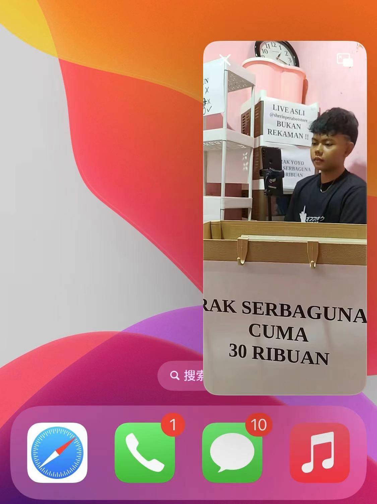
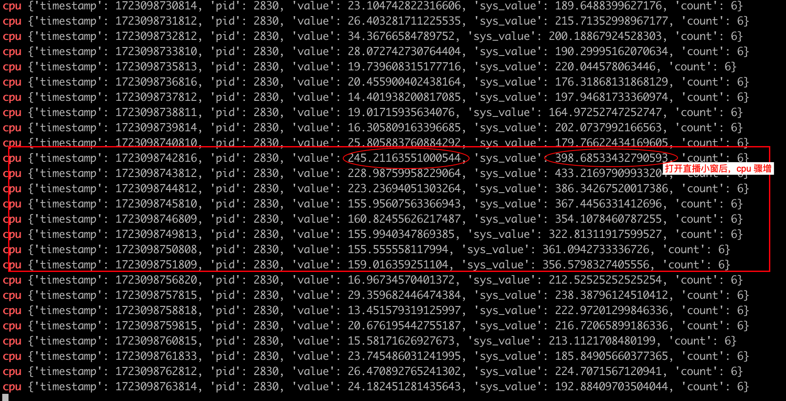
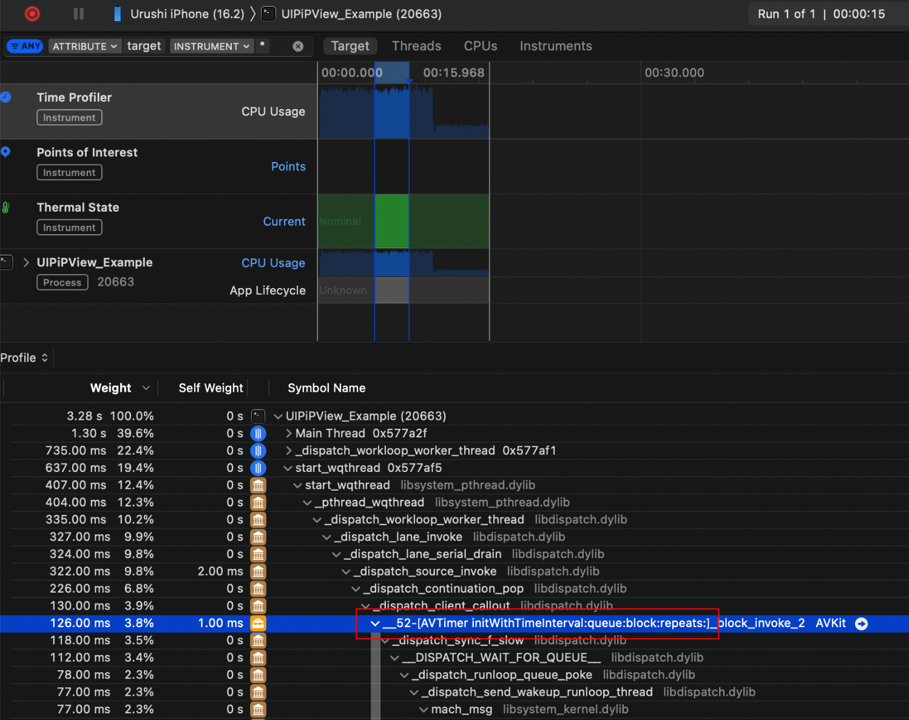
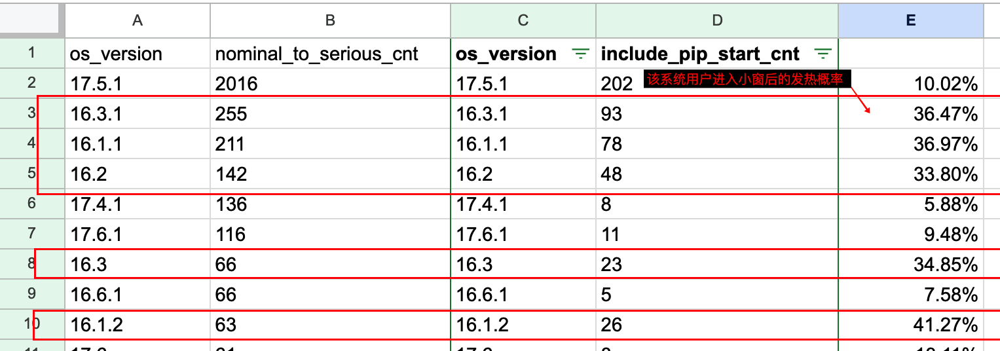

# iOS PiP 小窗导致异常发热的问题


## 背景

最近 QA 发现部分系统，从直播间进入后台，启动系统 PiP 小窗之后，会出现 CPU 骤增，导致温度急剧升高。



通过 tidevice 工具检测，可以看到进入 PiP 小窗后，cpu 大幅增加，发热非常严重。




## 问题原因 & 解决办法

> 这里直接先直接给结论，后面再给出详细的分析过程，如果感兴趣的同学可以再看看。

这是一个 iOS 系统 bug，从 iOS 16.1 开始有，不确定哪一个版本修复（应该在 iOS 17 之前）。最原始的讨论可以参考：[issue](https://github.com/uakihir0/UIPiPView/issues/17)

出问题的代码是下面这一段：

```objective-c
- (CMTimeRange)pictureInPictureControllerTimeRangeForPlayback:(nonnull AVPictureInPictureController *)pictureInPictureController {
    return CMTimeRangeMake(kCMTimeZero, kCMTimePositiveInfinity);
}
```

这段代码 PiP 小窗代理 `AVPictureInPictureSampleBufferPlaybackDelegate` 的一个实现，用于定义 PiP 模式下的播放时间范围。这里定义的时间是 [0~正无穷]，在直播间的场景下非常合理，也是通常的一种做法。

`kCMTimePositiveInfinity` 代表的就是正无穷远的时间，类似的还有 `kCMTimeNegativeInfinity` 负无穷时间。

不过在有问题的 iOS 系统版本中，使用 `kCMTimePositiveInfinity` 正无穷时间，会导致系统小窗的 AVTimer 出现错误，造成告诉循环：

> 因为我没有复现，所以这里的图是参考的其他人实验的结果



所以修复方案也就确认了，那就是避免有 bug 的版本使用 `kCMTimePositiveInfinity` 的时长即可

```objective-c
- (CMTimeRange)pictureInPictureControllerTimeRangeForPlayback:(nonnull AVPictureInPictureController *)pictureInPictureController {
    if (@available(iOS 17.0, *)) {
        // iOS 17 及更高版本，使用 kCMTimePositiveInfinity
        return CMTimeRangeMake(kCMTimeZero, kCMTimePositiveInfinity);
    } else if (@available(iOS 16.1, *)) {
        // iOS 16.1 及以上的 iOS 16，使用 24 小时的时间范围
        return CMTimeRangeMake(kCMTimeZero, CMTimeMake(3600 * 24, 1));
    } else {
        // 默认使用 kCMTimePositiveInfinity
        return CMTimeRangeMake(kCMTimeZero, kCMTimePositiveInfinity);
    }
}
```


## 分析过程

整个过程中，因为手边设备有限，无法找到指定系统进行复现操作，所以只能根据一些信息进行推断解决。


### 1. 发现与 iOS 系统版本相关

采用多个型号、系统的手机，发现只有部分系统的手机会复现这个问题（而且是稳定复现），而另一些型号的手机，则完全无法复现。

- 有问题：iOS 16.1
- 没问题：iOS 16.0、iOS 16.6、iOS 17.5、iOS 17.7

而 QA 帮忙跑了一下线上数据，发现 iOS 16.1~16.3 的用户是发热重灾区：




### 2. 与 PiP 小窗出现相关

经过测试，如果不触发小窗，或者在小窗出现后点击叉叉关掉小窗，发热问题都会得到解决。

所以判断发热问题肯定与 PiP 小窗的出现强相关。


### 3. 与小窗渲染效率无关

因为看到 PiP 小窗的实现，实际上是拿播放器 decode 之后的数据，手动渲染到小窗 layer 上的，这里面也包括了裁剪的计算，所以怀疑是不是手动渲染效率太低导致的问题。

但经过测试之后发现也没有关系。


### 4. 怀疑是系统本身的 bug

经过上述测试，发现即便小窗完全不进行渲染，只要开启了小窗，就会有问题。因此怀疑是指定系统版本下 PiP 小窗的系统问题，经过一通检索发现了这个 [issue](https://github.com/uakihir0/UIPiPView/issues/17) 中有相关的讨论。尝试了一下发现竟然直接解决了！