# iOS 中的手势传递（一）操作系统层

这是一篇在草稿箱里存了很久的文章，本来想写一个大而全的手势文章，可惜迟迟没有完结，索性还是先把前面写好的部分发出来了。

通常我们处理手势是在 UIView 层级，直接使用 UIButton、UIGestureRecognizer 等来捕获手势，而本文重点讲的是在此之前，手势识别与传递的过程，在介绍整个过程的同时，也能对整个操作系统的工作方式有一定的了解。


## 目录

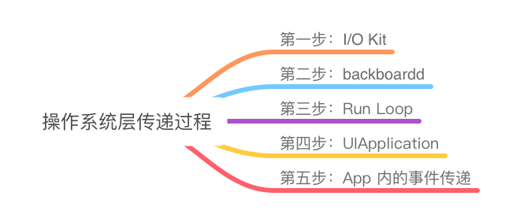

## 第一步：I/O Kit

### 手机触屏原理

我们首先来讲讲触摸手势最开始在物理层面上是如何被触发和检测的。

手机屏幕实现触屏的原理大概有分为两种，电容屏和电阻屏；其中电容屏虽然价格更为昂贵，但精度更高，可实现多点触控，以及保护、清洁都更方便，因此也是主流的方案。

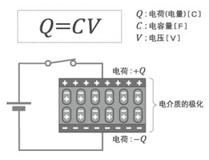

电容屏的大概原理简单来说，整块屏幕就是一个大的电容器。根据中学物理知识，电容器实际上就是一个储存电荷的电子元件，人体也可以传导微弱的电流；当人的手指触碰到电容器，人的手指就会变成电容器的一极，部分的电荷就会从人的手指处流失，从而被屏幕探测到触摸动作。

> 注 1：这也是为什么冬天戴手套时无法使用触摸屏幕的原因，因为绝大部分手套是绝缘体，无法成为电容器的一极，不会产生电荷的流动，因此无法被电容屏探测到触摸操作。
>
> 注 2：而有些安卓手机设置有手套模式，戴着手套也能使用触屏。这个主要是因为当电压足够的情况下，电荷的传到也能穿透一定的绝缘电阻。因此开启了手套模式后，电容屏功率加大，即使戴着较薄手套，也能产生电荷的转移。

而 iPhone 采用的是投射电容（Projected-Capacitive）式电容屏，一共主要有四层，一层触摸层，两层导电层，和一层隔离层，大致结构如下：

> 比较旧的论文里的信息，如果有最新的欢迎留言交流~

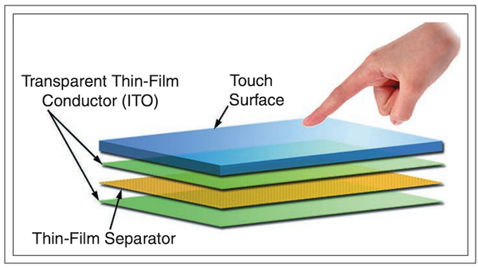

其中最上层透明的 touch surface 是触摸层，主要起保护作用，避免手指直接接触到下层结构。绿色 ITO 是导电玻璃层，中心黄色是绝缘层，这三层结构就构成了电容器。当手指触碰到触摸层时，就会产生电荷从电容器到人手指的转移，从而被屏幕捕获。

> 注：有些时候除了这些结构，最下层还会有额外的一层 ITO 导电玻璃层，主要用于减少显示屏的噪声（noise）。

而屏幕如何捕获具体的触摸坐标呢？实际上刚才说的两层 ITO 导电玻璃，分别负责探测触摸点的横纵坐标：

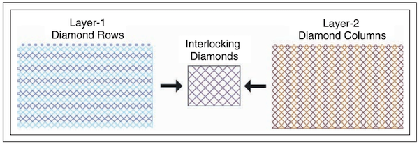

参考上图，两层分别都按横纵方向分布有联锁钻石（Interlocking Diamonds）形状，分别负责探测触摸点的横纵坐标，两者结合之后可以计算出具体的触摸点坐标。

### CPU 架构与 I/O 总线

其实看完上一小节，我们知道手机触摸屏对于系统内核来说，实际上就是一个外接的物理设备。而这个设备是如何与 CPU 连接起来的呢，这就要从计算机组成与 I/O 总线说起。在现代 CPU 架构中有一个总线（Bus）的概念，用于数据的传输：

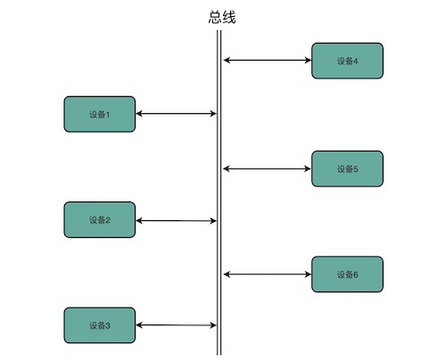

在物理层面上，总线可以被拆分为三条线路，分别是数据线（Data Bus）、地址线（Address Bus）和控制线（Control Bus）。分别用于数据的传输、地址的索引，以及具体传输操作的控制。在这样的结构支持下，总线连接的各个设备之间，通过”上下车“的机制，就能将需要数据在各个设备中传递。

而在现代 CPU 的架构中，存在多个总线结构，主要包括系统总线、内存总线和 I/O 总线，整体结构大概如下所示：

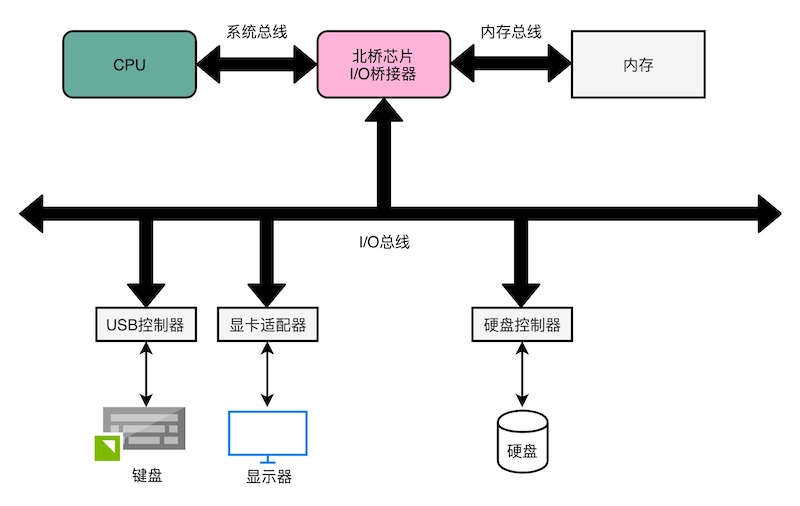

从图中可以看到，I/O 总线连接了各个设备，对于计算机来说就是诸如键盘鼠标、显示器、硬盘等；另一方面它与 I/O 桥接器（I/O Bridge）相连，就能完成设备与 CPU、内存的数据连通了。

### 什么是 I/O Kit

经过了上面的说明，大概能知道 I/O Kit 的作用是什么了。

> The I/O Kit is a collection of system frameworks, libraries, tools, and other resources for creating device drivers in OS X. It is based on an object-oriented programming model implemented in a restricted form of C++ that omits features unsuitable for use within a multithreaded kernel. By modeling the hardware connected to an OS X system and abstracting common functionality for devices in particular categories, the I/O Kit streamlines the process of device-driver development.
>
> -- [Apple Documentation](https://developer.apple.com/library/archive/documentation/DeviceDrivers/Conceptual/IOKitFundamentals/Features/Features.html#//apple_ref/doc/uid/TP0000012-TPXREF101)

根据 [Apple](https://developer.apple.com/library/archive/documentation/DeviceDrivers/Conceptual/IOKitFundamentals/Features/Features.html#//apple_ref/doc/uid/TP0000012-TPXREF101) 的官方文档，I/O Kit 简单来说就是连接系统与硬件的中间结构。它能提供以及简化在 OS X 系统上依赖硬件的开发过程，以及支持 iOS 的底层调用。虽然对于 iOS 来说通过 I/O Kit 进行内核编程的机会非常有限，但是也有通过其实现对电池电量监控的相关实践。

也因此可想而知，其实 I/O Kit 所处的位置应该位于系统较为底层的地方。对于 iOS 系统（以及 OS X）来说，如图所示，大概可以分为下面四层。其中操作系统核心 Darwin 包含内核和 UNIX shell 环境，I/O Kit 也位于其中。

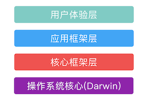

### IOHIDFamily

首先需要说明的是，I/O Kit 既适用于 OS X 也适用于 iOS，但是由于苹果对 iOS 使用 I/O Kit 的限制，因此在公开文档中大部分都是针对 OS X 所写，和 iOS 有一定的区别。

I/O Kit 中所有类的祖先都是 OSObject 类，而苹果定义了一些设备的 Family（"族"），都继承于 OSObject，分别实现了一些通用的驱动程序。这样说起来还是有点抽象，说一些常见的族就大概能理解了：

> 参考：[IOKit Fundamentals - I/O Kit Family Reference](https://developer.apple.com/library/archive/documentation/DeviceDrivers/Conceptual/IOKitFundamentals/Families_Ref/Families_Ref.html#//apple_ref/doc/uid/TP0000021-BABCCBIJ)

- IOUSBFamily：通用 USB 设备
- IOAudioFamily：所有音频设备
- IONetworkingFamily：提供对无线网络连接的支持
- IOGraphicsFamily：通用图形适配器，支持屏幕显示

而我们需要关注的是 IOHIDFamily，他的全称是 Human Interface Device。根据官方文档的说明，它负责连接与用户交互的驱动设备，比如键盘鼠标等：

> The Human Interface Device (HID) class is one of several device classes described by the USB (Universal Serial Bus) architecture. The HID class consists primarily of devices humans use to control a computer system’s operations.
>
> Examples of such HID class devices include: Keyboards and pointing devices such as mice, trackballs, and joysticks.....

根据针对 OS X 的这些描述，我们也能很容易地推断出，IOHIDFamily 在 iOS 系统上也负责了触屏事件的处理。实际上，IOHIDFamily 会创建一个 IOHIDEventSystem 对象，其中包括多个 IOHIDEventService，是用来向外分发事件的实现类：

> 参考：[IOHIDEventService - Apple](https://developer.apple.com/documentation/hiddriverkit/iohideventservice?language=occ)
>
> IOHIDEventService: The base class for implementing a device or operating system service that dispatches events to the system.

而在此基础之上，IOHIDFamily 定义了多种事件（本质是一个 IOHIDEvent 对象），全部都通过 IOHIDEventService 向外分发，包括键盘（[dispatchKeyboardEvent](https://developer.apple.com/documentation/hiddriverkit/iohideventservice/3338745-dispatchkeyboardevent?language=objc)）、鼠标准确点击（[dispatchAbsolutePointerEvent](https://developer.apple.com/documentation/hiddriverkit/iohideventservice/3338744-dispatchabsolutepointerevent?language=objc)）、鼠标滚轮（[dispatchRelativeScrollWheelEvent](https://developer.apple.com/documentation/hiddriverkit/iohideventservice/3338747-dispatchrelativescrollwheelevent?language=objc)）等，而其中我们就能找到我们所关心的触屏点击事件：[dispatchDigitizerTouchEvent](https://developer.apple.com/documentation/hiddriverkit/iohideventservice/3395539-dispatchdigitizertouchevent?language=objc)。

进一步的，我们可以看到 dispatchDigitizerTouchEvent 的声明：

```cpp
virtual kern_return_t 
dispatchDigitizerTouchEvent(uint64_t timeStamp, IOHIDDigitizerTouchData *touchData, uint32_t touchDataCount);
```

其中，touchData 是一个包含多个触摸信息（[IOHIDDigitizerTouchData](https://developer.apple.com/documentation/hiddriverkit/iohiddigitizertouchdata?language=objc)）的数组，每个触摸信息都对应屏幕上一个手指的触摸，包含具体的触摸点坐标、坐标变化等信息。看到这里，已经有一种豁然开朗的感觉了，这不就是 UIEvent 和 UITouch 的关系在底层的对应吗？

所以总结一下，整个内核处理触屏的整个过程大概如图所示：

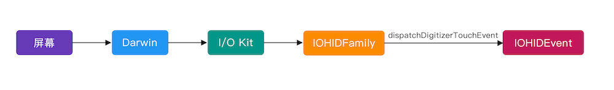


## 第二步：backboardd

### SpringBoard 与 backboardd

Daemons 程序是 iOS/OS X 操作系统内的核心程序，这类程序始终在后台运行，通常拥有更长的生命周期。

SpringBoard 是 iOS 系统内一个特殊的守护程序（Daemon），而 SpringBoard 主要负责 iOS 设备的 UI 支持。当系统启动后，它会启动一个图形 Shell 环境，支持丰富的 GUI，这在 OS X 上是 Finder，而在 iOS 上就是 SpringBoard。

SpringBoard 主要职责是负责展示 UI，比如每次创建 GUI 时 SpringBoard 都会遍历 var/mobile/Applications 中的所有应用，然后创建对应的图标展示在主屏幕上。与此同时，SpringBoard 也会负责 iOS 中每个类型的操作，负责将 UI 事件分发到应用程序。而如果 SpringBoard 被暂停，任何 UI 操作都不会被分发到应用程序；如果 SpringBoard 超过几分钟不响应，系统将会被 watch dog 重启。

SpringBoard 大家可能相对熟悉，不过从 iOS 6 开始，关于点击事件相关的任务被移交给了另一个 Daemon 程序负责：backboardd（也就是 BackBoard），backboardd 就负责点击事件从硬件到 app 之间的衔接。

当然 backboardd 和 SpringBoard 也会有相互通信的能力，通过 BackBoardServices.framework 简单封装就可以互相通信。

### backboardd 接收事件

Mach 是 OS X 以及 iOS 中最核心的部分，仅处理最重要的任务，包括：进程和线程抽象、任务调度、进程间通讯和消息传递、虚拟内存管理。在 Mach 中，消息会在两个端口 Port 之间传递，对象之间通过各自注册、负责端口，再通过端口传递消息来完成相互之间的通信。

内核通信都通过 Mach 消息在 port 之间传递，这部分能力主要由 SpringBoard 提供，SpringBoard 会要求注册不少的 port，其中最重要的是 PurpleSystemEventPort 这个端口，这个端口会接收硬件事件。

SpringBoard 可以接收来自 I/OKit 的消息，而接收形式就是前文提到的 IOHIDEvent。IOHIDEvent 一共定义了 20 种事件，而 SpringBoard 只接收其中的 4 种：

- keyboard：对于 iOS 设备来说，这个事件对应的不完全对应键盘输入，而是按钮事件，比如：静音按钮、锁屏按钮、音量键等。
- digitizer：包含上文提到的触屏事件
- accelerometer：加速计事件，包含转屏事件
- proximity：距离事件，通常是需要搭配蓝牙设备，当距离小于一定程度是触发事件，从而实现一些类似于自动解锁之类的功能。

而当 SpringBoard 通过 port 接收到消息之后，会进一步通知到 backboardd，由 backboardd 来进行封装和分发。

### backboardd 分发事件

backboardd 接收到消息后，会将事件封装为 GSEvent，然后通过传递 GSEvent 来传递 UI 事件。这里的 GSEvent 当然也不只包含触摸事件，也包含上一小节提到的按钮、加速计等事件，具体可以参考 [GSEvent](https://iphonedevwiki.net/index.php/GSEvent) 事件列表。

在封装时，backboardd 也会负责获取到当前的进程，从而实现将手势直接分发给目标 app 进程。

GSEvent 实际上是 GraphicsServices.framework 中关于 UI 事件的初步封装，也是 UIEvent 的基础。一个 GSEvent 会包含下面这些信息：事件的类别、事件的触发位置和时间、触发事件的进程，以及应该接受 GSEvent 的进程。

总体而言，上一小节最后提到的 IOHIDEvent 会被传递到 backboardd 中，在此之后就会由 backboardd 封装成 GSEvent 来分发给应用程序。具体过程可以参照下图：

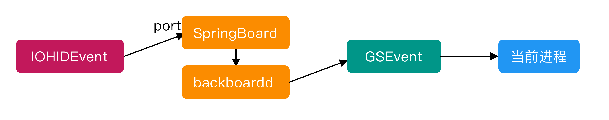

> 注：
>
> 网上之前有大量文章说 IOHIDEvent 经过 SpringBoard 中转后，仍是以 IOHIDEvent 被传递给当前的应用程序，但我对这一点表示怀疑，因为 SpringBoard 分发的 UI 事件应该是以 GSEvent 的形式（除了极少数如陀螺仪、磁力计事件）。
>
> 与此同时，GSEvent 也比 IOHIDEvent 包含更多的信息（参考 [IOHIDEvent.h](https://opensource.apple.com/source/IOHIDFamily/IOHIDFamily-308/IOHIDFamily/IOHIDEvent.h.auto.html) 和 [GSEvent.h](https://github.com/kennytm/iphone-private-frameworks/blob/master/GraphicsServices/GSEvent.h)），也包含直接计算 CGPoint 等的方法，所以推测它应该是更高一级的封装。
>
> 但实际上关于 IOHIDEvent 到 GSEvent 的封装，这里我查了很多资料，但是没有找到特别明确说明这个流程的文章，上述观点只是根据大量查阅到的资料归纳而成。大家如果有了解的，可以互相交流~


## 第三步：Run Loop

### RunLoop 机制

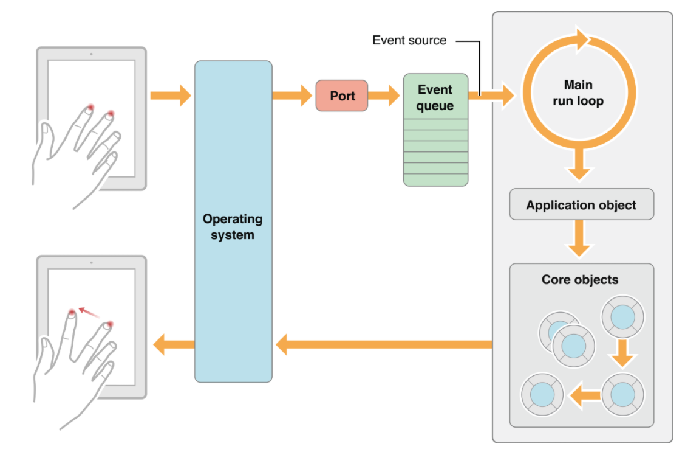

一般对于一个进程来说，一个线程一次只能对应一个任务，执行完成后线程就会退出。但这种单一事件的模式不适合系统对于手势的响应，这时候就需要 Event Loop 的模型，在 iOS 中就是 Run Loop。

> Event Loop 是一种常见的设计模式，Run Loop 本质上也是 event loop。

在 app 中，每一个线程都会依附一个 Run Loop，而主线程的 Run Loop 就是所谓的 main event loop，而它的最主要特点之一在于它会接收并处理底层操作系统产生的触摸事件。底层触摸事件会被操作系统分发进入一个事件处理队列 Event queue，按照先进先出 FIFO 的规则被主线程 Run Loop 处理。

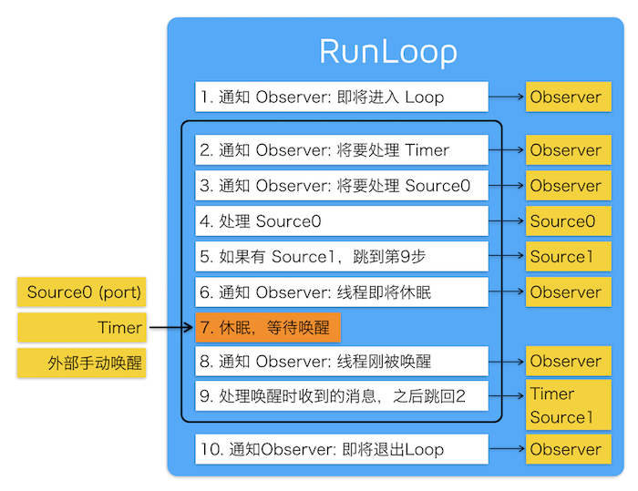

一个 app 启动后，会开启主线程 Run Loop，之后触摸事件就会被 Run Loop 上的 input source 接收，之后 app 会将这个触摸事件转换成对应的对象，对于 iOS 是 UIEvent，而对于 OS X 是 NSEvent。

> What distinguishes the main event loop is that its primary input source receives events from the operating system that are generated by user actions—for example, tapping a view or entering text using a keyboard. 

而主线程 Run Loop 和其他线程 Run Loop 的最主要区别之一就是，主线程 Run Loop 上的 input source 可以接收操作系统检测并生成的交互操作（比如点击 View 或者使用键盘）。

### Run Loop 监听事件

Run Loop 中的 CFRunLoopSourceRef 类负责触发事件，它有两个版本，Source0 和 Source1：

* Source0 包含一个回调函数（实际上是一个指针），负责通过回调函数向应用层传递事件。它并不能主动触发事件，Source0 被标记后需要唤醒 RunLoop 才能处理这个事件。
* Source1 同样包含一个回调函数（指针），同时也包含一个 mach port 端口。由于内核通信都通过 Mach 消息在 port 之间传递，所以 Source1 会负责接收内核的事件，同时通过回调函数唤醒 Run Loop。

如果我们给 Xcode 添加一个` __IOHIDEventSystemClientQueueCallback` 的符号断点，我们就可以发现一些端倪：

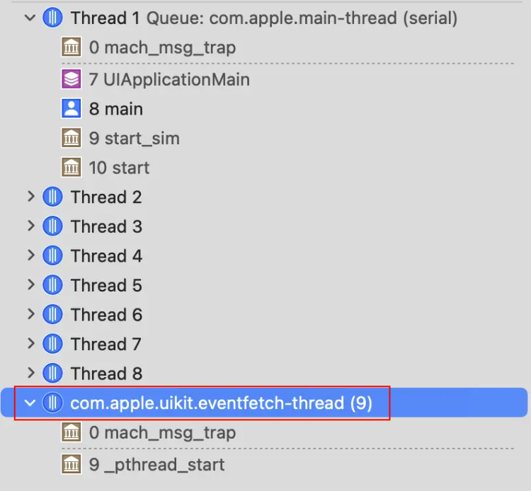

实际上，app 启动后会开启一个 com.apple.uikit.eventfetch-thread 的子线程，这个子线程会注册一个 source1，用于接收来自 backboardd 的 GSEvent 事件。而他的回调函数名字就是：`__IOHIDEventSystemClientQueueCallback`。

而主线程 RunLoop 中注册了一个 source0 事件，其回调函数就是 `__eventQueueSourceCallback`，这个函数会负责将 GSEvent 包装转化成 UIEvent，成为后续一系列我们熟知的流程的基础。

当我们窥探 UIKitCore 的私有头文件，找到 UIEvent.h（[xybp888/iOS-Header - UIEvent.h](https://github.com/xybp888/iOS-Header/blob/master/13.0/PrivateFrameworks/UIKitCore.framework/UIEvent.h)）时，我们不难发现 UIEvent 中有一个初始化方法，也能佐证 GSEvent 与 UIEvent 之间的关系：

```
- (id)_initWithEvent:(struct __GSEvent *)arg1 touches:(id)arg2;
```

因此整个流程就较为清楚了，backboardd 会将 GSEvent 通过特定 port 通知到当前 app 进程的 eventfetch-thread 子线程（source1），而 eventfetch-thread 会将主线程 RunLoop 中的 source0 事件标记为 pending 状态。而此 source0 负责 UIEvent 的封装与分发。


## 第四步：UIApplication

UIApplication 是一个 iOS app 的核心，app 启动时系统就会调用 UIApplicationMain 方法，从而创建一个 UIApplication 的单例（这也是第一个被创建的对象）。这个单例对象会处理最初的用户事件，分发消息，以及管理 UIView 视图层级。

如下图所示，UIApplication 对象也负责管理 Main Event Loop，也就是前文第三步中负责接收系统消息的主线程 Run Loop，因此这里就是连接底层操作系统与上层 app 之间的枢纽。UIApplication 中也有一个 `sendEvent:`，负责将 UIEvent 事件分发传递给最合适的响应者，所有操作系统传递来的 UIEvent 触摸事件，都会通过这个方法进行分发调度。

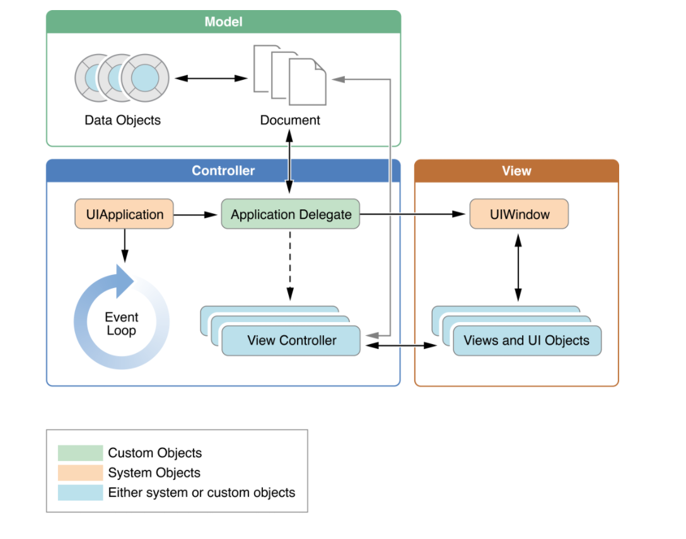

与此同时 UIApplication 也声明了一个协议 UIApplicationDelegate，当 app 接收到一些系统层级的重要 runtime 事件，比如启动、低内存提醒、app 中断、系统通知等，就会通知到相关的方法。以及 UIApplication 会要求 app 提供一个 UIWindow，作为所有视图层级的根节点。

因此可以明确的看到 UIEvent 从系统底层传递给 app 的具体路径：UIApplication 在 app 启动时被创建，同时开启并管理了主线程 Run Loop，在触摸事件发生时接收 UIEvent 事件信息，调用 `sendEvent:` 方法，通过 UIApplicationDelegate 传递给根节点处的 UIWindow 以及下层其他的 UIView。

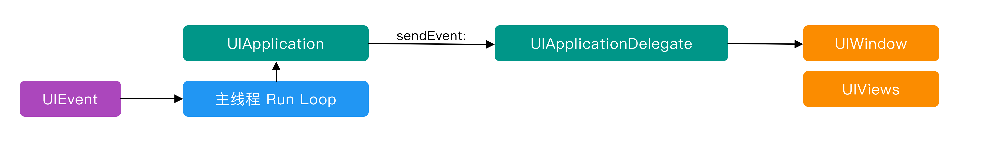


## 第五步：App 内的事件传递

这部分就到了大家熟悉的阶段了，本文也就先到此为止了~

最后，本文中有不少细节网上的资料相对较少，如果大家有更深入的了解，欢迎留言交流。


## 参考文献

- [计算机组成原理——原理篇 IO（上）- 小萝卜鸭](https://www.cnblogs.com/wwj99/p/12852344.html)
- [Projected-Capacitive Touch Technology](http://large.stanford.edu/courses/2012/ph250/lee2/docs/art6.pdf)
- [Apple - IOKit-fundamentals](https://developer.apple.com/library/archive/documentation/DeviceDrivers/Conceptual/IOKitFundamentals/Introduction/Introduction.html)
- [Apple - IOKit Fundamentals - I/O Kit Family Reference](https://developer.apple.com/library/archive/documentation/DeviceDrivers/Conceptual/IOKitFundamentals/Families_Ref/Families_Ref.html#//apple_ref/doc/uid/TP0000021-BABCCBIJ)
- [PhoneWiki - IOHIDFamily](https://iphonedev.wiki/index.php/IOHIDFamily)
- [深入浅出iOS系统内核（1）— 系统架构 — darcy87)](https://www.jianshu.com/p/029cc1b039d6)
- [PhoneWiki - GSEvent](https://iphonedevwiki.net/index.php/GSEvent)
- [PhoneWiki - backboardd](https://iphonedev.wiki/index.php/Backboardd)
- [Chapter 4. Event Handling and Graphics Services](https://www.oreilly.com/library/view/iphone-open-application/9780596155346/ch04.html)
- [Apple - main event loop](https://developer.apple.com/library/archive/documentation/General/Conceptual/Devpedia-CocoaApp/MainEventLoop.html)
- [深入理解RunLoop - ibireme](https://blog.ibireme.com/2015/05/18/runloop/)
- [xybp888/iOS-Header - UIEvent.h](https://github.com/xybp888/iOS-Header/blob/master/13.0/PrivateFrameworks/UIKitCore.framework/UIEvent.h)
- [iOS App Life Cycle - Xiao Jiang](https://medium.com/@neroxiao/ios-app-life-cycle-ec1b31cee9dc#:~:text=The%20Main%20Run%20Loop,on%20the%20app's%20main%20thread.)
- [iOS 从源码解析Run Loop (九) ](https://juejin.cn/post/6913094534037504014)
- [iOS RunLoop应用分析—原来这些都在使用RunLoop](https://juejin.cn/post/7056282331132198919)
