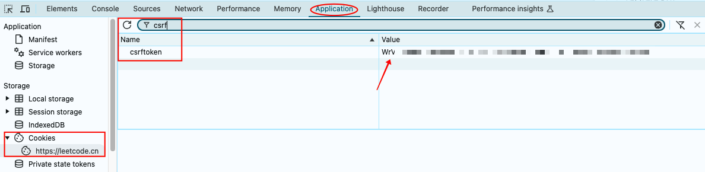

# LeetCode 规避限制，创建新进度方法

> 2025.02.17 测试有效


## 背景

众所周知，LeetCode 中进度是非常好用的一个功能。就我个人而言，每次求职准备阶段，都会开启一个新的进度，用于隔离之前的刷题记录。


Round1 是我秋招面试的准备，而 Round2 是我第一次社招跳槽时的刷题记录。如今又准备新一轮的跳槽了，所以迫切需要开启一个新的进度，然而此时却悲催地发现：


竟然暂时不支持创建新的进度了！据说是为了限制共享账号的情况，不过目前（2025.02.17）仍有绕过限制，创建进度的方法。


## 创建新进度方法

首先，获取 LeetCode 网站的 csrftoken。需要打开 Chrome 浏览器的 Inspect 面板，在 Application 下找到 Cookies，然后搜索 csrftoken，存下对应的 Value



然后切换到 Console Tab，输入下面的命令。注意将 csrftoken 替换为刚才复制的 value，以及修改你想要创建的进度的名字：

```
const options = {
    headers: {
        "content-type": "application/json",
        "x-csrftoken": "(PUT YOUR CSRF TOKEN HERE)",
        "x-requested-with": "XMLHttpRequest"
    },
    body: JSON.stringify({
        func: "create",
        name: "(PUT YOUR SESSION NAME HERE)"
    }),
    method: "PUT"
};
```


然后按回车执行。下一步再执行这行代码，就大功告成了！

```
fetch("https://leetcode.cn/session/", options)
```


最终效果：（点击一下进度名字，即可切换当前的进度）

