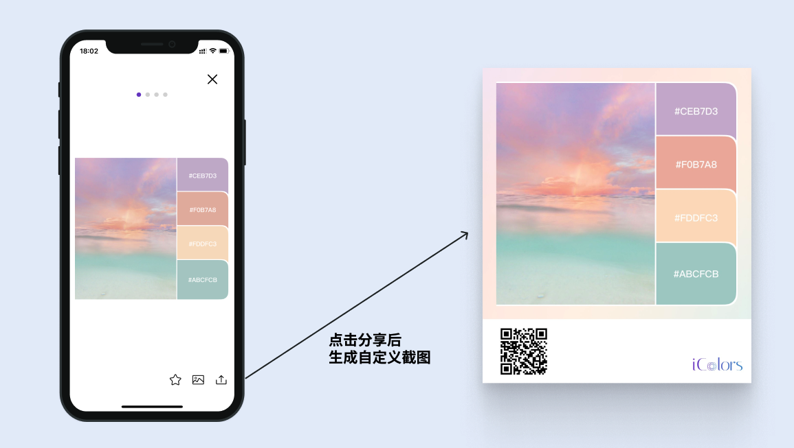
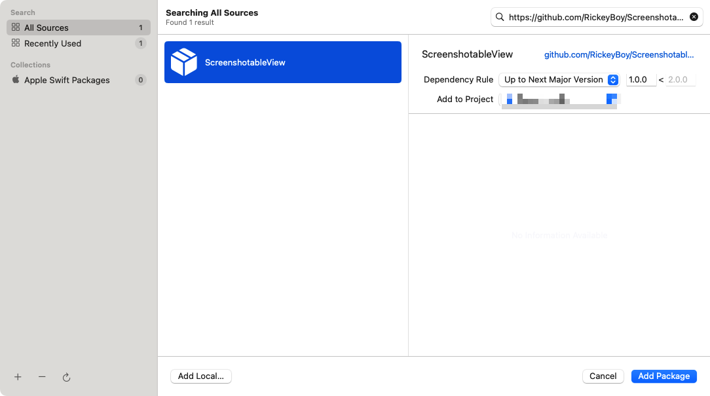
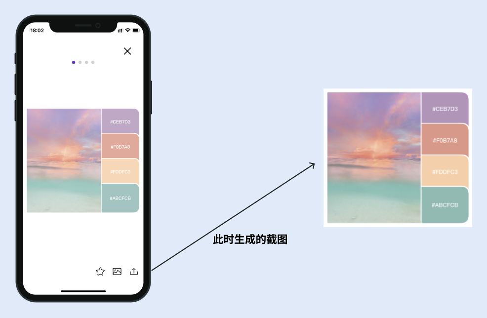
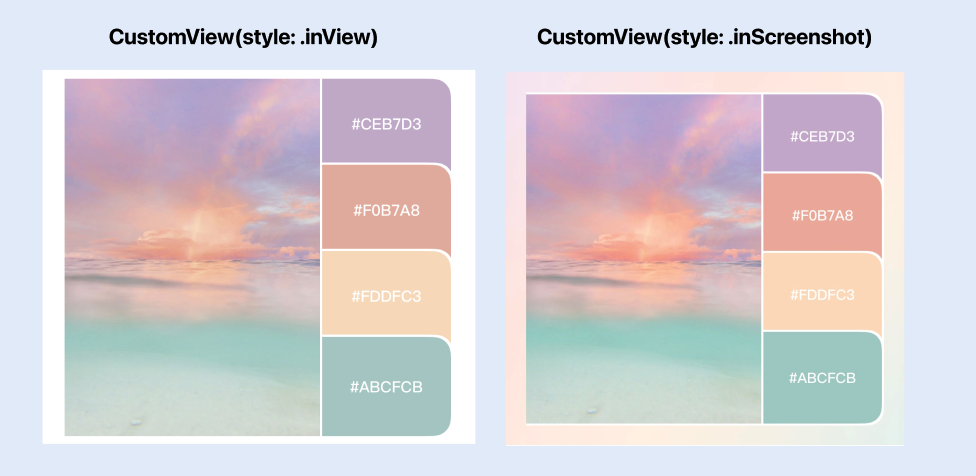
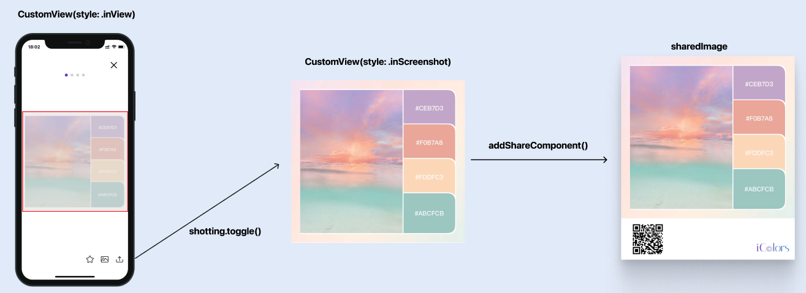

# SwiftUI 轻量级自定义截图组件（使用篇）


## 快速说明

- 介绍：SwiftUI 中，支持自定义截图的 View

- 仓库地址：[RickeyBoy/ScreenshotableView](https://github.com/RickeyBoy/ScreenshotableView)


## 案例演示

在 app 开发过程中，我们经常需要用到截图的功能，比如一个典型场景就是做【分享/保存图片】功能。

如下图所示，我们想要依赖已有的 UI，快速生成一个分享图，用 [RickeyBoy/ScreenshotableView](https://github.com/RickeyBoy/ScreenshotableView) 就能快速实现了。




## 实现步骤

### 1. 引入组件

使用 Swift Package Manager 引入工程即可，非常方便

> 通过 Xcode `File > Swift Packages > Add Pacage Dependency...`，再输入 `https://github.com/RickeyBoy/ScreenshotableView` 搜索添加




### 2. 添加截图按钮

首先，我们假设我们已经实现了一个页面的样式（基于 SwiftUI 是非常容易画 UI 的）。我们将中间的部分看做一个整体，命名为 CustomView：


那么这里的页面布局就非常简单了：

```swift
var body: some View {
  VStack {
    ... // Headers
    
    CustomView()
    
    ... // Tab buttons
  }
}
```

不同于 Objective C 和 Swift 中手动添加 Action 的方式，SwiftUI 需要通过 `@State` 关键字的变量，来绑定截图状态。所以我们在引入 ScreenshotableView 后，需要添加标记位，来实现截图的功能。

在想要截图时，直接调用 shotting.toggle() 就行了。

```swift
var body: some View {
  @State var shotting = false
  
  VStack {
    ... // Headers
    
    ScreenshotableView(shotting: $shotting) { screenshot in
        // 返回 screenshot 截图
    } content: {
        // 原有的 CustomView 内容
        CustomView()
    }
    
    ... // Tab buttons
  }
  
  func screenshot() {
    // 触发截图
    shotting.toggle()
  }
}
```

此时，如果直接输出截图的图片结果 `screenshot`，就会直接得到一张和 CustomView 一模一样的图片：




### 3. 实现自定义样式

如何实现展示效果 vs 截图效果的不同？ScreenshotView 其实提供了非常便捷的实现方式，在 block 中可以直接捕获到 `style`，包含 `inView` 和 `inScreenshot` 两个枚举类型，分别代表展示效果、截图效果。我们将参数透传给 Custom 即可：

```swift
var body: some View {
  @viewBuilder
  func CustomView(style: ScreenshotableViewStyle) -> some View {
    if style == .inView {
      // 展示时使用白色背景
			content
      	.background(.white)
    } else {
      // 截图时使用自定义的渐变色背景
      content
        .background {LinearGradient(...)}
		}
  }
}
```




### 4. 给截图添加底部额外信息

通过截图组件，我们能够拿到截图后回调的图片。那么就可以直接做一个简单的拼接，就可以得到最终的结果图了：

```swift
extension UIImage {
  /// 拼接分享底部 banner
  func addShareBanner() -> UIImage {
    // 资源图片
    let qrCodeImage = UIImage(named: "AppQRCode")!
    let logoImage = UIImage(named: "Logo")!
    // 参数
    let bannerHeight: CGFloat = 92 /// 新增 banner 的高度
    let newImageSize = CGSize(width: self.size.width, height: self.size.height + bannerHeight)
    // 新增画布
    UIGraphicsBeginImageContextWithOptions(newImageSize, false, UIScreen.main.scale)
    // 绘制原本的 Image
    self.draw(at: CGPoint.zero)
    // 绘制二维码
    let qrCodeRect = CGRect(origin: CGPoint(x: 24, y: self.size.height + 10), size: CGSize(width: 72, height: 72))
    qrCodeImage.draw(in: qrCodeRect)
    // 绘制 Logo
    let logoSize = CGSize(width: 74, height: 30)
    let logoRect = CGRect(origin: CGPoint(x: newImageSize.width - 12 - logoSize.width, y: newImageSize.height - 12 - logoSize.height), size: logoSize)
    logoImage.draw(in: logoRect)
    // 生成
    let image = UIGraphicsGetImageFromCurrentImageContext()
    UIGraphicsEndImageContext()
    return image ?? self
  }
}
```

我们只需要在回调中进行处理，就能得到我们最终的分享图了：

````swift
```swift
var body: some View {
  @State var shotting = false
  
  VStack {
    ... // Headers
    
    ScreenshotableView(shotting: $shotting) { screenshot in
      // 返回 screenshot 截图
      sharedImage = screenshot.addShareComponent()
    } content: { style in
      // 原有的 CustomView 内容
      CustomView(style: style)
    }
    
    ... // Tab buttons
  }
  
  func screenshot() {
    // 触发截图
    shotting.toggle()
  }
}
```
````

