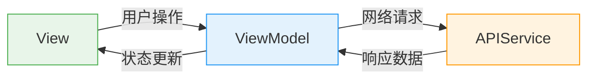

# SwiftUI 如何实现 Infinite Scroll？

> 面试题：用 SwiftUI 实现一个无限滚动列表，支持分页加载。

这道题我在面试中遇到过好几次，说实话第一次答的时候以为随便写个 `LazyVStack` + `onAppear` 就完事了。后来才发现，面试官真正想考的不是你会不会用 API，而是你对状态管理、性能优化、Task 生命周期这些东西到底理解多深。

我的思路是**从最简方案出发，一步步暴露问题、一步步优化**。在开始写代码之前，先聊一下架构选型。

## 为什么选 MVVM？

先说一下 SwiftUI 里常见的架构选择。MVC 就不聊了，那是 UIKit 时代的标配，Controller 跟 UIKit 强耦合，到了 SwiftUI 里根本没有 `UIViewController` 这个角色，MVC 自然也就退出舞台了。

SwiftUI 里最常见的架构，从简单到复杂大概是这么几个：

| 架构 | 特点 | 适合场景 |
|---|---|---|
| **MV（Model-View）** | 没有 ViewModel，状态直接放 View 里，Apple 官方示例的典型写法 | 逻辑简单的页面 |
| **MVVM** | 抽出 ViewModel 管理状态和逻辑，SwiftUI 里最主流的选择 | 中等复杂度，需要可测试性 |
| **TCA** | 单向数据流，State + Action + Reducer + Effect，强约束 | 大型项目，需要严格的状态管理 |

其中 MV 是最基础的，逻辑简单的页面，`@State` 往 View 里一放就完事了，Apple 自己的 WWDC 示例大量都是这么写的。但 infinite scroll 涉及分页状态、加载状态、错误处理、Task 生命周期管理这些东西，全塞 View 里会很乱。抽一个 ViewModel 出来专门管理这些状态，View 只负责渲染和转发用户操作，职责就清晰多了。

所以这道题用 MVVM 是最合适的，**不是因为 MVVM 最好，而是这个场景的复杂度刚好适合**。并且采用 MVVM 结构规整，可拓展性也强，从面试回答的角度来讲也是正好的。

而 SwiftUI 天然就鼓励这种模式，`@Observable` 本身就是 binding 机制，ViewModel 状态一变，View 自动更新，不需要手动同步。我们后面的代码就是按这个思路来的。

## 一、最小可用版本

先写一个能跑的最简版本。

核心思路很简单：`LazyVStack` 只在 item 即将可见时才实例化 View，我们利用 `onAppear` 检测"最后一个 item 出现了"，然后触发下一页请求。

### Model

```swift
struct Item: Identifiable, Equatable {
    let id: String
    let title: String
}

struct PageInfo {
    let endCursor: String?
    let hasNextPage: Bool
}
```

### ViewModel

```swift
@MainActor @Observable
final class ItemListViewModel {
    private(set) var items: [Item] = []
    private var pageInfo: PageInfo?

    func loadNextPage() async {
        let response = try? await APIService.fetchItems(after: pageInfo?.endCursor)
        guard let response else { return }
        items.append(contentsOf: response.items)
        pageInfo = response.pageInfo
    }
}
```

### View

```swift
struct ItemListView: View {
    @State private var viewModel = ItemListViewModel()

    var body: some View {
        ScrollView {
            LazyVStack {
                ForEach(viewModel.items) { item in
                    ItemRow(item: item)
                        .onAppear {
                            if item == viewModel.items.last {
                                Task { await viewModel.loadNextPage() }
                            }
                        }
                }
            }
        }
        .task { await viewModel.loadNextPage() }
    }
}
```

代码很短，逻辑也直白：

1. 每当最后一个 item 出现在屏幕上，就触发 `loadNextPage()`
2. `loadNextPage()` 请求后台去 fetch，拿到数据然后塞进 items 中
3. View 检测到有更新，自动刷新页面

一句话总结：最后一个 item onAppear 的时候，就进行请求。

### 1.1 分页方式：cursor vs offset

可能有同学会问：为什么 `fetchItems(after: cursor)` 用的是 cursor，而不是传统的 `page` 或 `offset`？

分页一般有两种方式：

- **Offset-based**：`fetchItems(page: 3, size: 20)`，按页码或偏移量取数据
- **Cursor-based**：`fetchItems(after: "abc123")`，传上一页最后一条的标识，从那里往后取

对于 infinite scroll 这种场景，cursor-based 更合适。详细对比一下：

|  | Cursor-based | Offset-based |
|---|---|---|
| **数据一致性** | 不受中间插入/删除影响 | 插入新数据会导致重复或遗漏 |
| **性能** | 数据库只需定位到 cursor 后续 | 大 offset 需要 skip N 行 |
| **适用场景** | 实时 feed、社交流 | 固定数据集、后台管理列表 |

简单来说，cursor-based 更适合"数据随时在变"的场景（比如社交 feed），offset-based 更适合"数据基本不变"的场景（比如后台管理列表）。infinite scroll 的数据通常是动态的，所以用 cursor-based。

### 1.2 `LazyVStack` vs `List`

可能有同学会问：为什么用 `LazyVStack` 而不是 `List`？

先说浅显的回答：`LazyVStack` 布局更自由，没有 `List` 自带的分割线、背景色、cell 样式这些限制，适合高度自定义的 UI。而 `List` 开箱即用，自带滑动删除、拖拽排序这些交互，适合标准列表场景。

当然，如果想要深入回答，还有可以继续。二者还有一个关键区别其实是**内存模型**：

|  | LazyVStack | List |
|---|---|---|
| **View 回收** | ❌ 不回收，创建后常驻内存 | ✅ 内部回收机制 |
| **内存增长** | 随滚动距离线性增长 | 基本恒定 |
| **自定义布局** | 完全自由 | 受限于 List 样式 |
| **万级数据** | 可能有内存压力 | 表现更好 |

为什么会有这个区别？因为它们底层的实现不一样。`List` 底层是基于 `UICollectionView`（iOS 16 之前是 `UITableView`），天然有 cell 回收复用机制，滚出屏幕的 cell 会被回收，滚入时再复用，所以内存占用基本恒定。而 `LazyVStack` 底层只是一个普通的布局容器，"Lazy" 的意思是**延迟创建**，item 滚入可见区域时才创建 View，但创建之后就一直留在内存里，不会回收。

所以如果列表数据量很大（比如社交 feed 那种上万条的），`List` 在内存上更有优势。如果需要高度自定义的 UI，那就用 `LazyVStack`，但要心里有数：用户滚得越远，内存占用越大。

### 1.3 为什么加 `@MainActor`？

上面的 ViewModel 代码加了 `@MainActor`，这个很容易被忽略但其实很关键。

`@Observable` 本身**不会自动保证在主线程更新状态**。而我们的 `loadNextPage()` 是在 `Task` 里通过 `await` 拿数据，`await` 之后的代码在哪个线程执行是不确定的。如果恰好在后台线程执行了 `items.append(...)`，SwiftUI 收到状态变更通知后会在后台线程刷新 UI，这就会导致紫色警告（"Publishing changes from background threads is not allowed"）甚至崩溃。

加上 `@MainActor` 之后，这个类的所有属性访问和方法调用都会被隔离到主线程，从根源上避免线程安全问题。

另外补充一下：Swift 6.2（Xcode 26）引入了模块级别的 `Default Actor Isolation` 设置，可以把整个模块的默认隔离改为 `MainActor`，开启之后所有类型都默认跑在主线程，不用再手动加 `@MainActor`。但这是一个 opt-in 的设置，默认值还是 `nonisolated`，而且不是所有项目都会立刻升级。所以目前来说，显式写 `@MainActor` 仍然是更稳妥的做法。

### 1.4 几个小细节

有几个代码细节，不影响功能，但代码质量会好不少，属于面试加分项。

**`private(set)` 控制可见性**

`items` 用 `private(set)` 修饰，外部只能读不能写。这样 View 就没法直接改 `items`，所有数据变更都必须经过 ViewModel 的方法，数据流向是单向的。这个习惯在 MVVM 里很重要，不然 View 和 ViewModel 的职责边界很容易模糊。

**让 Item 遵循 `Equatable`**

上面的代码里 `Item` 已经加了 `Equatable`，所以判断"是不是最后一个"可以直接写 `item == viewModel.items.last`，不用绕一圈去比 `id`。后面加叠加更多功能的时候也可以用，代码更简洁。

**`.task` = `.onAppear` + `Task`**

View 里首次加载用的是 `.task { await viewModel.loadNextPage() }`，这其实等价于在 `.onAppear` 里手动创建一个 `Task`。但 `.task` 有个好处：**当 View 消失时会自动 cancel 这个 Task**。手动写 `Task {}` 的话你得自己管 cancel，容易漏掉，所以首次加载优先用 `.task`。

## 二、防重复请求

上一个最基础的版本，有个明显的问题：**快速滚动时 `onAppear` 有可能会被多次触发**，导致同一页被重复请求了。

怎么解决？思路也很直接：加一个 `isLoading` 标记 + `hasNextPage` 判断，双重 guard，然后通过这些属性来判断是否需要发送请求。

```swift
@MainActor @Observable
final class ItemListViewModel {
    private(set) var items: [Item] = []
    private(set) var isLoading = false
    private var pageInfo: PageInfo?

    var canLoadMore: Bool {
        guard let pageInfo else { return items.isEmpty } // 首次加载
        return pageInfo.hasNextPage && !isLoading
    }

    func loadNextPage() async {
        guard canLoadMore else { return }
        isLoading = true
        defer { isLoading = false }

        let response = try? await APIService.fetchItems(after: pageInfo?.endCursor)
        guard let response else { return }
        items.append(contentsOf: response.items)
        pageInfo = response.pageInfo
    }
}
```

`canLoadMore` 这个 computed property 干了两件事：

- 没有下一页时不请求（通过后端返回的 `pageInfo.hasNextPage` 来判断）
- 正在加载时不重复请求（通过 `isLoading` 来判断）

### 2.1 小细节

**`defer` 管理状态翻转**

注意 `isLoading` 的写法：开头设为 `true`，然后紧接着 `defer { isLoading = false }`。这样不管后面是正常返回还是提前 `return`，`isLoading` 都会被重置回 `false`。

如果不用 `defer`，你就得在每个 `return` 之前手动加一句 `isLoading = false`，路径一多很容易漏掉，漏掉的后果就是列表永远卡在 loading 状态，再也加载不了下一页。

**`canLoadMore` 作为 computed property**

把"能不能加载"的判断收到一个 computed property 里，而不是在 `loadNextPage()` 里写一堆 `if`。好处是逻辑集中，后面要加新条件（比如错误状态下不加载）直接改这一个地方就行，调用方不用动。

## 三、提前预加载：Threshold Prefetch

目前的逻辑是"最后一个 item 出现了才开始加载"，那么用户的感受就是：**滚到底 → 停顿 → 等数据 → 新数据出现**。那个停顿虽然可能只有几百毫秒，但体感上还是挺明显的。

怎么办？**提前触发。** 不等最后一个 item，而是在还剩 N 个 item 时就开始加载下一页。

```swift
// View
ForEach(viewModel.items) { item in
    ItemRow(item: item)
        .onAppear { viewModel.onItemAppear(item) } // View 层仅透传，将逻辑交给 ViewModel
}

// ViewModel，新增 prefetch threshold
private let prefetchThreshold = 5

func onItemAppear(_ item: Item) {
    guard let index = items.firstIndex(of: item),
          index >= items.count - prefetchThreshold else { return } // 判断是否该加载下一页了
    Task { await loadNextPage() }
}
```

这样一来，用户还剩 5 个 item 可以滚的时候，网络请求就已经在跑了，等滚到底部时，数据大概率已经回来了，体验上就是"无缝衔接"。

那 threshold 到底设多少合适？这个纯属经验值，根据具体的数据量、UI 复杂度都相关，5 只是一个经验值。总的来讲就是一个 trade-off：

- **threshold 太小**：快速滚动还是会看到停顿
- **threshold 太大**：用户可能只看前几条就走了，白白浪费请求

## 四、Task 取消 + 错误处理

到这里基本功能已经没问题了。接下来聊聊 **Task 生命周期管理和错误恢复**，这部分在面试里属于加分项。

### 4.1 Task 取消

为什么需要管理 Task 取消？我们目前的例子中，单一列表的情况可能不需要考虑。但是如果是搜索页面的列表，或者叠加筛选功能，问题就复杂了。

举个具体的例子：

1. 用户在搜索页搜"咖啡"，然后在列表页向下滑动，触发了一个 `loadNextPage` 的请求 A
2. 还没等数据回来，用户改成搜"奶茶"，请求 B 又发出去了
3. 这时候网络上同时有两个请求在跑。如果请求 B 先于 A 回来，那么等请求 A 回来的时候，用户就会发现明明搜索的是“奶茶”，但是却又展示了不少“咖啡”内容。

这种 bug 不是每次都能复现（取决于网络时序），但一旦出现用户会很困惑，所以解决方式就是：**发新请求前先 cancel 旧的，被 cancel 的任务即便返回了 response 也不处理**。

```swift
@MainActor @Observable
final class ItemListViewModel {
    private(set) var items: [Item] = []
    private(set) var isLoading = false
    private(set) var error: Error?
    private var pageInfo: PageInfo?
    private var loadTask: Task<Void, Never>? // 💾 持有当前请求的引用

    func loadNextPage() {
        guard canLoadMore else { return }
        loadTask?.cancel() // ❌ 发新请求前，先 cancel 旧的
        isLoading = true

        loadTask = Task { [weak self] in // 🔒 weak self 防止循环引用
            guard let self else { return }
            defer { self.isLoading = false }

            do {
                let response = try await APIService.fetchItems(after: pageInfo?.endCursor)
                guard !Task.isCancelled else { return } // 🛡️ 被 cancel 了就不写入
                self.items.append(contentsOf: response.items)
                self.pageInfo = response.pageInfo
                self.error = nil
            } catch {
                guard !Task.isCancelled else { return } // 🛡️ 同上
                self.error = error
            }
        }
    }

    func reset() {
        loadTask?.cancel() // ❌ 先 cancel，再清空
        items = []
        pageInfo = nil
        isLoading = false
        error = nil
    }

    // ...
}
```

### 4.2 错误重试

错误处理其实是一个很容易被忽略，同时也非常复杂的事情。这里我们的方案是当出现错误的时候，展现一个重试按钮。从 UI 的角度来讲不好看，但实际上面试阶段时间有限，能够展示出有错误处理的思维就可以了。

```swift
@MainActor @Observable
final class ItemListViewModel {
    // ...
    private(set) var error: Error?

    func retry() {
        error = nil
        loadNextPage()
    }
}
```

```swift
// View — 列表底部
if viewModel.error != nil {
    RetryButton { viewModel.retry() }
} else if viewModel.isLoading {
    ProgressView()
}
```

### 4.3 空状态处理

还有一个容易忽略的边界情况：首次加载完成后，后端返回了 0 条数据。

当前的代码里，`items` 为空有两种可能：一种是"还在加载第一页"，另一种是"加载完了但确实没数据"。如果不区分这两种状态，用户看到的就是一片空白，不知道是在等数据还是真的没有内容。

处理方式也很简单，加一个 computed property 判断一下：

```swift
var isEmpty: Bool {
    !isLoading && items.isEmpty && error == nil && pageInfo != nil
}
```

这里的关键是 `pageInfo != nil`，说明至少请求过一次了（首次加载前 `pageInfo` 是 `nil`）。四个条件同时满足，才说明"确实没数据"。

View 里对应的处理：

```swift
if viewModel.isEmpty {
    ContentUnavailableView("暂无数据", systemImage: "tray")
} else if viewModel.isLoading && viewModel.items.isEmpty {
    ProgressView() // 首次加载中
} else {
    // 正常的列表内容
}
```

这样用户就能清楚地区分"加载中"和"没有数据"这两种状态了。

### 4.4 用 enum 收敛 View 状态

到这里你会发现，View 层需要处理的状态越来越多：首次加载中、有数据、空数据、出错。如果全用 `if/else if` 判断，条件一多很容易写乱，漏掉某个分支也不会有编译器提醒。

可以定义一个 enum 来收敛这些状态：

```swift
enum ViewState {
    case initialLoading    // 首次加载中
    case loaded            // 有数据，正常展示列表
    case empty             // 加载完了但没数据
    case error(String)     // 出错了
}
```

然后在 ViewModel 里加一个 computed property，从现有属性推导出当前的 View 状态：

```swift
var viewState: ViewState {
    if let error, items.isEmpty {
        return .error(error.localizedDescription)
    }
    if isLoading && items.isEmpty {
        return .initialLoading
    }
    if isEmpty {
        return .empty
    }
    return .loaded
}
```

注意这里的关键：**`ViewState` 是 computed property，不是存储属性**。底层的数据源还是 `isLoading`、`items`、`error`、`pageInfo` 这些独立属性，`viewState` 只是把它们组合成 View 更容易消费的形式。这样既不会出现之前 `LoadingState` enum 耦合状态的问题，又让 View 的代码变得很干净：

```swift
var body: some View {
    Group {
        switch viewModel.viewState {
        case .initialLoading:
            ProgressView()
        case .empty:
            ContentUnavailableView("暂无数据", systemImage: "tray")
        case .error(let message):
            ErrorView(message: message) { viewModel.retry() }
        case .loaded:
            ScrollView {
                LazyVStack(spacing: 0) {
                    ForEach(viewModel.items) { item in
                        ItemRow(item: item)
                            .onAppear { viewModel.onItemAppear(item) }
                    }
                    loadingFooter
                }
            }
        }
    }
    .task { viewModel.loadNextPage() }
}
```

用 `switch` 替代 `if/else if`，每个分支对应一种状态，漏掉任何一个编译器都会报错。用 `Group` 包裹 switch 是为了能在外层挂 `.task` 触发首次加载。

## 五、完整代码

前面一步步拆解完了，最后把所有东西整合到一起。先看一下整体架构：



View 只管渲染和转发用户操作，ViewModel 管状态和请求编排，APIService 做实际的网络调用。数据流向是单向的：用户操作 → ViewModel 处理 → APIService 请求 → 数据回来更新状态 → View 自动刷新。

#### Model

```swift
struct Item: Identifiable, Equatable {
    let id: String
    let title: String
}

struct PageInfo: Equatable {
    let endCursor: String?
    let hasNextPage: Bool
}

struct PagedResponse {
    let items: [Item]
    let pageInfo: PageInfo
}
```

#### ViewState

```swift
enum ViewState {
    case initialLoading
    case loaded
    case empty
    case error(String)
}
```

#### ViewModel

```swift
@MainActor @Observable
final class ItemListViewModel {
    // MARK: - State

    private(set) var items: [Item] = []
    private(set) var isLoading = false
    private(set) var error: Error?

    // MARK: - Private

    private let prefetchThreshold = 5
    private var pageInfo: PageInfo?
    private var loadTask: Task<Void, Never>?

    // MARK: - Computed

    var canLoadMore: Bool {
        guard !isLoading else { return false }
        guard let pageInfo else { return items.isEmpty }
        return pageInfo.hasNextPage
    }

    var isEmpty: Bool {
        !isLoading && items.isEmpty && error == nil && pageInfo != nil
    }

    var viewState: ViewState {
        if let error, items.isEmpty {
            return .error(error.localizedDescription)
        }
        if isLoading && items.isEmpty {
            return .initialLoading
        }
        if isEmpty {
            return .empty
        }
        return .loaded
    }

    // MARK: - Trigger

    func onItemAppear(_ item: Item) {
        guard let index = items.firstIndex(of: item),
              index >= items.count - prefetchThreshold else { return }
        loadNextPage()
    }

    // MARK: - Actions

    func loadNextPage() {
        guard canLoadMore else { return }
        loadTask?.cancel()
        isLoading = true

        loadTask = Task { [weak self] in
            guard let self else { return }
            defer { self.isLoading = false }

            do {
                let response = try await APIService.fetchItems(after: pageInfo?.endCursor)
                guard !Task.isCancelled else { return }
                self.items.append(contentsOf: response.items)
                self.pageInfo = response.pageInfo
                self.error = nil
            } catch is CancellationError {
                // Task was cancelled, do nothing
            } catch {
                guard !Task.isCancelled else { return }
                self.error = error
            }
        }
    }

    func retry() {
        error = nil
        loadNextPage()
    }

    func reset() {
        loadTask?.cancel()
        items = []
        pageInfo = nil
        isLoading = false
        error = nil
    }
}
```

#### View

```swift
struct ItemListView: View {
    @State private var viewModel = ItemListViewModel()

    var body: some View {
        Group {
            switch viewModel.viewState {
            case .initialLoading:
                ProgressView()
            case .empty:
                ContentUnavailableView("暂无数据", systemImage: "tray")
            case .error(let message):
                ErrorView(message: message) { viewModel.retry() }
            case .loaded:
                ScrollView {
                    LazyVStack(spacing: 0) {
                        ForEach(viewModel.items) { item in
                            ItemRow(item: item)
                                .onAppear { viewModel.onItemAppear(item) }
                        }
                        loadingFooter
                    }
                }
            }
        }
        .task { viewModel.loadNextPage() }
    }

    @ViewBuilder
    private var loadingFooter: some View {
        if viewModel.error != nil {
            VStack(spacing: 8) {
                Text("加载失败")
                    .font(.caption)
                    .foregroundStyle(.secondary)
                Button("Retry") { viewModel.retry() }
                    .buttonStyle(.bordered)
            }
            .frame(maxWidth: .infinity)
            .padding()
        } else if viewModel.isLoading {
            ProgressView()
                .frame(maxWidth: .infinity)
                .padding()
        }
    }
}
```

## 总结

回顾一下整个思路：

1. **从简单方案说起** — `LazyVStack` + `onAppear` last item，先把原理讲清楚
2. **暴露问题并优化** — 重复请求 → guard；体验停顿 → threshold prefetch
3. **展示工程素养** — Task 取消、error handling、retry
4. **完整架构** — View 只渲染 + 转发，ViewModel 管状态 + 编排
