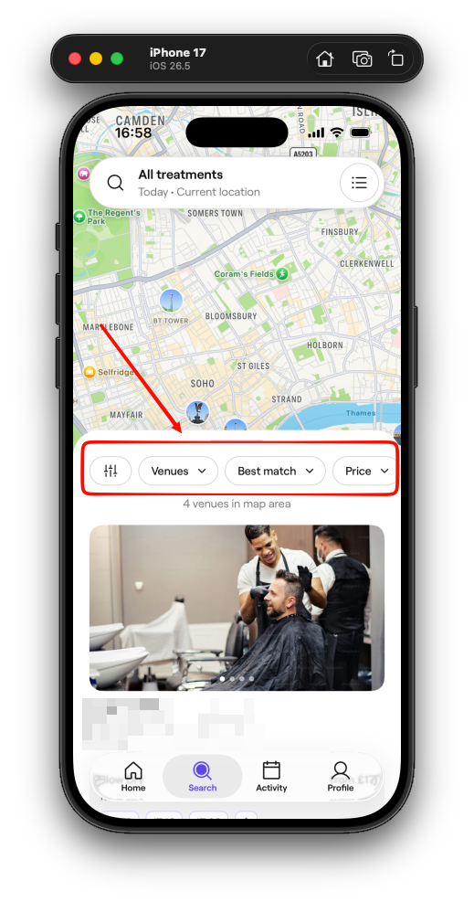
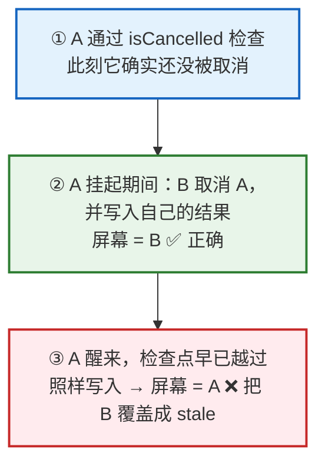
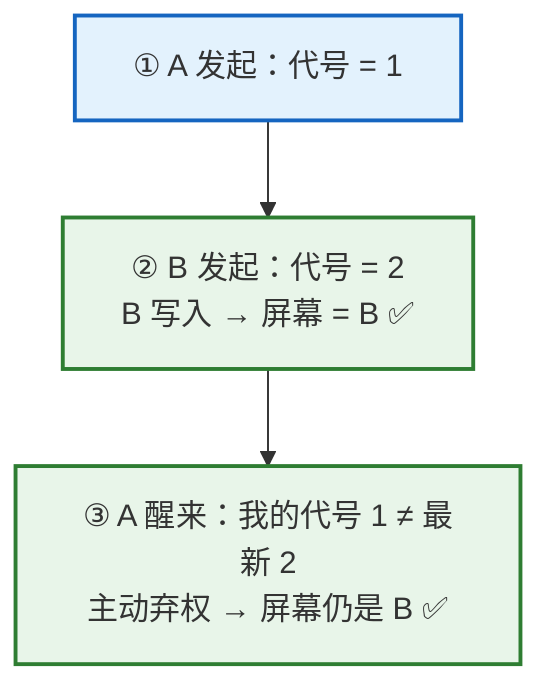

# 只靠 cancel 还不够：搜索分页里的 Latest-Wins 陷阱

> 这是 [《SwiftUI 如何实现 Infinite Scroll?》](../SwiftUI/infinite-scroll-best-practices.md) 的续集。上一篇聊无限滚动的时候，最后提到搜索 + 分页场景会有「串台」问题，当时给的方案是「发新请求前 `cancel()` 旧的，再配一个 `guard !Task.isCancelled` 兜底」。那套方案在简单的单列表里确实够用，但等这个列表长出了筛选、分页、地图之后，它就罩不住了 —— 而且里面还藏着一个比较隐蔽的时序漏洞。这篇就来把这个漏洞讲透，顺便给出一个更靠谱的解法。

先把结论撂这儿：**要真正做到「只有最新一次搜索能提交结果」（latest-wins），光靠 cancel 不够，还得给每次搜索发一个单调递增的「代号」（generation），提交前对一下代号，不是最新的就直接丢掉。**

至于为什么 cancel 不够、这个代号具体怎么用、翻页这种「往后追加」的场景又有什么额外的坑，咱们一点点来。

## 一、先复现：一个 cancel 也拦不住的 bug

先看看这个 bug 长什么样。下面是一个地图 + 列表的搜索页，顶上那排就是筛选、排序、价格这些控件：



> 图：搜索页顶部的筛选 / 排序栏（红框）。切换其中任意一项，都会发起一次全新的搜索。而下面的结果卡片、地图 pin，以及「4 venues in map area」这个计数，就是这次搜索要更新的东西。

场景很日常：

1. 用户在「理发店」这个筛选下发起了一次搜索，请求 A 出去了
2. 数据还没回来，用户改主意了，切成「健身房」，请求 B 又发出去了
3. 这时候网络上同时有两个请求在飞。偏偏 A 慢、B 快，B 先回来，屏幕正确地显示了健身房的结果
4. 然后 A 慢吞吞地回来了 —— 明明用户看的是健身房，列表里却混进了一堆理发店

而且不只是列表会错。这个页面的计数、地图上的 pin，全都会被 A 的旧数据一起覆盖掉。用户看到的画面是：**计数是新的、卡片是旧的、pin 又是另一套，三者对不上**。这种 bug 还不是每次都能复现（取决于 A 和 B 谁先回来），但一旦出现，用户是真的会懵。

眼熟吧？这其实就是上一篇结尾讨论过的那类「串台」—— 上篇用的是咖啡 / 奶茶的例子，换成理发店 / 健身房，道理一模一样。当时的方案是：发 B 之前先 `cancel()` 掉 A，再配一个 `guard !Task.isCancelled` 兜底，被取消的任务即便返回了数据也不写入。

```swift
func search(_ query: Query) {
    searchTask?.cancel()          // 发新请求前，先取消旧的
    searchTask = Task { [weak self] in
        guard let self else { return }
        let results = try await api.search(query)
        guard !Task.isCancelled else { return }   // 被取消了就不写入
        self.state = results
    }
}
```

在一个「单列表 + 单次请求」的场景里，这段代码其实没毛病：`guard` 紧跟在 `await` 后面、中间没有别的挂起点，检查和写入是连在一起的，不会被插队。

但现实里的搜索页没这么单纯 —— 它有筛选、有排序、有分页、有地图，好几条路径都在往同一份 state 里写。一旦复杂起来，你还是能压出串台。那问题到底出在哪？

## 二、为什么 cancel 不够：cooperative cancellation 的「提交窗口」

关键在于：**Swift 的任务取消是「协作式」的（cooperative cancellation）。**

`cancel()` 这个方法名有点唬人，听起来像是「啪」一下把任务掐断。但它做的事情其实特别克制 —— **它只是把这个 Task 的 `isCancelled` 标记位设成 `true`，仅此而已**。它不会打断正在执行的代码，也不会让卡在 `await` 上的请求立刻抛错返回。真正「取消」这件事，得靠任务自己在合适的时机去查 `isCancelled`（或者调用 `Task.checkCancellation()`），查到了才主动收手。

简单来说：cancel 是「通知」，不是「强制」。你通知了，但对方什么时候看、看不看，是另一回事。

问题就出在这个「什么时候看」上。真实的搜索流程，拿到数据之后往往还要再做点异步处理（二次请求、地理编码、组装地图数据……），也就是说 **检查点和最终写入 state 之间，还夹着别的 `await`**：

```swift
func search(_ query: Query) {
    searchTask?.cancel()
    searchTask = Task { [weak self] in
        guard let self else { return }
        let raw = try await api.search(query)
        guard !Task.isCancelled else { return }   // ← 在这儿查了一次，当时没被取消
        let processed = await postProcess(raw)     // ← 又一个 await，窗口就开在这里
        self.state = processed                      // ← 等真正提交时，上面那次检查早就过期了
    }
}
```

看出来了吗？在 `postProcess` **之前**查了一次 `isCancelled`，当时是干净的；可是 `postProcess` 本身又是个挂起点，在它挂起的这段时间里，用户完全可以切一次筛选、把这个任务取消掉。但代码已经过了检查点，resume 回来之后直接就 `self.state = processed` 了 —— **stale 数据就这么写进去了**。

我把这个过程画出来会更直观（A 是理发店、慢，B 是健身房、快）：



> 图：自上而下就是时间线。① A 检查时确实没被取消，放行；② 它挂起的这会儿，B 取消了 A 并写入了正确结果；③ 可 A 一旦醒来，检查点早已越过，它照样把自己的 stale 结果写回，反而把 B 覆盖掉了。cancel 只是设了个 flag，拦不住这最后一步。

你可能会说：那我把 `guard !Task.isCancelled` 挪到 `self.state =` 的**正前方**，每次提交前都重查一遍，不就堵上了？

这确实能缓解，但它有两个绕不开的问题：

1. **它把「正确性」绑死在了「取消有没有被准确送达」上。** 取消这件事，依赖 `searchTask` 这个句柄此刻**正好**持有的是那个该被取消的任务。可现实里的搜索页有好几条写入路径 —— 筛选重载、翻页、地图刷新 —— 它们**不该**互相取消（比如翻页是往当前搜索后面追加一页，它凭什么去取消一个正在进行的新搜索？反过来也一样）。cancel 没法当「谁是最新」这件事的唯一裁判。
2. **协作式取消的送达时机本身就是不确定的。** 你很难用「有没有被取消」这种 best-effort 的信号，去表达「我到底还是不是最新那一个」这种需要**确定性**的判断。

`isCancelled` 回答的是「我被取消了吗？」，而我们真正想问的是另一个问题 —— **「我这份结果，现在还是最新的吗？」** 这俩不是一回事。cancel 能顺手帮我们及早掐掉没用的网络请求（省流量），但要判断「谁能提交」，得换一个更硬的机制。

这个机制，就是下一节要讲的 generation token。

## 三、解法：给每次搜索发一个「代号」

上一节我们卡在了一个问题上：`isCancelled` 回答的是「我被取消了吗」，可我们真正想知道的是「我还是不是最新那一个」。那……干脆直接问后面这个问题好了。

做法特别朴素：搞一个只增不减的计数器，每发起一次搜索就 +1，并且把当前这个值抄一份、揣进这次任务自己兜里。等它辛辛苦苦把数据拿回来、准备写进屏幕之前，先掏出兜里那个值，跟当前最新的值对一下 —— 一样，说明这中间没人插队，放心提交；不一样，说明后面已经有更新的搜索了，这份结果就是过期的，直接扔掉。

```swift
@MainActor
final class SearchViewModel {
    private var latestGeneration = 0          // 只增不减：当前最新是第几次搜索
    private var searchTask: Task<Void, Never>?

    func search(_ query: Query) {
        latestGeneration += 1
        let myGeneration = latestGeneration   // 记住「我」是第几次
        searchTask?.cancel()                  // 顺手取消旧的，省掉没用的网络请求

        searchTask = Task { [weak self] in
            guard let self else { return }
            guard let raw = try? await api.search(query) else { return }
            let processed = await postProcess(raw)
            // 提交前对一下代号：我还是最新的那次吗？
            guard myGeneration == latestGeneration else { return }   // 不是最新，直接丢弃
            self.state = processed
        }
    }
}
```

满打满算也就多了两行：一行 `latestGeneration += 1` 加捕获，一行提交前的 `guard`。但就这两行，把「谁能提交」这件事从「取消有没有送达」里彻底解耦出来了。

那凭什么说它是「确定性」的、不再看 cancel 的脸色？两个点：

1. `latestGeneration += 1` 是在 `@MainActor` 上同步执行的，中间没有 `await`。只要一个更新的搜索把开头几行跑完，`latestGeneration` 就已经变了 —— 不存在「变到一半」的中间态。
2. 提交前那句 `guard` 和紧接着的 `self.state = processed` 之间，也没有任何 `await`。在 `@MainActor` 上这俩是连在一起、不会被打断的。所以只要你通过了 guard，就没人能在你写入之前插进来。

一句话：**generation 是一个同步、单调、随时能对答案的事实，而 `isCancelled` 是一个 best-effort、送达时机说不准的信号。** 用前者裁决「谁能提交」，才是确定性的 latest-wins。

那 cancel 还留不留？留。它俩压根不是二选一，而是各司其职：

| | `cancel()` | generation |
|---|---|---|
| 管什么 | 及早掐掉没用的网络请求 | 决定谁能提交 |
| 图什么 | 省流量、省钱、少做无用功 | 保正确 |
| 机制 | 协作式，best-effort，时机不定 | 单调自增，同步比对，确定 |
| 单用够不够 | 不够（有提交窗口漏洞） | 够 |

所以最终是「cancel + generation」一起上：cancel 负责省资源，generation 负责定对错。

回到上一节那张图，加上这道关卡之后，第三步就被稳稳挡下了：



> 图：还是同一条时间线，只是 A 醒来时多了一道 `guard`。它一对代号，发现自己（1）已经不是最新（2），就主动弃权 —— 屏幕稳稳停在 B。

## 四、翻页是另一回事：replace 与 append

到这儿 latest-wins 好像就圆满了。但搜索页还有一个动作我们一直没算进来 —— **翻页**（列表底部那个「Show more」，或者滚到底自动加载下一页）。

翻页和前面那些操作有个本质区别。切筛选、切 venue / professional、移动地图，这些都是**换一批全新结果**，我们叫它 replace；而翻页是**在当前这批结果后面接一页**，我们叫它 append。一个是「重来」，一个是「续上」。

这个区别很关键，因为它俩对 generation 的态度完全相反：

| | replace（切筛选 / 切 tab / 移地图） | append（翻页） |
|---|---|---|
| 语义 | 换一批全新结果 | 给当前结果续一页 |
| generation | 自增，我是新的一代 | **不自增**，我属于当前这代 |
| 旧任务 | cancel 掉 | **不 cancel** |
| 已有结果 | 清空、重来 | **保留、往后追加** |

为什么翻页**不能**自增 generation？你想想：翻页是「第 2 代搜索的第 2 页」，它从头到尾都属于第 2 代，而不是「第 3 代」。要是翻页也 `+1`，它就把自己冒充成了最新一代 —— 万一用户翻着页又切了个筛选（那才是真正的新一代），这俩谁新谁旧就乱套了。所以翻页只能老老实实待在当前这代里。

但 —— 翻页**仍然需要 generation 这道 guard**，只不过是「只读」地用：发起翻页时把当前代号抄一份；等这一页回来，如果代号变了（说明用户中途切了搜索），这页就作废。

```swift
    func loadNextPage() {
        guard let cursor = pageInfo?.endCursor, pageInfo?.hasNextPage == true else { return }
        let myGeneration = latestGeneration   // 只抄不增：翻页是续页，不是新搜索

        Task { [weak self] in
            guard let self else { return }
            guard let page = try? await api.search(query, after: cursor) else { return }
            guard myGeneration == latestGeneration else { return }   // 中途换了搜索？这页丢弃
            self.state.items += page.items       // 往后追加，而不是整体替换
            self.pageInfo = page.pageInfo
        }
    }
```

注意它和 `search(_:)` 的三处不同：**没有** `latestGeneration += 1`、**没有** `searchTask?.cancel()`、写入用的是 `+=` 而不是 `=`。这三条正好对应上表里 append 那一列。

最后提一个容易翻车的细节：**翻页失败时别整屏报错**。翻页是在已经有一屏结果的情况下加载更多，这时候网络要是出错，你把整个页面切成一个大大的错误页，等于把用户正在看的那一屏结果也一起吞了。更好的做法是：保留现有结果，在列表底部给一个「加载失败，点击重试」，或者飘一个 toast —— 错误归错误，别殃及已有内容。

## 五、怎么测：让 latest-wins 可验证

写完这套逻辑，你多半心里没底：竞态这东西，平时想复现都难，怎么保证它以后不会悄悄回来？

难点就在这儿 —— 不能靠 `sleep` 几百毫秒去「碰运气」等竞态出现，那样的测试今天绿明天红，纯属自欺欺人。要测竞态，你得**亲手把那个出问题的时序精确地造出来**。

造出来需要两样东西：

1. **一个能「手动放行」的 mock** —— 每个请求什么时候返回，由测试说了算，而不是交给真实网络。简单说就是 mock 内部把每个 query 挂在一个 continuation 上，测试调用 `resolve` 时它才返回。
2. **确定性的任务执行** —— 通过注入 executor（或 Swift Testing 提供的机制），让 `await` 的推进是可控、可预期的，而不是随机调度。

有了这两样，那段串台时序就能一步步摆出来：

```swift
@Test
func staleSearchDoesNotOverwrite() async {
    let api = SearchAPIMock()
    let sut = SearchViewModel(api: api)

    sut.search(.barber)          // ① 发起 A（理发店），mock 先不放行 → 挂起
    sut.search(.gym)             // ② 发起 B（健身房）
    await api.resolve(.gym)      // ③ 让 B 先返回并提交
    await api.resolve(.barber)   // ④ 再放 A 回来 —— 此时它已经是 stale

    #expect(sut.state == .results(for: .gym))   // 屏幕必须还是 B，A 不许覆盖
}
```

还有关键的一步，很多人会忘：**把 `guard myGeneration == latestGeneration` 那行删掉，这个测试必须立刻变红。** 如果你删了 guard 测试还是绿的，那说明它压根没测到这个竞态 —— 测了个寂寞。确认「去掉防护会红、加上防护会绿」，这个测试才算数。

## 总结

回头把整条线捋一遍：

1. **串台的本质**：搜索页有好几条路径往同一份 state 里写，慢的、被取代的请求后到，把新结果覆盖了。
2. **cancel 不够**：Swift 的取消是协作式的，`cancel()` 只设了个 flag；检查点和真正提交之间那段「提交窗口」没人守着，被取代的任务醒来照样能写。而且 `isCancelled` 回答的是「我被取消了吗」，不是我们真正关心的「我还是不是最新」。
3. **generation 才是解法**：一个同步、单调自增的「代号」，提交前对一下答案，不是最新就丢弃 —— 确定性的 latest-wins。cancel 留着省资源，generation 负责定对错，两者各司其职。
4. **replace 和 append 要分开**：翻页是「续页」不是「重来」，不自增 generation、不 cancel、结果往后追加，但仍要「只读」地用 generation 挡下中途换搜索的过期页。
5. **竞态要能测**：手动放行的 mock + 确定性执行，把时序摆出来；再用「删掉 guard 必须变红」验证测试真的有效。

最后留个尾巴。你可能已经发现了：这套 latest-wins 的逻辑，眼下是**散落在好几个写入路径里**的 —— replace 一处、append 一处，还有地图 cluster 刷新等等，每处都得手写一遍 `generation` 的自增和比对。手写就容易漏，append 这条路一开始就漏掉过。更稳的做法，是把「只有最新才能提交」这个不变式**收口到一个统一的地方**（比如一个专门管提交的 loader），让所有写入路径都从它过一遍 —— 这样「绕过」就变成了不可能，而不是靠每个人自觉。这一步我还在做，以后单独再聊。

## 参考资料

- [Swift Concurrency — Task Cancellation](https://developer.apple.com/documentation/swift/task)（协作式取消的官方说明）
- 上一篇：[《SwiftUI 如何实现 Infinite Scroll?》](../SwiftUI/infinite-scroll-best-practices.md)
