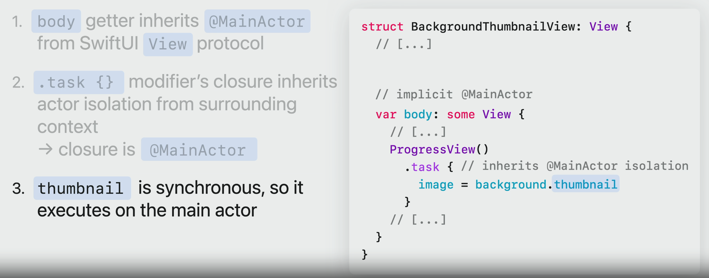

# 如何使用 Instruments 分析 Hangs

## 背景

最近在优化我自己的独立 app 产品时，遇到了比较严重的卡顿问题，想系统的来学习和梳理一下怎么样分析卡顿/卡死的这种场景，所以学习了一下 [WWDC2023 - 使用 Instruments 分析挂起](https://developer.apple.com/cn/videos/play/wwdc2023/10248) 这一篇。

> 在官方文档中，所有的卡死、卡顿、挂起都被统一使用 Hangs 这个词来表示，其实都是一个意思。为了统一性，本文也基本都使用“挂起”。

## 目标

本篇主要关注如何利用 Instrument，对 Hangs 挂起这种场景进行分析，找到问题代码。注意，主要是针对分析过程，所以具体 case 的分析就会略过了。

## Hangs 的分类

在分析之前，我们需要先来拆分一下，挂起到底有哪几类的情况。

### 按照主线程状态分类

一共有两种导致主线程挂起的类型：

- Busy Main Thread
- Blocked Main Thread

第一种 Busy Main Thread 是因为主线程在做大量复杂任务，导致相应缓慢，出现挂起。在这种情况下，使用 Instruments 抓取时，出现 severe hang 的时候，Main Thread CPU 仍然有大量运算。

第二种 Blocked Main Thread 是主线程直接被其他的任务挂起，而无法响应。在这种情况下，severe hang 出现时，Main Thread CPU 基本没有任务进行。

### 按照发生原因分类

我们先来简述一下 Instrument 检测挂起的原理：其实非常简单，就是每隔 100ms 检测主线程是否能响应。

这样其实就有如图所示的三种情况：

- 第一种情况，是最常见的挂起，就是任务本身需要超过 100ms 才能响应。那么任务 Event 在从触发到响应的过程，超过 100ms，就会被认为是挂起。

- 第二种情况，是正常情况，Event 触发后立刻响应。

- 第三种情况，则是一种异步的挂起。当任务被触发，此时主线程正在处理其他任务，过了一段时间才能处理本次 Event。所以即便 Event 本身执行的很快，也会被认为是挂起。

第一种情况的挂起，叫做同步挂起 Synchronous，第三种情况是异步挂起 Asynchronous，通常是由于主线程在进行耗时的异步操作，导致任务响应被 Delay 了。

异步挂起，通常由主队列上的 "dispatch_async" 或是异步运行的 Swift Concurrency 引起，让主线程被处理的任务占据，导致新事件等待处理。

这两种挂起在 Instrument 监控下，会有颜色上的区分：

| Synchronous 同步挂起：红色                | Asynchronous 异步挂起：黄色               |
| ----------------------------------------- | ----------------------------------------- |
|  |  |

## 利用 Instrument 中的工具进行分析

通常我们分析性能问题，都会使用 Time Profiler 进行分析。当然我们还有一些其他的工具，可以被用来分析。总结来说：

- Time Profiler：全场景适用
- View body：适合分析 Busy Main Thread 主线程繁忙的场景
- Swift Tasks：适合分析 Asynchronous 异步挂起
- Thread State Trace：适合分析 Blocked Main Thread 主线程阻塞的情况

### 利用 Time Profiler 分析

我们只关心发生 Hangs 时期发生的事情，所以可以通过右键点击 Hang，来选择对应区域。当然，这里还有一个进阶版，按住 option 键，然后点击右键，可以选择后展开

| 点击右键                                  | 按住 option + 点击右键                    |
| ----------------------------------------- | ----------------------------------------- |
|  |  |

接下来，就很好分析了。这里整体过程基于 Instruments - time profiler 的基本使用，就不再过度赘述，就用官方的案例简单讲解一下了：

当我们选中了对应区域后，选中主线程的堆栈，可以从下方看出耗时函数方法。与此同时右下角也会有一个 Heaviest Stack Trace 总结最耗时的方法。

进一步如果我们通过 call tree 选中 hide system libraries 时，将会更加直观和明显的发现问题

### 利用 SwiftUI - View body 分析

点击右上角加号，可以将 View Body 添加进来，进行辅助分析。当然，新添加了之后需要重新跑一次。

重新运行之后，我们来看下效果：

- 每个橙色方框代表一次视图运算
- 可以看到执行的视图名称，叫做 BackgroundThumbnailView
- 橙色的长度，代表运算所需要的时间

从下面的 Summary 处也可以看到：

- BackgroundThumbnailView 一共被执行了 70 次，每次要消耗 46ms，总共消耗了 3.23s 的时间

通过这些数据佐证，就能明确知道导致挂起的具体原因：BackgroundThumbnailView 的过度计算绘制。当我们定位到具体原因之后，解决起来就更加容易了。

### 利用 Swift Tasks 分析

针对异步挂起的情况，我们可以利用 Swift Tasks 工具进行辅助分析。

当我们引入后，重新运行可以看到，Instrument 能够监控不同 Task 任务的表现。于此同时，主线程监控也有了更多的展示维度可以选择：

此时，当我们聚焦在挂起的范围之内，可以看到有大量的 Task 任务在被执行：

这也许就是导致挂起的原因。当我们聚焦在其中一个任务，可以从右下角看到主要的耗时来源：

这样，我们就发现了问题的原因：thumbnail.getter 导致主线程繁忙。

查看代码可以知道，这里的 .task 任务是一个主线程同步任务，虽然这里的 background.thumbnail 被放到 task 任务里面去，但是由于他是一个同步方法，所以依然会导致主线程的繁忙，从而造成挂起。要修改的话，需要将其改为一个异步方法，然后使用 await 进行调用。

### 利用 Thread State Trace 分析

现在来分析一下另一种主线程挂起的情形，Blocked Main Thread 的情况，通常表现如下：

- 一开始会有一点的主线程 CPU 消耗
- 挂起的过程中没有任何主线程 CPU 消耗

这种情况，由于 CPU 的监控没有办法给我们提供任何额外的信息，我们只能借助其他的工具了：Thread State Trace

当我们添加这个工具，然后再次运行后，我们就能看到具体造成 block 的关键位置：

- 查看 main thread，可以看到多了 block 的具体信息
- 选中 block，看下房 Narrative 的那一栏，可以看到有一个 6.62s 的 block，源自于 `mach_msg2_trap`
- 这看起来是一个系统堆栈，我们可以在右侧 Backtrace 面板中看到具体的调用顺序

根据右侧 Backtrace 的面板，我们能看到：

- 又是由于 BackgroundThumbnail 中的 body 部分，导致了这次的挂起

我们定位到原因之后，就非常好解决了。本文专注于如何利用 Instrument 发现 Hangs 的过程，所以具体的 case 的解决过程就不再赘述了。
