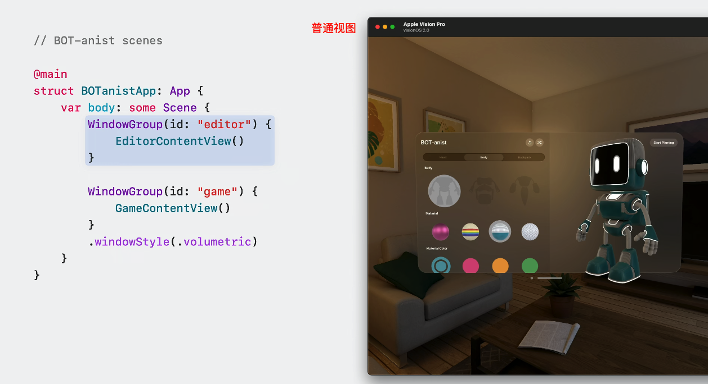
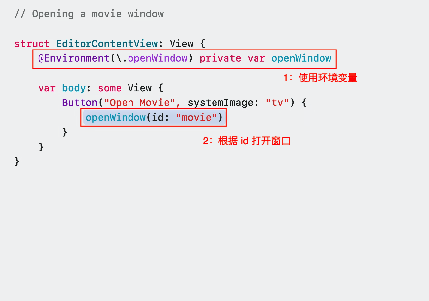

# Session 10149 - 在 SwiftUI 中设计窗口

本文基于 WWDC24 -  Session 10149 [Work with windows in SwiftUI](https://developer.apple.com/videos/play/wwdc2024/10149/) 梳理


> 摘要：Window（窗口） 是承载 App 内容的最重要的容器，尤其是在 macOS 和 VisionOS 平台上更是需要优雅地设计和使用窗口。本文将介绍 Windows 组件，并且基于一个 Demo（BOT-anist）从实战角度进行教学。


## 1. 什么是窗口 - Window

[Window](https://developer.apple.com/documentation/swiftui/window) 窗口是 app 内容的容器，所有视图内容都将通过它来进行呈现。

用户可以使用熟悉的控件来控制窗口，比如移动窗口、改变窗口大小和关闭窗口。下面以 VisionOS 中的截图为例，展示用户如何能方便地操作窗口：

| 移动窗口          | 改变大小          | 关闭窗口          |
| ----------------- | ----------------- | ----------------- |
|  |  |  |

那么，作为开发者应该如何设计和使用 Window 呢？本文将以 BOT-anist 这个 SwiftUI app 为基础，进行讲解和演示。BOT-anist 是一个多平台应用，但本次讲解中将聚焦在 visionOS 上，内容包括基础使用（Fundamentals）、设置窗口位置（Placement）、调整窗口大小（Sizing）等三个维度。


## 2. 基础使用 - Fundamentals

### 2.1 基础功能介绍

每个窗口都能展示丰富的 app 内容，不同窗口之间相互独立，这样用户就可以同时查看多个窗口的内容，甚至将同一种内容展示在多个窗口中。窗口的这些特性极大地丰富了用户的使用体验。还有比如说下面这些特点：

**通用的系统控件**

Apple 为窗口组件都设计了通用的系统控件，让用户能够方便的进行缩放、移动等操作。

**在 visionOS 上展示 3D 内容**

窗口在每个平台上，都能有不同的效果，能够利用平台特性进行展示。比如在 visionOS 中，就能使用窗口来展示 3D 内容。

**使用 TabView 能简化体验**

需要注意的是，尽管使用多窗口能够极大的丰富用户的体验，但是部分场景使用 TabView 是能够简化用户体验的，具体可以参考下图：


| TabView 展开       | TabView 收起       |
| ----------------- | ----------------- |
|  |  |

> 如果想要进一步了解 TabView 和其他顶级视图（top-level view）控件，可以参考 [Elevate your windowed app for spatial computing - WWDC23](https://developer.apple.com/videos/play/wwdc2023/10110/)
> 想要学习在 visionOS 中合理使用多窗口，可以参考 [Design for spatial user interfaces - WWDC23](https://developer.apple.com/videos/play/wwdc2023/10076/)

### 2.2 Demo：展示 3D 内容

在 BOT-anist 这个 Demo 中，我们可以通过设置 [windowStyle](https://developer.apple.com/documentation/swiftui/windowstyle) 属性来通过窗口展示 3D 内容


| 默认：.windowStyle(.automatic) | 3D 内容：.windowStyle(.volumetric) |
| ------------------------------ | ---------------------------------- |
|               |                   |

### 2.3 Demo：打开和关闭窗口

要打开一个新的窗口，只需要两步：

1. 新建窗口 WindowGroup 并绑定 id
2. 使用环境变量打开对应 id 的窗口

比如我们需要给 BOT-anist 新增一个窗口页面的话，就需要新增加一个 WindowGroup，然后绑定一个 id（绑定的 id 是 "movie"），然后使用 [openWindow](https://developer.apple.com/documentation/swiftui/environmentvalues/openwindow) 方法根据 id 打开窗口。


| 步骤 1            | 步骤 2            |
| ----------------- | ----------------- |
|  |  |

当然，控制窗口的方法除了 [openWindow](https://developer.apple.com/documentation/swiftui/environmentvalues/openwindow) 以外，还有 [pushWindow](https://developer.apple.com/documentation/swiftui/environmentvalues/pushwindow) 和 [dismissWindow](https://developer.apple.com/documentation/swiftui/environmentvalues/dismisswindow)，一共三种方法。显然 dismissWindow 容易理解，就是关闭窗口，而另外两者都是打开窗口，区别在于 pushWindow 会覆盖原有的 window，将其隐藏：


| openWindow           | pushWindow         |
| -------------------- | ------------------ |
| 效果：新打开一个窗口 | 效果：覆盖原有窗口 |
|    |  |

显然，这种场景下使用 pushWindow 会有更好的效果。打开新的 movie 页面，原有窗口会自动隐藏从而让用户沉浸式体验；当用户关闭 pushWindow 时，原有的窗口会被重新打开。

### 2.4 其他好用的功能

除了打开窗口的基础能力之外，还有一些特殊功能能够利用平台特性，给用户带来更优质的体验。比如下面介绍的这几种，都能提升窗口在 visionOS 中的体验：

**工具栏挂饰（toolbar ornament）**

[挂饰 ornaments](https://developer.apple.com/cn/design/human-interface-guidelines/ornaments/)：在 visionOS 中，挂饰呈现了与窗口相关的控件和信息，而不会挤占或遮挡窗口内容。

挂饰悬浮在与其关联窗口平行的平面中，并且沿着 z 轴稍微位于窗口前面。如果关联窗口移动，挂饰也会随之移动，以保持其相对位置不变；如果窗口内容滚动，挂饰中的控件或信息保持不变。

通过使用工具栏挂饰，可以在窗口的底边缘处方便的展示各种控制按钮，增强用户的体验。


| 挂饰 ornament      | 工具栏挂饰 toolbar ornament |
| ------------------ | --------------------------- |
|  |           |

**工具栏标题菜单（ToolbarTitleMenu）**

当用户点击标题时，可以将与窗口内容相关的一些操作按钮展示出来，面板会采用 present 的动画效果。通过使用工具栏标题菜单，将窗口相关的操作包含在弹出的菜单中，能够避免挤占页面内容的空间。

工具栏标题菜单的图示：


| 代码实现           | 正常收起状态       | 点击后的展开状态   |
| ------------------ | ------------------ | ------------------ |
|  |  |  |

**隐藏窗口系统控件**

通过使用 .persistentSystemOverlays 方法可以控制窗口系统控件的显隐状态，在合适的场景下也可以优化用户体验。比如在 demo 中，通过隐藏 "movie" 窗口的控件，可以隐藏控件来达到沉浸式的效果。


| 代码实现           | 正常显示状态       | 设置隐藏后状态     |
| ------------------ | ------------------ | ------------------ |
|  |  |  |

**更多在 macOS 中的技巧**

我们介绍了三种在 visionOS 中提升用户体验的小技巧，如果想要了解 macOS 中使用窗口的技巧，可以学习 [Tailor macOS windows with SwiftUI - WWDC24](https://developer.apple.com/videos/play/wwdc2024/10148/)


## 3. 设置窗口位置 - Placement

### 3.1 需要调整位置的场景

当我们学会如何打开新的窗口之后，我们还需要考虑的一个问题是新打开窗口的默认位置。比如在 BOT-anist 中有下面这个场景，我们新打开一个窗口用作展示控制器（id："controller"）：


如果只是使用 openWindow 打开新窗口而不设置位置，那么就有可能出现问题：

- 新窗口挡住原有的窗口，影响观看
- 新窗口显示的太远，不方便操作

### 3.2 窗口的默认位置

当不进行设置的情况下使用 openWindow，新的窗口会是这样的表现：

- 在 visionOS 中：出现在原窗口的前方
- 在 macOS 中：出现在屏幕中央

显然，我们很多场景下都是需要进行调整的。可以用 [defaultWindowPlacement](https://developer.apple.com/documentation/swiftui/scene/defaultwindowplacement(_:)?changes=latest_major)（macOS 15.0+、visionOS 2.0+） 方法来设置默认位置。这个方法需要返回一个 [WindowPlacement](https://developer.apple.com/documentation/swiftui/windowplacement?changes=latest_major) 来指定位置，而 [WindowPlacement](https://developer.apple.com/documentation/swiftui/windowplacement?changes=latest_major) 一共有三种类型的设置方式：


| 对齐其他的窗口     | 适合使用者的位置   | 根据屏幕相对位置   |
| ------------------ | ------------------ | ------------------ |
| visionOS + macOS   | visionOS           | macOS              |
|  |  |  |

### 3.3 Demo：visionOS 中默认位置贴近使用者

比如在刚才提到的打开 BOT-anist 控制面板的场景中，我们需要让新打开的控制器窗口（id："controller"）靠近使用者，那么我们就可以通过 [utilityPanel](https://developer.apple.com/documentation/swiftui/windowplacement/position/utilitypanel?changes=latest_major) 属性来设置：


| 代码实现           | 效果图             |
| ------------------ | ------------------ |
|  |  |

可以对比看到，现在的控制器窗口打开之后，会距离使用者更近，更方便操作。

### 3.4 Demo：macOS 中手动计算位置

我们注意到，[defaultWindowPlacement](https://developer.apple.com/documentation/swiftui/scene/defaultwindowplacement(_:)?changes=latest_major) 方法在回调中，提供了两个参数：

- [WindowLayoutRoot](https://developer.apple.com/documentation/swiftui/windowlayoutroot?changes=latest_major)：代表窗口的内容，可以通过它计算出大小信息

- [WindowPlacementContext](https://developer.apple.com/documentation/swiftui/windowplacementcontext?changes=latest_major)：代表窗口的位置信息，从而确保在不同平台上都能获取到布局信息。

以 Demo 为例，比如在 macOS 上，我们能通过这样的方式获取到窗口布局相关的信息，然后手动计算新窗口的位置和大小。

```SwiftUI
WindowGroup(id: "controller") {
    ControllerContentView()
}
.defaultWindowPlacement { content, context in
    #if os(visionOS)
    return WindowPlacement(.utilityPanel)
    #elseif os(macOS)
    // 1. 获取默认位置时，屏幕中可以呈现内容的区域大小
    let displayBounds = context.defaultDisplay.visibleRect
    // 2. 调用 sizeThatFits，获取窗口内容大小
    let size = content.sizeThatFits(.unspecified)
    // 3. 计算位置信息（设置为左右居中、底部距离下边缘 20 像素点）
    let position = CGPoint(
        x: displayBounds.midX - (size.width / 2),
        y: displayBounds.maxY - size.height - 20
    )
    // 4. 根据结果更新默认位置
    return WindowPlacement(position, size: size)
    #endif
}
```

最终效果如下：


| 代码实现           | 效果图             |
| ------------------ | ------------------ |
|  |  |


## 4. 调整窗口尺寸 - Sizing

### 4.1 改变默认尺寸

为了保证新窗口被打开后始终很好看，我们需要计算和调整它的大小。窗口的默认大小是由系统决定的，想要修改的话有这么几种方法。

如果尺寸是依赖屏幕大小或者是其他窗口，那么：

1. 使用 [defaultWindowPlacement](https://developer.apple.com/documentation/swiftui/scene/defaultwindowplacement(_:)?changes=latest_major) API，原理和过程和 3.4 小节一样
2. 使用 [defaultSize(width:height:)](https://developer.apple.com/documentation/swiftui/scene/defaultsize(width:height:)) 方法。不过需要注意的是这样设置的大小，在有其他约束条件的时候会失效，比如返回一个已经初始化的 Scene，或者同时通过 [defaultWindowPlacement](https://developer.apple.com/documentation/swiftui/scene/defaultwindowplacement(_:)?changes=latest_major) 也设置了大小的情况。

| defaultWindowPlacement | defaultSize(width:height:) |
| ---------------------- | -------------------------- |
|      |          |

另外，如果是使用 pushWindow 的情况，那么是无法设置尺寸大小的，新窗口的尺寸大小和前一个窗口是一样的。

### 4.2 Demo：限制窗口尺寸

在 visionOS 中用户是可以随心所欲调整窗口大小的，但是很多场景我们都不希望用户能够完全随意的调整大小，因为这样会影响 UI 上的表现。

此时，我们就会需要使用 [windowResizability(_:)](https://developer.apple.com/documentation/swiftui/scene/windowresizability(_:)?changes=latest_major&language=o_8) 方法来进行限制，比如当我们设置了内容的尺寸之后，我们就可以通过这个方法来使窗口遵守内容的尺寸限制。

比如在 BOT-anist 中，我们为了保证视频观看窗口（id："movie"）的大小合适，避免窗口过小影响观看，可以进行如下改动：


这样设置之后，窗口大小就会依赖内容，最小不小于 680 *680，最大不超过 2720* 1020，效果如下：


| 没有限制大小       | 限制大小后的效果   |
| ------------------ | ------------------ |
|  |  |

又比如 BOT-anist 中的另外一个场景，对于控制器窗口（id："controller"），我们不希望他过大而影响美观，那么我们也可以进行设置。


这样设置之后，窗口也会依赖内容大小了，而因为内容 ControllerContentView() 是固定大小，所以最终窗口也是固定大小。


| 没有限制大小       | 限制大小后的效果   |
| ------------------ | ------------------ |
|  |  |


## 5. 后续建议

经过优化，demo app（BOT-anist）已经取得了非常好的效果。那么在我们开发自己的 app 时也可以注意使用这些技巧，总结一下有下面四点：

1. 思考页面内容的载体，是用新的窗口，还是顶级视图（top-level view）控件更好
2. 使用接口去调整窗口的默认布局
3. 根据内容去限制窗口的边界尺寸
4. 合理利用各平台特性

希望大家都能做出体验更好的 app！
