# 独立开发之 App 国际化全步骤

> 关于我：大厂摸鱼 + 业余独立开发，之后会输出深度技术文章 + 独立开发技巧
>
> 我的往期技术文章合集：[RickeyBoy - Gitbub](https://link.juejin.cn/?target=https%3A%2F%2Fgithub.com%2FRickeyBoy%2FRickey-iOS-Notes)
>
> 我的独立开发 App：[iColors - 设计灵感 配色助手](https://link.juejin.cn/?target=https%3A%2F%2Fapps.apple.com%2Fapp%2Fid6448422065)

对于一个独立 app 来讲，国际化出海是一个非常重要的步骤，海外广阔的市场和购买力，在营销跟上的情况下，是一个非常不错的收入来源。

在做国际化之前，其实我在网络上也找过很多的资料和教程，不过绝大部分教程只是讲解了其中的一个步骤，比如通过 localizable 文件实现多语言。但是这些教程普遍只适合架构比较简单的 app，涉及到固定文案、且文案数量不多的情况，并且实操性有限。

所以本系列会以我自己的独立 app：「iColors」 为例，全方位讲解其中涉及到的各个步骤的原理和方法，感兴趣 or 觉得有用的朋友可以点赞收藏。要是觉得非常有用，可以去 App Store 下载一下我的 App，点个五星好评哈哈！

实际效果图示：

| 中文版                                             | 英文版                                             |
| -------------------------------------------------- | -------------------------------------------------- |
|  | 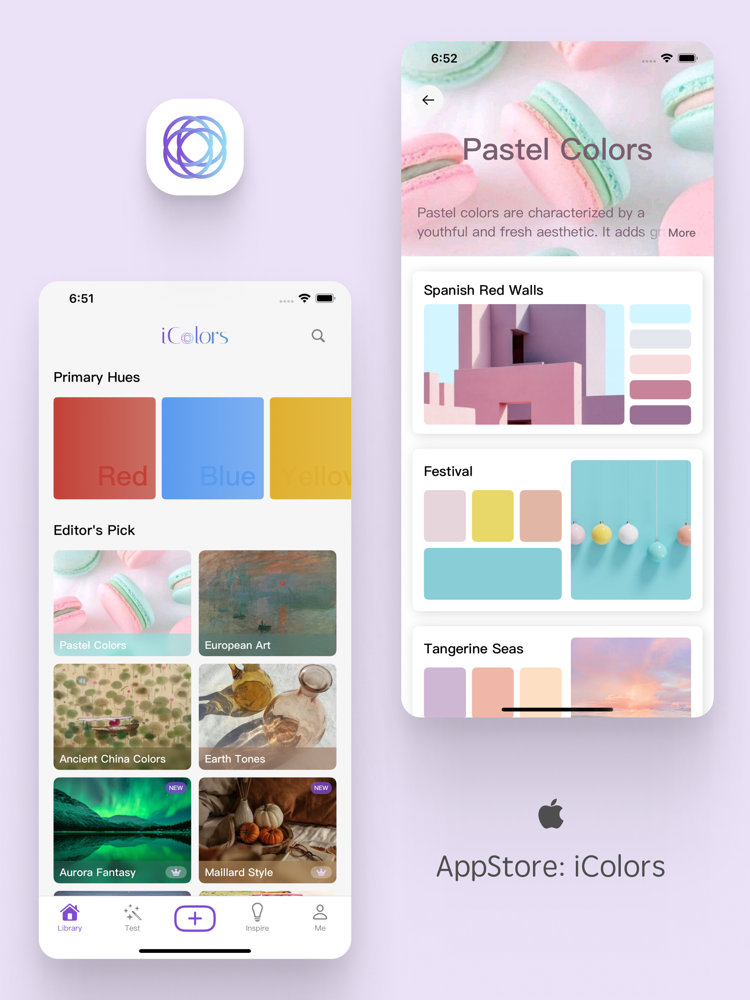 |


# 🌏 为什么要做国际化

做之前先想清楚为什么要做。

对于一些大 app 而言，做国际化肯定是一件理所应当的事情。那么作为一个独立 app 而言为什么要做国际化？简单而言，那就是用户基数的扩大，再叠加海外用户的付费能力更强。

### 用户基数成规模的扩大

这一点是非常容易容易理解，毕竟全球用户会更多。其实即便没有做国际化多语言适配，App 也是可以上架所有国家的，但是这里有两方面的问题：

1. App 在所有国家只能拥有默认语言版本（比如中文）的 AppStore 介绍页，以及 AppStore 搜索关键词。那么可以想象，自然流量就几乎不存在了。
2. 如果没有实现对应语言，或者没有英语的情况下，用户很容易遇到下载了却无法使用的情况。这样很容易导致在 AppStore 海外市场被打低分。

### 海外用户的付费能力

这是老生常谈的一点，整体而言海外用户的付费能力和付费意愿都会比国内更强。海外用户已经习惯了为喜爱的 app 或者是工具付费，如果足够喜欢是很愿意付高价的。并且由于汇率等一些原因，国内软件的价格对于海外用户而言是相对划算的一笔钱。所以可想而知，单个用户的价值是会相对更高一点的。

所以非常明显，即便做国际化需要较为复杂的工作量，也是值得做的，尤其是对于独立 app 而言更是如此。


# 📏 开始前的准备

好的，再决定了要做国际化适配多语言之后，我们可以正式开始这部分的实操了。这里先简单说一下我自己的项目技术栈：

- 代码语言：SwiftUI
- 数据存储：Core Data

- App 初始语言：中文

- App 目标语言：英文

这里再多说一句，一方面我目前的独立 App 功能算是非常完善了；同时因为我这里涉及到了 Core Data 作为数据存储中心之一，需要考虑 Core Data 模型升级，导致整个过程会更加复杂。

如果你的 App 只是一个小型工具，不涉及数据本身的多语言适配，或者 App 文案大多数是通过写死的方式存在，那么应该会更加简单一些。

另外，过程中会使用到 ChatGPT（免费的就够了），相信大家都已经有账号了吧！整个过程中我感觉现在 AI 对于生产力是真的有明显提升的，习惯使用的话确实很有帮助。毕竟程序员，善用各种工具是基本素质了。


# 🫙 数据库内容翻译

首先我们需要对我们的数据进行翻译。因为我的 App 「iColors」内部有非常多内容数据，通过 Core Data 进行管理，这些数据都需要进行翻译，这一部分的工作量实际上是非常大，以及非常复杂的。

## 难点分析

首先比如像 App 主打的中国传统色，其实每一种颜色都需要翻译对应的英文名，而且为了保持调性，需要非常高质量的翻译，尽量让英文名也能尽量保持优雅、简洁。

我截图两个页面举例，可以看到其实中国传统色本身的名字就很有诗意，也有些偏僻；最终翻译出来的结果也要能做到同样的效果。

| 中文版                                                | 英文版                                                |
| ----------------------------------------------------- | ----------------------------------------------------- |
| 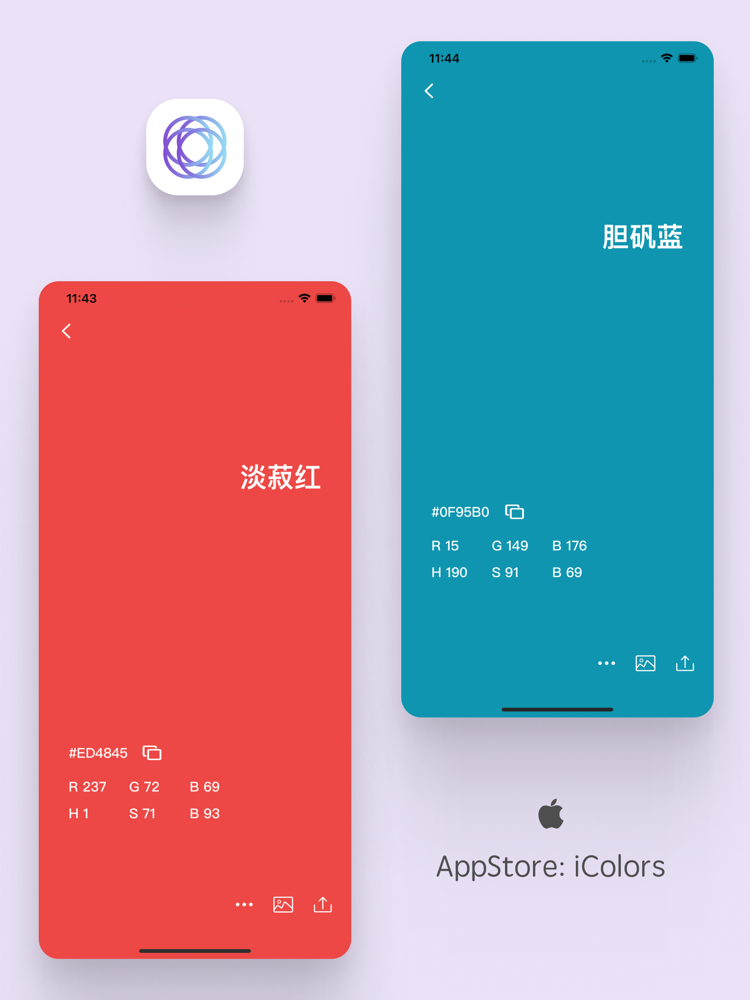 | 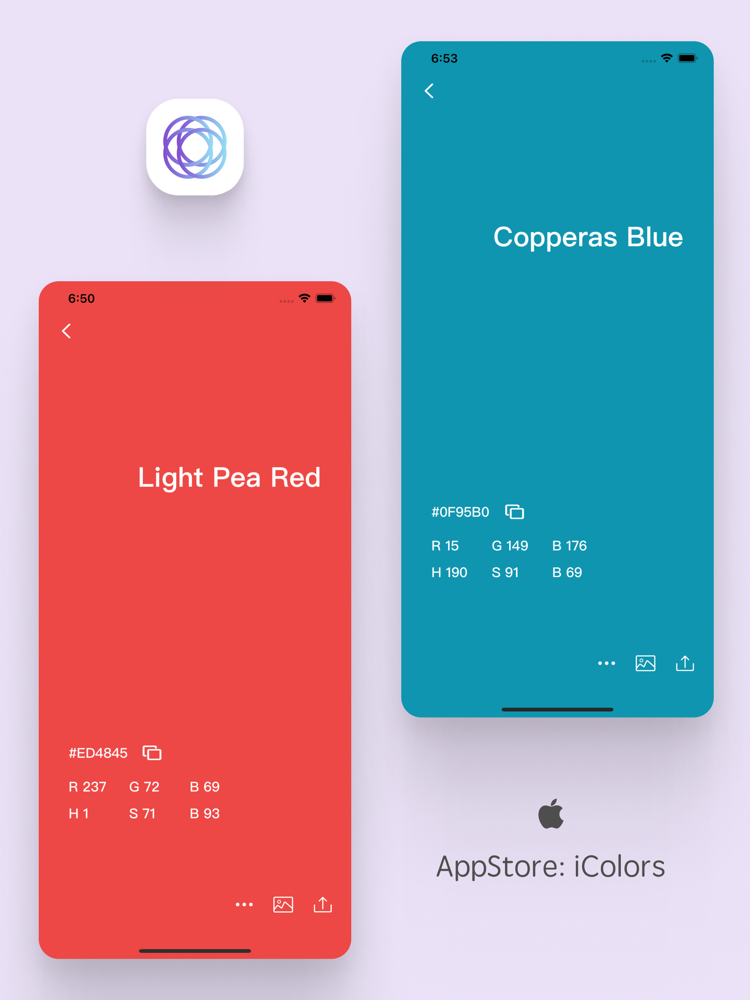 |

另外，「iColors」数据库整体非常的庞大，除了大量中国传统色之外，还有大量的色组配色，全部都需要高质量的翻译。

| 中文版                                               | 英文版                                               |
| ---------------------------------------------------- | ---------------------------------------------------- |
| 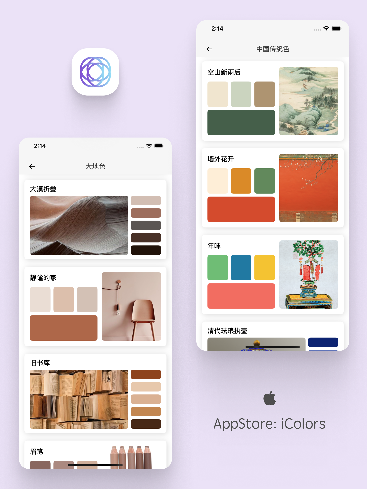 | 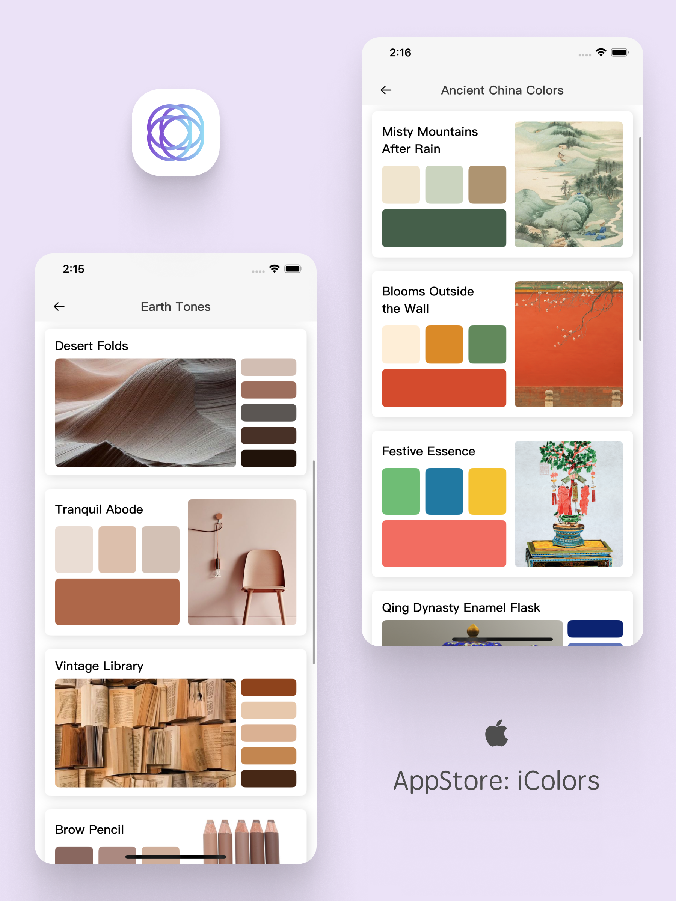 |

所以这一个章节我将专门讲一讲我如何把这些内容翻译好。

需要再额外说明的是，如果你的 App 不涉及到特别多本土化的内容，那么其实可以跳过这一步。毕竟这一步的复杂过程，有因为我的独立 App 的特殊之处。


## 第一步：提取待翻译的文案

首先需要从数据库中，将所有涉及到文案全部整理出来。这一步相对简单，主要是为了方便后续的翻译。

比如我的原始数据是以 Json 的方式存在，通过 Python 脚本就可以将其中需要翻译的名字提取出来，整理成表格形式。

当然，如果你不会写的话，也可以让 ChatGPT 帮你写一个 Python 脚本。需要描述清楚你的原始数据类型，以及你的目标形式，很快就可以有一个非常完美的脚本了。

这一步相对简单，我就不过多废话了。


## 第二步：翻译文案

整理好了需要翻译的内容之后，接下来就是喂给 ChatGPT，然他帮忙翻译了。如果你是尊贵的 GPT-4 用户，那么可以直接将整个文件直接上传，要不然就分批操作也是没问题的。

在 prompt 阶段，可以说明一些要求，比如要求翻译名 "elegant"、"simple"、"poetic" 等。

虽说翻译完成之后仍旧需要人工对这些翻译进行一个检查，不过有了 AI 的帮助，这个过程也还是轻松很多了。


## 第三步：将 Core Data 数据对应的文案塞入

核心就是将翻译后的英文，拼接到对应的数据之中，这一步也通过 Python 脚本实现。核心代码如下

```python
import pandas as pd
import json

# 读取翻译文件
file_path = 'xxx.xlsx'
xls = pd.ExcelFile(file_path)

data_dict = {}
for sheet_name in xls.sheet_names:
    df = pd.read_excel(xls, sheet_name, header=None)
    # 遍历所有行，并且把其中英文到字典中
    for index, row in df.iterrows():
        key = row[0]  # Value from column 1
        value = row[1]  # Value from column 2
        data_dict[key] = value     
xls.close()

# 按照 Json 格式输出
output_file = 'xxx.json'
with open(output_file, 'w', encoding='utf-8') as f:
    json.dump(data_dict, f, ensure_ascii=False, indent=4)
```

用一张图来说明前三步做的事情：

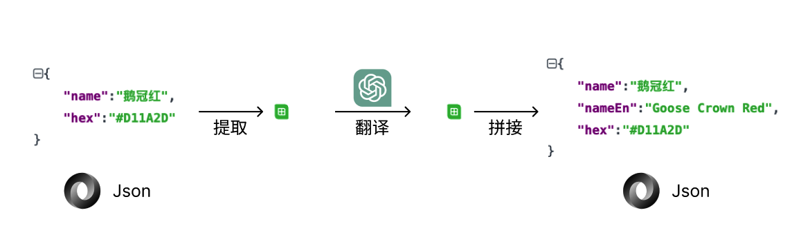

这里只是以中国传统色来进行说明（实际上除了传统色还有大量色彩组合需要处理），翻译后在原有的数据结构上增加了对应的英文翻译内容。这样就可以进行下一步了，对 Core Data 底层进行升级，从而在 App 内读取到对应的中英文名称。


# 🧙🏻‍♀️ Core Data 架构升级

数据内容准备好之后，接下来就是升级 Core Data 架构了，确保能够顺利的使用最新的数据。这里面最主要的就是 Core Data 的模型升级，因为毕竟在原有模型中新增了英文的名称，Core Data 的模型也需要做对应的适配：

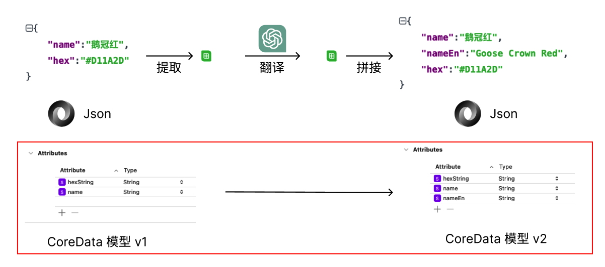

## 什么是 schema migration

> 数据模型总有需要升级的时候！

所谓 schema migration，其实就是数据模型升级。使用 Core Data 来管理数据时，肯定有需要对模型进行升级的时候，比如给模型添加新属性、删除属性、修改属性类型等等。而我就以给 Core Data 模型增加属性为例（也就是上面提到的，给中国传统色模型增加英文属性），来讲解当数据模型发生这些更改。

那么为什么要进行数据升级呢，如果我直接给模型加一个新的属性不就行了么？这样肯定是不行的，App 肯定需要涉及到对旧版本的兼容，旧版本内容需要按照一定的规则过渡到新的内容。

具体而言，如果不进行 schema migration 升级操作：

- App 肯定无法正常运行，存在数据丢失、数据损坏等问题
- Core Data 会直接拒绝打开 persistent store，报错 `NSPersistentStoreIncompatibleVersionHashError`

比如，如果直接改模型，就会报错：

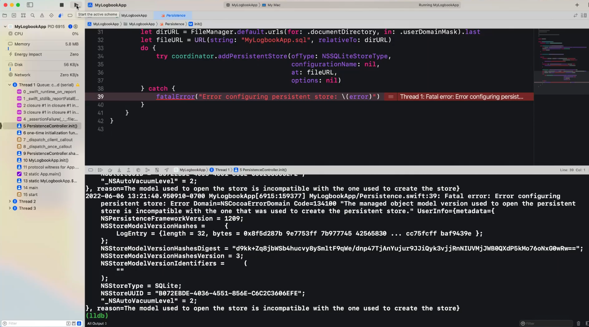


## 使用 Lightweight migration

Apple 其实已经为我们提供了一种非常方便且合理的升级方式，就是 Lightweight migration，如果想要进一步理解它，以及全方位理解 Core Data 数据结构的升级，可以看一下 WWDC22 的教学视频：[WWDC22 - Evolve your Core Data schema](https://developer.apple.com/videos/play/wwdc2022/10120/)

粗略来看他的原理的话，可以用视频中的原文来说明：

> Lightweight migration is the preferred method of migration. Lightweight migration automatically analyzes and infers the migration from the differences between the source and destination managed object models.
>
> At runtime, Core Data looks for the models in the bundles returned by .allBundles and .allFrameworks methods of the NSBundle class. Lightweight migration then generates a mapping model to materialize the changes you've made in your app in your database schema.
>
> -- Evolve your Core Data schema

Lightweight migration 是首选的数据迁移方式，它能够自动推断出源模型和目标模型差别。在运行时，Core Data 会通过 NSBundle.allBundles、NSBundle.allFrameworks 中获取到所有的模型信息，然后 Lightweight migration 机制会自动根据这些模型，以及他们之间的映射关系等，来改变数据库中的源模型。


## Lightweight migration 支持的能力

如上文所说，Lightweight migration 能够自动支持 Core Data Models 大部分类型的改变，那么到底包含多少类型呢？

首先是针对 Attributes 的能力：

| English                                                   | 中文                                   |
| --------------------------------------------------------- | -------------------------------------- |
| Adding                                                    | 新增属性                               |
| Removing                                                  | 移除属性                               |
| Non-optional becoming optional                            | 非 optional 变为 optional              |
| Optional becoming non-optional and defining default value | optional 变为非 optional，并指定默认值 |
| Renaming                                                  | 重命名                                 |

> 注意：Core Data 能自动适配版本变动，如 V1->V2->V3 都有改动，也是没有问题，可以自动适配 v1->v3

其次是关于 Relationships 的能力：

| English             | 中文         |
| ------------------- | ------------ |
| Adding              | 新增关系     |
| Removing            | 移除关系     |
| Renaming            | 重命名       |
| Cardinality changes | 数量关系改变 |

>  注意：Cardinality changes 指的是数据库关系中对应的数量变化，包括 1 对 1，1 对多，多对多。

最后是关于 Entities 的能力：

| English                                       | 中文                     |
| --------------------------------------------- | ------------------------ |
| Adding                                        | 新增实体                 |
| Removing                                      | 移除实体                 |
| Renaming                                      | 重命名                   |
| Creating new parent or child entities         | 创建新的父或子实体       |
| Moving attributes within the entity hierarchy | 在实体层次结构中移动属性 |
| Modifying the entity hierarchy                | 修改实体层次结构         |
| **Cannot merge entity hierarchies**           | **无法合并实体层次结构** |

> 注意：Lightweight migration 并不能自动合并 entity 的结构！


## 实战操作

如果你仔细阅读理解了上面 Lightweight migration 的内容，就知道其实从实操上面来讲，你并不需要做什么事情。如果你使用的是 NSPersistentContainer，那么 Core Data 就能够自动实现这些功能。只需要我们定义清楚升级之后的模型就行了。

选中 **Editor** 然后选中 **Add Model Version**，就可以创建一个新的 `.xcdatamodel` 文件，这样就算成功了

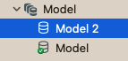


这样其实就创建了目标模型了，不过可以看到那个绿色的小勾勾 ✅ 现在还在旧 Model 上面，代表现在 App 还默认使用的是旧的模型。

不过没关系，我们先将 Model 2 进行修改，修改为我们我们希望升级到的新模型就可以了。比如我的例子中，就是新增一个 nameEn 的 Attribute：

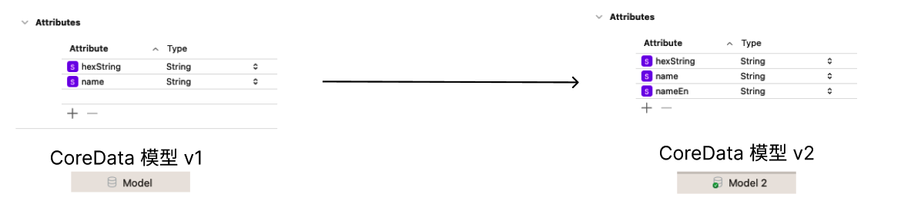

好的，接下来就是将 Model 2 设置为默认。选中 Model 2，打开右侧 Inspectors 面板，然后选择 Current Model Version 就可以了：

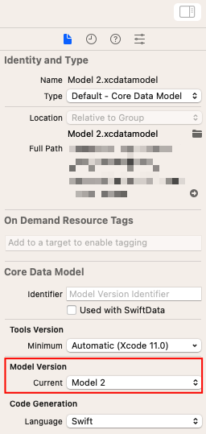

可以看到，现在绿色的小勾勾 ✅ 转移到 Model 2 上面，就已经成功了！

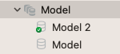


# 🕵🏻‍♂️ Core Data 模型解析升级

当 Core Data 数据模型升级完毕之后，就意味着我们的数据可以被顺利的导入到 App 之中了。不过这还不够，我们在 App 中使用模型的相关代码，也要做一定的调整。

## 如何手动解析 Core Data

目前我的 App 中使用的是手动解析 Core Data Model 的模式。这样虽然需要多一些额外的代码，但是好处是更加直观可控，也可以增加一些计算属性等，提高代码的易用性和可读性。

那么如何采用手动解析的方法呢？

1. 我们先选中 Core Data 的模型（我们的例子中就是 Model 2 文件）
2. 选中 Xcode 的 Tab `Editor`，然后 `Create NSManagedObject subclass`，选中对应的 Data Model 进行创建
3. Xcode 会自动生成两个文件，分别为 `xxxModel+CoreDataClass` 和 `xxxModel+CoreDataProperties`
4. 注意，此时 Data Model 对应的代码生成方式（Inspectors 面板中的 Codegen），应该选择 Manual，如下图所示

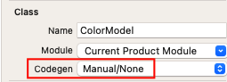

此时，Core Data 就明白了，App 在解析模型时，会使用我们手动生成和修改过的文件，也就是 `xxxModel+CoreDataClass` 和 `xxxModel+CoreDataProperties` 这两个。

那么，这两个文件应该如何去实现呢？其实主要是 `xxxModel+CoreDataClass` 文件，是需要声明属性的。而`xxxModel+CoreDataProperties` 通常上使用自动生成的部分基本就够了。

 我这里直接上代码，首先是 `xxxModel+CoreDataClass`（其实就是 `ColorModel+CoreDataClass`），注释我直接加载代码之中了，相信大家应该能够看懂

```swift
import CoreData

public class ColorModel: NSManagedObject, Decodable {
  	// 通过 enum 声明需要解析的属性名称
    private enum CodingKeys: String, CodingKey { case name, hex }

    // 初始化方法，用于解码和初始化ColorModel对象
    required convenience public init(from decoder: Decoder) throws {
        // 获取上下文对象
        guard let context = decoder.userInfo[.context] as? NSManagedObjectContext else { fatalError("NSManagedObjectContext is missing") }
        // 获取ColorModel对应的 entity
        guard let entity = NSEntityDescription.entity(forEntityName: "ColorModel", in: context) else { fatalError("Wrong entity name") }

        // 初始化
        self.init(entity: entity, insertInto: context)

        // 解码，获取所有参数信息，并依次解析
        let values = try decoder.container(keyedBy: CodingKeys.self)
        name = try values.decode(String.self, forKey: .name)
        hexString = try values.decode(String.self.self, forKey: .hex)
    }
}
```

这段代码解析了 ColorModel，可以看到他有两个属性，分别解析了 name 和 hex 两个字符串类型的参数。


## 手动解析 Core Data：适配更新后的模型

相信通过上面的代码逻辑，我们不难看出，模型升级后，对应的手动解析文件也需要修改。当 Model 升级为了 Model 2 之后，ColorModel 除了 name 和 hex，还新增了一个 nameEn 的新属性。

不过明白了上面的代码之后，改动起来就非常简单了，只需要调整两个地方：

```swift
// 修改一行
private enum CodingKeys: String, CodingKey { case name, nameEn, hex }
// 新增一行
nameEn = try values.decode(String.self, forKey: .nameEn)
```

相信我不用做太多说明，大家也知道该怎么改了。与此同时，我们可以在  `ColorModel+CoreDataProperties`  文件中，增加一个方法，用于做多语言的适配：

```swift
func localizedName(_ locale: Locale) -> String {
      if locale.isEnglish { // 这里 isEnglish 的判断如何实现，我后面会再详细讲解
          return nameEn
      } else {
          return name
      }
  }
```


## Tips：如何查看 Core Data 数据

在对 Core Data 进行修改的过程中，我们不免涉及到一些需要调试的时候。此时我们如果有一个方法能够直接看到 Core Data 数据库中的数据情况就好了。

关于这一点，可以分享一个在 stack overflow 上面看到的神奇操作：[How can I check what is stored in my Core Data Database?](https://stackoverflow.com/a/49044302)


# 🤿 提取 App 内文本文案

我们前面花了大部分的篇幅，讲清楚了和 Core Data 相关的数据库文案的翻译。一般来讲，App 的国际化需要考虑两部分文案，我姑且称之为“数据库文案”和“文本文案”。数据库文案是指的 App 中的运营内容，每次上传新的运营数据其实都会需要准备多语言的版本，是一个长期的活；而文本文案通常本身就是写死的，只需要在国际化的时候一次性解决就行了。

下面用一张图来说明就很清楚了：

- 红色部分，就是文本文案
- 蓝色部分，就是数据库文案

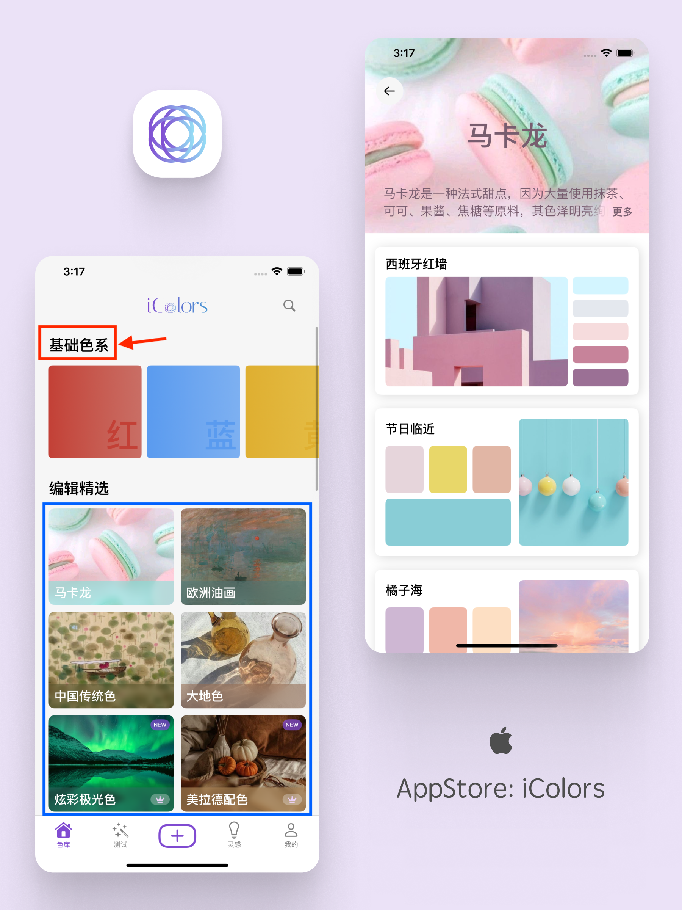

因为我的 App 的特殊性，所以需要先处理数据库文案，实际上大部分 App 只需要处理文本文案就够了。这也是之前我说，大部分网上的国际化教程，都不能够直接使用的原因。

那么，从这一章开始，我们就准备开始处理文本文案了。


## 配置新语言

我们需要先新增目标语言，以我这里的例子而言就是本身支持中文，现在需要新增英文语言。这部分的教程其实很多，也并不难，所以这里我会尽量简洁地讲解。

首先需要根据 `Project -> Info -> Localizations` 在工程设置中添加所需本地化语言：

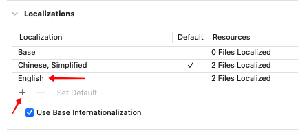

之后如果有一些稍微有所经验的开发者，可能知道我们该创建 `Localizable.strings` 文件了。没错，这其实就是我们最终想要获得的翻译文件，应该有多份 `Localizable.strings` 文件来承载不同的语言翻译。

不过相比于传统的，手动创建文件，并执行翻译，我们这次会尝试使用更具效率的方法，那就是通过 Xcode 的新功能来自动进行生成。


## Xcode 自动提取文本文案

首先，我们需要确认 Xcode 中的一个配置是正确的，即 `Use compiler to Extract Swift` 这个选项配置为 YES。这里意味着我们允许 Xcode 自动提取我们 App 中的文本文案：

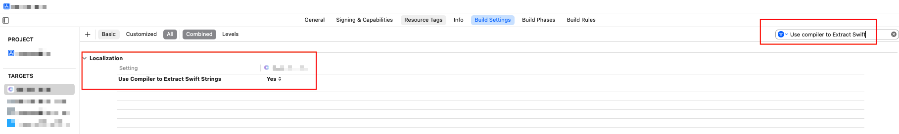

接下来，我们在 Xcode 的 Product 选中 Import Localizations，就可以自动创建了：

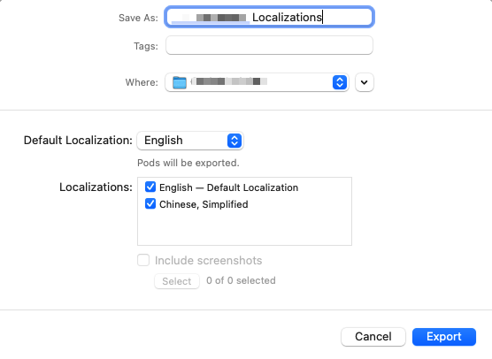

提取出来之后，大概页面会是这样：

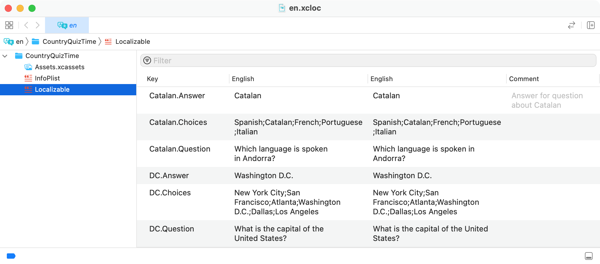

这里有两列 English，第二列和第三列看起来一模一样。这里讲一下区别：

- 第二列：代表基础语言（base localization），如果你的 App 选择的 base language 是英文，那么这里就是英文，如果选择的是中文这里就是中文
- 第三列：当前语言的翻译，目前浏览的是英文翻译，所以这里就是英文；如果浏览的是中文翻译，那么第三列就是中文。

这样，我们就可以将 Xcode 自动生成的 Localizable.strings 导入，成功之后的样式应该是如下图所示：

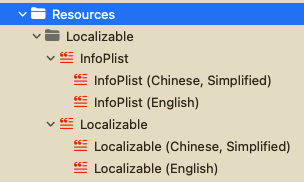

这样，我们的架构实际上就已经成功搭建起来了，通过这样的文件架构，我们就能处理文本文案的多语言展示。比如我们分别在 Localizable.strings 文件中增加了对应的翻译：

```swift
// Localizable (Chinese, Simplified)
"色彩主题" = "色彩主题";
// Localizable (English)
"色彩主题" = "Editor's Pick";
```

那么在代码中就自动被更新了，在英文版中也可以被直接正常显示了！

```Swift
Text("色彩主题")
```

成功！不过目前我们还有一个大问题没有解决：

当 App 中的文本不多时，用这样的方式可以非常方便的进行创建和提取。如果 App 比较复杂，里面涉及的文本非常多，用这种自动提取的方法，发现有很多文本没有办法被自动处理。

不过不用担心，遗漏的翻译我们是有办法检查出来的，现在我们只需要先进行下一步。


# 📡 替换代码中使用的文本

好的，前文我们提取了一些待翻译的文件，具体翻译的过程我们就跳过了。现在假设我们能够通过某种方式得到具体的翻译后的结果。那么在此基础之上，我们需要先优化一下 Localizable.strings 的声明方式。


## Localizable.strings 使用专门的 Key

上一部分我们在 Localizable.strings 文件中增加了对应的翻译，如下图所示：

```swift
// Localizable (Chinese, Simplified)
"色彩主题" = "色彩主题";
// Localizable (English)
"色彩主题" = "Editor's Pick";
```

但是这样有一个小问题，就是对于中文（之前的默认语言）来讲，无法区分是否是处理过的翻译。比如我现在在代码中有一个类似的使用之处，我并没有办法一眼识别出，这是否是经过多语言处理过的。

```swift
Text("首页")
```

以及另外一个问题，我们有些时候会存在同样的中文，却因为具体使用场景不同，而需要对应不同的英文。比如同样是"会员"，有些可能需要根据使用场景、UI 界面等不同因素，翻译成 "vip" 或者是 "membership"。这样如果直接用中文本身作为 key，就会产生问题。

所以，我们最好的方式还是使用单独的 Key，这样可以更规范和更准确。比如下面这样：

```swift
// Localizable (Chinese, Simplified)
"SOME_KEY" = "色彩主题";
// Localizable (English)
"SOME_KEY" = "Editor's Pick";
```

这样，我们需要手动去替换一下使用就可以了。

```swift
Text("SOME_KEY")
```

至于这里使用的 KEY，只需要保证唯一性就可以了，与此同时如果能有一定的字面意义会更好。具体的生成可以交给 ChatGPT，能够节约不少的时间。


## 在代码中使用 Key

好的，接下来就是我自己认为最爽的时刻了，那就是替换代码中文本文案的使用。首先，如果是 Text、Button 等系统提供的组件，是可以直接接受 Key 的：

```swift
// 直接使用 key
Text("SOME_KEY")
Button("SOME_KEY", role: .cancel) { ... }
```

我们想想，为什么这里直接使用 "SOME_KEY"，展示的是多语言结果，而不是直接将 "SOME_KEY" 作为字符串展示出来呢？

> 来自 SwiftUI 文档的解释：
>
> When you use the initializer `Text("Hello")`, SwiftUI creates a `LocalizedStringKey` for you and uses that to look up a localization of the `Hello` string. This works because `LocalizedStringKey` conforms to [`ExpressibleByStringLiteral`](doc://com.apple.documentation/documentation/swift/expressiblebystringliteral).

能做到这一点，本质上是因为这些组件都默认实现了通过 LocalizedStringKey 作为参数进行初始化，SwiftUI 会自动通过 "SOME_KEY" 创建 LocalizedStringKey 实现多语言，而不是使用普通的 String。

```swift
extension Text {
    public init(_ key: LocalizedStringKey, tableName: String? = nil, bundle: Bundle? = nil, comment: StaticString? = nil)
}
```

没错，这里的 "SOME_KEY" 会被创建为 LocalizedStringKey 类型，而不是 String 类型！

理解了这一点，相应的我们如果自定义一个 CustomView，就需要使用 LocalizedStringKey 而不是 String

```swift
// 声明
struct CustomView: View {
    let title: LocalizedStringKey
  
    var body: some View {
        Text(title)
    }
}
```

当然我们也可以手动将 String 转变为 LocalizedStringKey，比如像下面这样声明

```swift
// 声明
struct CustomView: View {
    let some_key: String
  
    var body: some View {
        Text(LocalizedStringKey(some_key))
    }
}
```


## 检查遗漏的翻译

好了，当我们替换了所有多语言的使用之后，现在来解决之前遗留的一个问题：如果发现忘记进行多语言的文本文案？

此时我们统一使用 "SOME_KEY" 的好处就体现出来了，我们只需要检查没有直接使用中文字符串的地方即可，因为正确情况下，我们所有的代码中都不会直接出现中文字符串，只会出现 "SOME_KEY"！

下面就是检查脚本，如果有遗漏的翻译，就会被直接打印出来。原理很好理解，我会用注释尽量讲清楚：

```python
import os
import unicodedata

project_directory = "xxxxx"

# 判断字符串中是否包含中文
def contains_chinese_characters(string):
    for char in string:
        if 'CJK' in unicodedata.name(char, ''):
            return True
    return False

# 判断是否是注释内容，如果是注释内容的话可以忽略
def is_comment(line):
    line = line.strip()
    return line.startswith("//") or line.startswith("/*") or ("//" in line and contains_chinese_characters(line.split("//")[1]))

# 用于统计结果
violations = []

# 遍历所有文件
for root, _, files in os.walk(project_directory):
    for file in files:
        if file.endswith(".swift"):
            file_path = os.path.join(root, file)
            with open(file_path, "r") as f:
                lines = f.readlines()
                for line_number, line in enumerate(lines, start=1):
                    # 如果不是注释，且包含中文，就记录下来
                    if not is_comment(line) and contains_chinese_characters(line):
                        violations.append((file_path, line_number, line.strip()))

# 输出
if violations:
    print("Violations:")
    for violation in violations:
        file_path, line_number, line = violation
        print(f"File: {file_path}, Line: {line_number} - String: {line}")
else:
    print("No violations found.")
```

这样，我们遗漏的部分就能被轻松找出来了。比如会输出：

```python
File: /.../xxxx.swift, Line: 38 - String: AlertToast(type: .regular, title: "保存失败")
```

查看对应的代码，是我直接使用第三方组件的部分，之前就没有被自动提取出来：

```swift
// 弹出失败提醒
AlertToast(type: .regular, title: "保存失败")
```


## Tips：全局替换多余的 LocalizedStringKey

我们之前提到，SwiftUI 能够自动识别出 "SOME_KEY"，并帮助我们创建 LocalizedStringKey，从而实现多语言。不需要手动进行额外的创建。这一个优势不仅包括 Text、Button，也包括 navigationTitle、toggle 等，也都是可以自动识别的。

```swift
// 没必要
Text(LocalizedStringKey("SOME_KEY"))
// ✅
Text("SOME_KEY")
```

这样就可以大大简化我们的代码。不过可能有一些开发者，在最开始实现的时候并不知道这一个技巧，或者现在读了文章之后才知道这个技巧，那该怎么办呢，难道要一个一个地方手动修改吗？

当然我们还有更好的办法，就是利用 Xcode 的正则匹配搜索，来进行批量的替换！

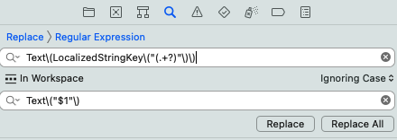

如图所示就可以了，两个正则表达式也很好理解，我直接贴在这里，供大家参考

```swift
// Text(LocalizedStringKey("SOME_KEY"))
Text\(LocalizedStringKey\("(.+?)"\)\)
// Text("SOME_KEY")
Text\("$1"\)
```


# 🎯 App 内语言环境搭建

当我们做完上面的一切操作之后，App 目前看起来已经大体上适配了国际化了，我们可以直接看下效果。


## 修改默认语言

目前我们可以通过直接设置 App 的默认语言，来查看多语言的效果。可以在真机的设置页面，进行修改：

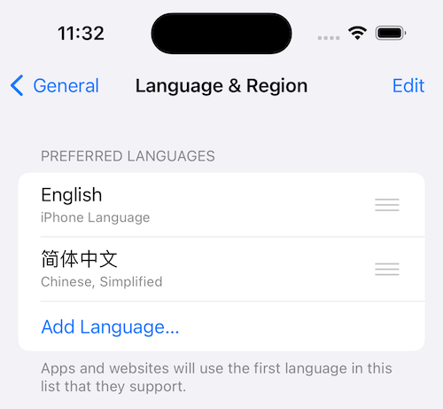

当然，如果是通过 Xcode 直接进行测试，可以通过修改 Scheme 中的 App Language 设置，来选择默认的语言：

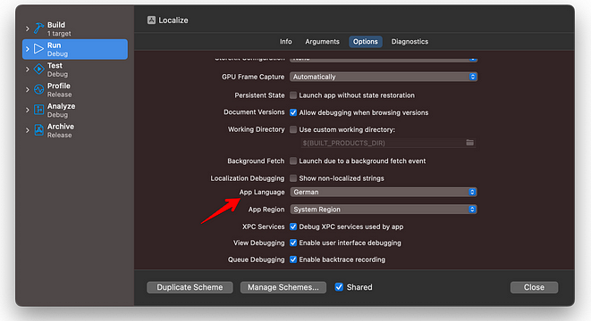

如果是通过 SwiftUI Preview，可以这样快速测试多语言：

```swift
CustomView()
	.environment(\.locale, .init(identifier: "en")) // use English
	.environment(\.locale, .init(identifier: "zh-Hans")) // 使用中文
```


## iOS 中的语言体系

再进行接下来的内容之前，我们需要先了解一下 iOS 中的语言体系。在上面的代码中，注意到我们使用了语言代码 "zh-Hans" 和 "en" 指定对应的语言，来调整 SwiftUI Preview 中需要展示的语言。那么这里的代码到底是什么意思？

> [Locale - Apple](https://developer.apple.com/documentation/foundation/locale)
>
> Information about linguistic, cultural, and technological conventions for use in formatting data for presentation.

首先我们需要知道，iOS 中使用 Locale 来记录语言和地区信息。比如 Locale 中，有几个属性，我们可以获取到对应的信息：

- [`language: Locale.Language`](https://developer.apple.com/documentation/foundation/locale/3952516-language)：语言信息，中文、英语等
- [`currency: Locale.Currency?`](https://developer.apple.com/documentation/foundation/locale/3952510-currency)：货币信息，人民币、美元、欧元等
- [`region: Locale.Region?`](https://developer.apple.com/documentation/foundation/locale/3952525-region)：地区，中国内地，香港，美国等

那么如何初始化一个 Locale 类型呢？一种最简单的方法，就是通过 identifier 来直接创建，比如 "zh-Hans" 就代表简体中文，而 "en" 就代表英文，更多的还有 "fr" 代表法语等等，详细的对应关系可以参考 [ioslocaleidentifiers - Github](https://gist.github.com/jacobbubu/1836273)


## 支持 App 内语言选择

目前语言选择的逻辑有两个主流的方式，一个是直接在 App 内支持语言选项，另一个是不支持 App 内选择语言，而是直接使用设置中选中的语言。

其实两种方式并没有非常明显的优缺点，支持 App 内切换的话可能灵活一点，但是实现起来相对难一些。可以根据具体 App 诉求进行选择。


我这里主要讲解第一种，即支持语言在 App 内进行选择，我的 App 也是用的这种方式。

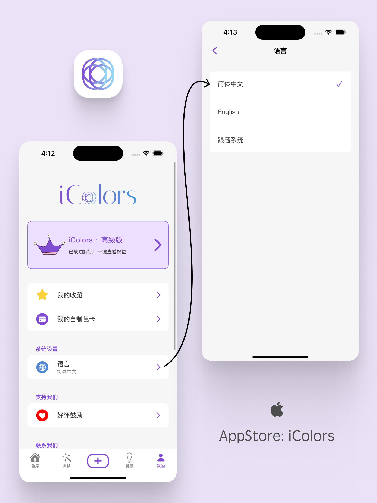

要实现这样一个语言选择逻辑，我们要来自定义一下支持的语言。就 iColors App 来说，目前就需要支持三种语言，中文 + 英文，以及使用系统默认的语言。那么通过枚举类型，进行类似于下面的定义即可：

> 为了方便读者理解，这里罗列的仅是摘要的简单版本。想要详细使用的话，可以参考：[LanguageManager-SwiftUI - Github](https://github.com/Abedalkareem/LanguageManager-SwiftUI) 中的代码

```swift
public enum Languages: String {
    case en
    case zhHans = "zh-Hans"
    case deviceLanguage
}
```

注意，这里 Languages 类型的 rawValue 其实对应的就是前文提到的 Locale 的语言代码。

与此同时，我们需要通过单例，记录当前选择的语言即可：

```swift
public class LanguageSettings: ObservableObject {
  @Published public var selectedLanguage: Languages = .deviceLanguage
}
```

当然我们还需要一个转换逻辑，将我们定义的 Languages 模型和 iOS 的 Locale 模型关联起来。当我们选择 .deviceLanguage 时，直接使用当前默认的 Locale，否则使用我们选择的 language：

```swift
public class LanguageSettings: ObservableObject {
    @Published public var selectedLanguage: Languages = .deviceLanguage
  
    public var locale: Locale {
        if selectedLanguage == .deviceLanguage {
            return Locale.current
        } else {
            return Locale(identifier: selectedLanguage.rawValue)
        }
    }
}
```

这样我们就完成了一个简单的语言选择逻辑系统，我们只需要在 App 初始化时将 LanguageSettings 的单例初始化并通过 environment 进行环境变量的关联，并且将 locale 信息设置给整个 App 即可，这样我们全局的语言就已经设置好了。

```swift
@main
struct XXXApp: App {
	@StateObject var settings = LanguageSettings()
  var body: some Scene {
        WindowGroup {
            ContentView()
                .environment(\.locale, settings.locale)
                .environmentObject(settings)
        }
    }
}
```


## 增加语言选择页面

有了目前的语言管理框架，那么实现一个语言选择页面，就是一个非常简单的逻辑了。我们可以增加一个数组，保存支持的语言：

```swift
public class LanguageSettings: ObservableObject {
  ...
  public let supportedLanguages: [Languages] = [.zh, .en, .deviceLanguage]
}
```

之后，在语言选择页面，展示所有支持的语言，然后在选择后绑定到当前选择的语言 `selectedLanguage` 即可：

```swift
struct MeLanguageSelection: View {
    @EnvironmentObject var languageSettings: LanguageSettings
    
    var body: some View {
        VStack {
            // list all choice
            ForEach(languageSettings.supportedLanguages, id: \.rawValue) { language in
                CustomChoiceView(language)
                    .onTapGesture {
                        // binding
                        languageSettings.selectedLanguage = language
                    }
            }
        }
    }
  
    ...
}
```


# 🔦 App 内语言细节适配

我们做完了前文所说的一切，目前整个 App 应该绝大部分内容都已经适配多语言了。大的框架已经完成，剩余的是一些细节优化与调整，有部分特殊的场景需要额外的进行适配。


## 系统权限文案的适配

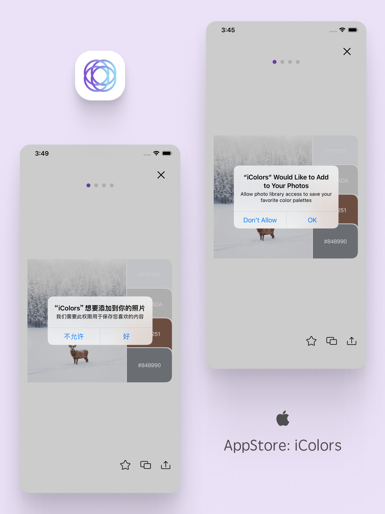

除了 App 本身内容支持多语言之外，类似于这样的权限内容也需要支持多语言。那我们怎么去设置呢？其实原理和 Localizable.strings 的原理是一致的，只不过此时我们需要一个新的文件，叫做 InfoPlist.strings，用来专门为 InfoPlist 中的内容做多语言的适配。

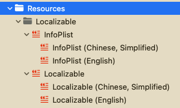

支持简体中文和英文的，完整 Localizable 文件应该如上图所示。接下来我们只需要使用 InfoPlist 中的 key 作为key，Xcode 会自动为我们匹配对应的翻译文案，实现上图所示多语言效果。比如，我们要使用保存图片的权限，这个权限在 InfoPlist 中对应的 key 是 NSPhotoLibraryAddUsageDescription：

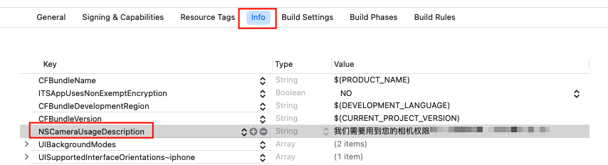

那么我们进行如下的配置，就大功告成了！

```swift
// InfoPlist (Chinese, Simplified)
"NSPhotoLibraryAddUsageDescription" = "我们需要此权限用于保存您喜欢的内容";
// InfoPlist (English)
"NSPhotoLibraryAddUsageDescription" = "Allow photo library access to save your favorite color palettes";
```


## 小组件文案适配

除了主 App 本身的文案，还有一部分是小组件中使用的文案。适配这部分的文案非常简单，不需要做额外的处理，把翻译文案同样放到 Localizable.strings 中即可。

不过这里涉及到一个新的问题，就是如何将主 App 中的语言选择，同步到 Widget 小组件中？我选用的是通过 AppGroupUserDefaults 的方案。相信之前实现了小组件功能的情况下，大概率已经实现通过 AppGroup 进行数据互通了，这里我就不再赘述具体的实现方法。

需要注意的是，我们如果在 App 中选择了新语言，更改了语言环境之后需要通知小组件进行刷新：

```swift
WidgetCenter.shared.reloadTimelines(ofKind: "CodeModulesWidget")
```


## 自动换算时间信息

当我使用脚本检查未翻译的内容时，发现漏网之鱼：在 iColors App 中，有部分场景使用到了时间信息，包括月份和星期，如下图所示。

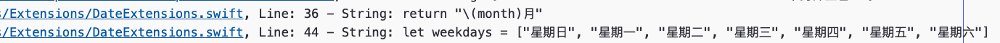

这部分内容如果要按照之前的方法，在 Localizable.strings 中实现对应的翻译也是不难的，不过稍显繁琐。那么有没有更好的办法呢？

其实 Locale 本身内置了根据多语言，返回对应日期的方法，我们这里以月份为例，用这样的方式可以获取到当前月份的正确表达。

```swift
func currentMonth(for locale: Locale) -> String {
    let calendar = Calendar.current
    let month = calendar.component(.month, from: self)

    let dateFormatter = DateFormatter()
    dateFormatter.locale = locale

    if let monthSymbols = dateFormatter.standaloneMonthSymbols {
        let monthSymbol = monthSymbols[month - 1]
        return monthSymbol
    } else {
        return ""
    }
}
```


# 🥳 结语

到这里，本篇终于完结了。一方面完成如此大工程的一个项目，我也想尽量将我的成果记录下来；另一方面，也希望这些内容能对读者有所帮助。

感谢大家的阅读，如果有任何问题，可以给我留言，我会尽量解答。

