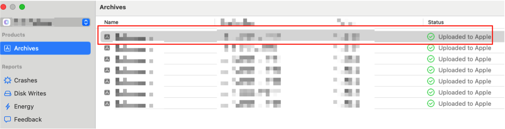
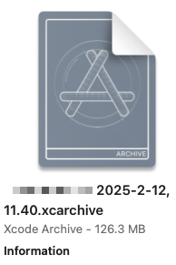
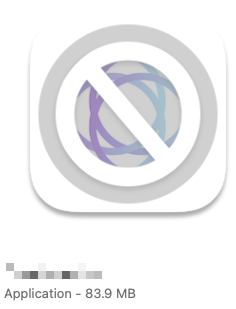
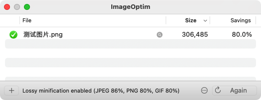
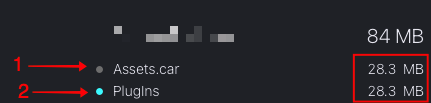
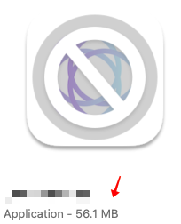
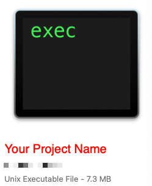

# Practical Guide to Reducing the Size of an Independent App's Package

## Background

As my independent app becomes more feature-rich and comprehensive, the issue of package size has become increasingly significant. The installation package was approaching 100MB, which, while still acceptable, felt a bit bloated for an independent app.

Moreover, from my previous experience working at a company, I learned that package size has a much greater impact on download rates than one might expect. Downloading an app from the App Store is often an unstable process, and many users abandon the download when it takes too long.

Thus, it’s time for a systematic optimization of my app’s package size!

Most articles on package size optimization focus on large apps like TikTok and WeChat. These apps have well-established infrastructures, such as storing image assets on cloud servers by default, which is not necessarily applicable to smaller independent apps. Additionally, since these large apps contain massive amounts of code, their optimization strategies primarily revolve around compilation techniques, which are less relevant for smaller apps.

This article aims to provide practical insights into package size optimization from the perspective of an independent app developer.

> My App: [iColors - Color palette muse](https://apps.apple.com/app/id6448422065) 
>
> Follow me on GitHub [RickeyBoy](https://github.com/RickeyBoy)
>
> My Medium: [RickeyBoy](https://medium.com/@rickeyboy0318)

## Step 1: Analyze Package Composition  

After archiving the app in Xcode (`Product → Archive`), locate the `.xcarchive` file in Finder. Rename it to `.zip` and extract its contents:  

Typically, we upload these packages to the App Store or TestFlight for testing or release. To analyze package size, we can inspect these build artifacts.

Right-click the latest archive and select **"Show in Finder"** to locate the source file, which is an `.xcarchive` file. This is an archive format generated by Xcode, used for exporting `.ipa` files for App Store uploads. Essentially, it’s just a folder.

Copy the `.xcarchive` file and rename its extension to `.zip`, then unzip it to access its contents. The extracted folder contains three key components:

- **`dSYMs` folder**: Contains dSYM (Debug Symbol) files for crash log symbolication.
- **`Info.plist`**: Stores archive metadata, including the app version.
- **`Products` folder**: Contains the compiled `.app` file.

Inside the `Products` folder, locate the final `.ipa` file. Right-click and select **"Show Package Contents"** to inspect its internal structure.

To simplify analysis, we use **DaisyDisk**, a third-party tool that sorts files by size. This provides a clear breakdown of the package components.

  

The total package size is approximately **84MB** (some optimizations were already applied before this analysis). The key components are:

- **Assets.car**: Contains image and asset resources.
- **Plugins**: Stores app extensions, such as widgets.
- **Custom `.ttf` fonts**: Embedded typeface files.
- **Executable file**: The compiled binary of the app.

## Step 2: Optimizing `Assets.car`

`Assets.car` is a compiled binary representation of the `Assets.xcassets` directory, primarily containing image resources. Let’s explore optimization strategies.

### 1. Moving Images to the Cloud

For an app like iColors, which focuses on color palettes and image-based inspiration, local image storage quickly becomes unsustainable. Initially, all images were stored in `Assets.xcassets`, but as the number of images grew, it became necessary to transition them to cloud storage and load them via URLs.

I had already implemented this optimization. If you're interested, you can check out my previous guide:
[Basic Configuration for Using Alibaba Cloud OSS in an Independent App](https://github.com/RickeyBoy/Rickey-iOS-Notes/blob/master/Notes/iColorsDevelopment/独立 App 使用阿里云 OSS 的基础配置.md).

### 2. Compressing Image Files

Images should be resized appropriately before compression. For example, in the iColors app, the homepage cover images only occupy half of the screen width:

Using a **1600×800** image for this display is overkill. Resizing it to **800×400** still provides sufficient clarity while reducing the file size to roughly **¼ of the original**.

After resizing, we can apply lossless compression. Tools like **ImageOptim** can easily reduce file sizes by **30% or more**, with some images compressing by up to **80%**.

### 3. Removing Unused Images

Some third-party tools can scan for unused images in the codebase. However, these tools are not always reliable, especially if images are referenced dynamically. For independent apps, manually reviewing assets is a simple and effective approach.

### 4. Additional Recommendations

- **Use WebP format**: iOS 16+ natively supports WebP, which is smaller than PNG/JPEG.
- **Remove unnecessary `@3x/@2x` assets**: If older `@1x` devices are no longer supported, delete their assets.
- **Eliminate unused dynamic colors**: If `Color Sets` in `Assets.xcassets` are not used, remove them.

------

## Step 3: Optimizing `Plugins/XXXExtension.appex`

The `Plugins` folder contains **WidgetKit extensions**. In my case, my widget was simple, yet it consumed a significant amount of space.

Upon investigation, I discovered that the **main app's assets were duplicated in the widget extension**.

Since the widget did not need these assets, I removed them. If certain images are required, they should be placed in the widget’s separate `Assets.xcassets` folder.

After this change, the **package size decreased by 27.8MB**.

------

## Step 4: Optimizing `.ttf` Font Files

Custom fonts, especially Chinese fonts, tend to be large. The best approach is to **avoid embedding them entirely**. Alternatives include:

1. Convincing designers to use system fonts.
2. Using images instead of font files for static text.
3. **Hosting fonts in the cloud and downloading them on demand.**

By offloading font files to Alibaba Cloud OSS, I saved **15MB**.

------

## Step 5: Optimizing the Executable File

The **Unix Executable File** is the main app binary.

To reduce its size:

- **Eliminate redundant code**: Refactor duplicated logic and avoid unnecessary third-party libraries.
- **Optimize widget dependencies**: If a library is used minimally in a widget, extract only the required parts to avoid unnecessary dependencies.
- **Ensure correct CPU architecture settings**: In Xcode’s **Build Settings → Architectures**, ensure only **arm64** is selected.
- **Enable Dead Code Stripping**: Set **"Dead Code Stripping"** to **YES**.

------

## Conclusion

For independent apps, optimizing package size can yield substantial improvements. Moving images and fonts to the cloud and resolving widget resource duplication were the most impactful optimizations. In my case, these optimizations **halved the package size** with minimal effort.

I hope this guide proves useful! 🚀