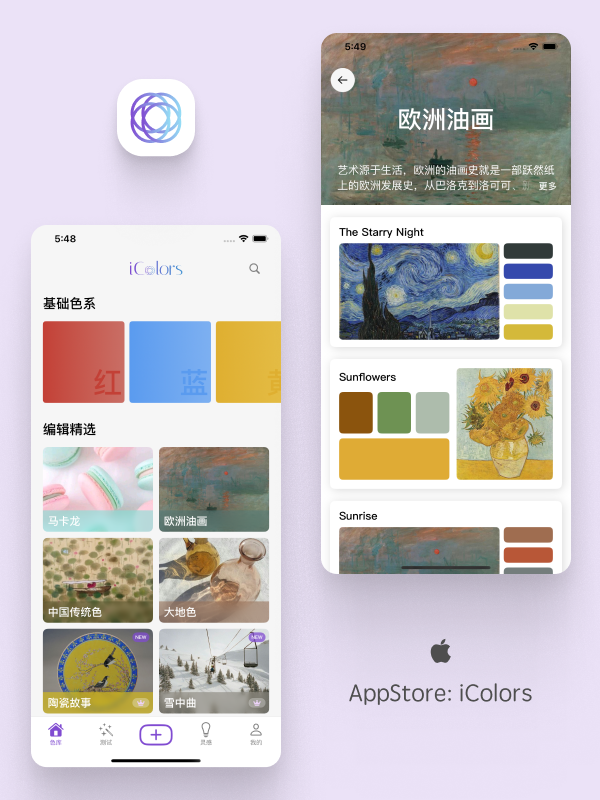
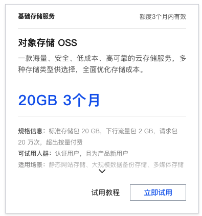
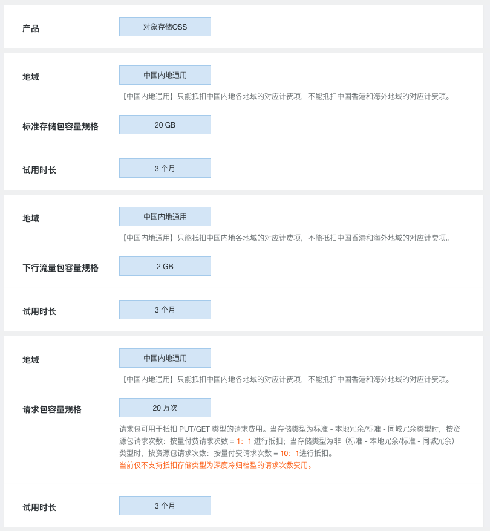
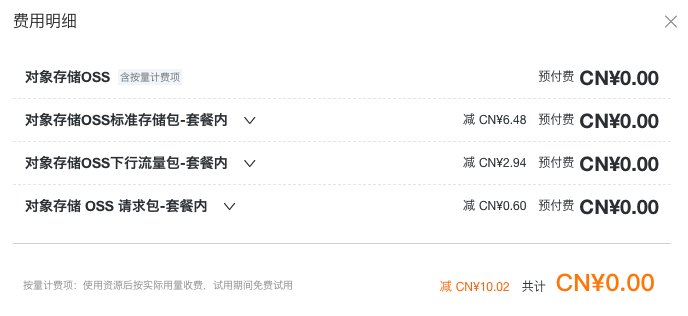
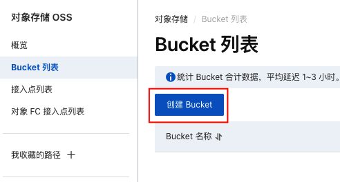
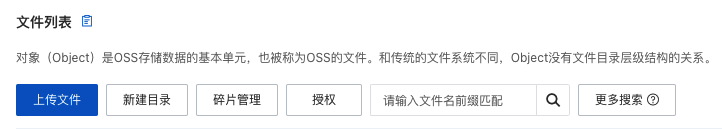
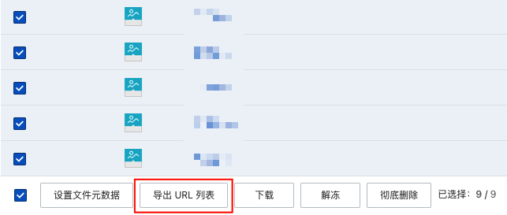
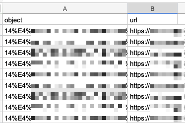
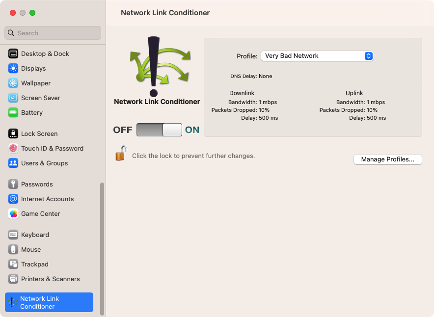

# 独立 App 使用阿里云 OSS 的基础配置

> 关于我：大厂摸鱼 + 业余独立开发，之后会输出深度技术文章 + 独立开发技巧
>
> 我的往期技术文章合集：[RickeyBoy - Gitbub](https://link.juejin.cn/?target=https%3A%2F%2Fgithub.com%2FRickeyBoy%2FRickey-iOS-Notes)
>
> 我的独立开发 App：[iColors - 设计灵感 配色助手](https://link.juejin.cn/?target=https%3A%2F%2Fapps.apple.com%2Fapp%2Fid6448422065)
>
> iColors 详细介绍：[iColors色彩灵感App: 精选配色，图片取色，还有免费四季型人测试！ ](https://www.douban.com/group/topic/302111433/)


## 🌄 背景

我的 iColors 是一个有大量图片的独立 App，从一开始就面临着如何处理图片存储的问题。预览一下就会发现，全都是图片！



一般来讲，对于中大型的 app，绝大部分图片都是部署在云端，在 App 打开后进行下载的，然后少部分重要图片，或者是首屏就会使用的图片会内置。这样能够达到性能体验、包大小、流量使用三者的平衡。

不过我在开发初期，本着减少开支、轻量级架构、尽快上线的原则，我当时采用了把所有图片全部内置的方案。包大小并不是最佳，不过这样着实非常方便。

现在随着项目迭代，图片越来越多，导致包大小迅速增加，因此不得不开始着手将图片迁移到云上的方案了。对于一个纯粹的客户端开发，最开始对上云这一套东西还是有一些畏惧的，不过实际做了之后发现并没有想象中复杂。


## ☁️ 对象存储服务 OSS

首先介绍一下什么是对象存储服务（Object Storage Service，简称 OSS），它是云服务商提供的一种海量、安全、低成本、高可靠的云存储服务，适用于存储任意类型的文件，如图片、音频、视频、日志等，并且支持容量和处理能力的弹性扩展。

简单来说，就是将静态存储文件（图片视频等都可以）存储在云上，然后会根据存储量、下载量等指标来进行收费。

对于中小开发者来说，这是一个非常方便的云服务。OSS 有许多优点，比如基于分布式架构，保证了高可靠性；针对不同区域也能方便的使用 CDN 服务；更不用说还有一些容灾、数据安全相关的服务。如果你要是自己搭建服务器，实现这些就得费劲了。

国内的云服务商们都提供了 OSS 服务，我理解差异性应该不大，我就随缘选择了阿里云 OSS 服务，下面来介绍一下具体的配置过程。


## ☁️ 阿里云 OSS 配置

#### 1. OSS 购买

首先，我们去去阿里云官网，找到【对象存储 OSS】这一项，新用户是有 20GB + 3 个月的免费额度的，我们不要犹豫直接试用就行。



点开详情可以看到具体的参数。需要注意的是这里的免费只针对中国内地，也就是说如果你是一个面向全球的 app（比如我）那么就还是不能完全免费…当然，至少国内免费了总比没有好。



接下来，我们能看到费用明细。这里其实可以看到，之后的计费方式是按量计费的，这里主要分为三部分：

- 标准存储：和你存储在 OSS 上的内容多少有关
- 下行流量：用户从 OSS 进行下载消耗的流量。相对应的上行流量，指的是用户向 OSS 云端上传的流量，在阿里云这部分是不收费的。
- 请求：PUT/GET 请求的数量，请求数也是有限制的，比如这里的免费额度是 20 万次，对于小 App 来说是完全够用了。

至于具体免费之后收费情况，这就很复杂了，包括直接从 OSS 下载和通过 CDN 下载的费用也不一样，这里就先暂时不深究了。



#### 2. OSS 上传文件

首先我们需要创建一个 Bucket，直译过来是“水桶”的意思，反正就是一个大的文件夹，用来存储的一个容器，不同 Bucket 之间是相互隔离的。



在配置的时候，有几个选项，我们这里选择公共读。这几个概念应该很好理解，如果选择私有的话需要获取权限才能进行访问，安全性更高不过实现起来也更麻烦。


配置好了之后，我们就可以开始上传文件了。

> 需要注意的是，我这里演示的是最简单的手动上传和手动获取图片 url 的方法，如果你是有后台系统的话，那就是另外一种方案了

我们点击进文件列表，直接开始上传文件就行了，真的很好理解。



我这里上传了一些图片，上传完之后，选中目标文件，点击到处 URL 列表，就可以了。



这样，我们就获得了一系列的链接，分别对应上传的图片文件名，和对应的 url 链接。注意是可以直接默认支持 https 链接的。




## 📱 App 模型优化

接下来就是在 App 中使用对应的 url 了，如果你和我一样是个客户端开发同学，那这部分就非常简单了。

首先，不论通过后台下发，还是直接写死在 app 里，我们都能很方便的获取到图片的 url。

然后，选择你心仪的第三方库，直接使用就行了。比如我选用的是 Kingfisher，在 SwiftUI 中使用：

```
KFImage(url)
    .placeholder(placeholderImage)
```


## ⚙️ 弱网测试

好了，接下来就是进行测试了。功能性的测试很简单，直接看图片能否展示就可以了。

这里提供一个小技巧，就是在测试图片加载态的时候，需要提供弱网环境。可以参考 [Medium - simulate poor network](https://medium.com/macoclock/how-to-simulate-poor-network-conditions-on-ios-simulator-and-iphone-faf35f0da1b5)：如果你是在模拟器上 Monitor，那么安装 Network Link Conditioner 就可以了。需要开启的话就在设置页中打开即可




## 🥳 结语

好的，目前最简单的、核心的 OSS 配置流程就已经讲完了，配置好之后也是可以使用了。不过 OSS 提供的能力非常丰富强大，我后续肯定还会继续完善和使用~