# 独立 App 包大小优化

## 背景

随着我的独立 app 内容和功能越来越完善和丰富，包大小的问题也越来越严重了。安装包直逼 100MB，虽说还处于可以接受的范围内，但是对于一个独立 app 而言还是略微臃肿了一点。

另外之前在公司工作时也了解到，包大小其实对下载量的影响其实比想象中大很多的。App Store 中下载其实是一个极其不稳定的过程，很多人就是卡在了 app 半天没下载下来的这一步。

因此，是时候系统性优化一下 App 包大小了！！

现在网上很多关于包大小优化的文章和经验，主要针对的是抖音微信之类的大型 app：一方面这些 app 在基础设施方面已经非常完善了，比如将图片资源存放在云端服务器等操作根本就是默认的，和个人小 app 的情况不同。另一方面，这些大 app 因为代码量级非常庞大，所以他们的优化经验主要集中在编译优化等方面，其实对代码不多的小 app 来讲可参考性并不高。

因此，本文也旨在以一个小型独立 app 开发者的视角，通过实战来讲解如何对独立 app 进行包大小优化。

>我的独立开发 App：[iColors - 设计灵感 配色助手](https://apps.apple.com/app/id6448422065)
>
>iColors 详细介绍：[iColors色彩灵感App: 精选配色，图片取色，还有免费四季型人测试！](https://www.douban.com/group/topic/302111433/)
>
>另外，欢迎大家关注我的 Github [RickeyBoy](https://github.com/RickeyBoy) 和 小红书 [Rickey的独立开发日记](https://www.xiaohongshu.com/user/profile/5c0f9a76000000000503955d)

## 第一步：包成分分析

当我们每次使用 Xcode 的 Product --> Archive 打包完成之后，在面板中我们会得到这样一些打包产物，也就是上传包：

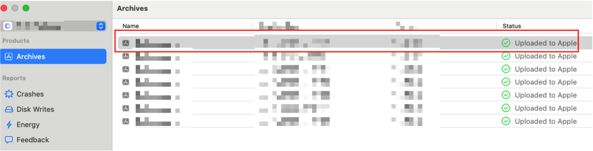

通常而言，我们会将这些包上传到 App Store 或者 Testflight，进行测试或者上架。现在我们想要进行包大小分析的话，就可以直接去获取这种打包好的产物。

右键，选中最新的产物，然后选择 "Show in Finder"，找到源文件。可以看到，是一个 `.xcarchive` 文件。`.xcarchive` 是 Xcode 生成的归档文件，通常用于导出 `.ipa` 进行 App Store 上传，其本质其实就是一个文件夹。

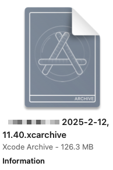

我们将其复制出来，然后将其的后缀直接从 `.xcarchive` 改为 `.zip` 就能直接获取到其中的具体内容了。解压后的内容一共有三部分：

- `dSYMs` 文件夹里面存放的是 dSYM (Debug Symbol) 文件，包含了符号表，用于解析崩溃日志。

- `Info.plist` 主要存储归档数据，包括 App 版本号等等

- `Products` 文件夹：这里存放了打包后的应用 `.app` 文件

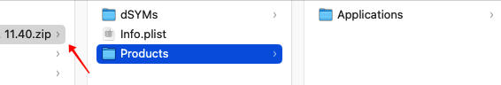

我们直接从 Products 中找到最终的 ipa 文件，然后右键展示包内容 "Show Package Contents" 即可看到具体的内容！

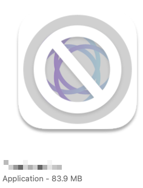

为了方便分析，我们使用第三方工具 DaisyDisk（本质上是一个梳理文件夹中文件内容的工具），将包的内容按照文件大小进行梳理排序，就可以得到具体的包成分分析！

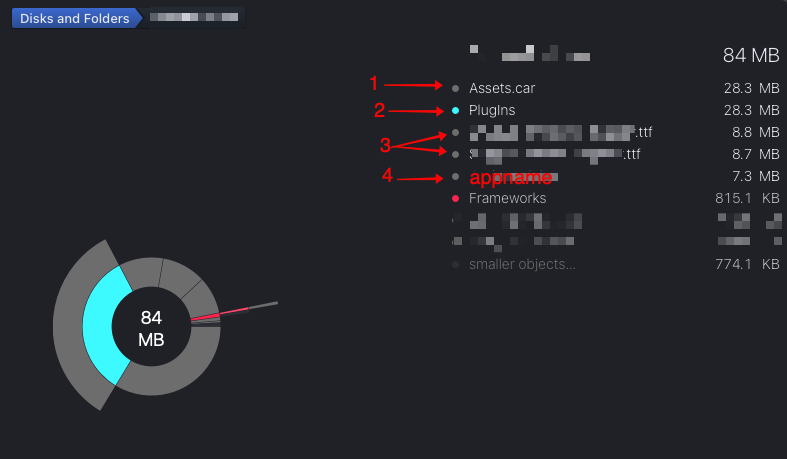

可以看到，总共的包大小在 84MB 左右（截图前已经进行了一部分优化），剩下总共有 4 个部分

- Assets.car：资源文件
- Plugins：小组件拓展
- xxx.ttf 文件：自定义字体文件
- appname（实际上是 Unix Executable File）：app 编译产生的可执行文件

## 第二步：优化 Assets.car 文件

`Assets.car` 实际上就是  `Assets.xcassets` 目录被编译后的二进制格式，里面包含了各种资源，主要以图片为主。接下来我们来尝试优化。

### 1 本地图片上云

大量图片其实是必不可少的，尤其是我的独立 app 是以图片配色分享类为主要功能，必不可少的会需要很多图片资源。前期我是将图片直接存放在 Assets 中，后期随着图片增多，必然有很多需要上云，从本地加载改为使用 url 链接加载。

这一步优化我之前已经做过，可以参考我之前的文章：[独立 App 使用阿里云 OSS 的基础配置](https://github.com/RickeyBoy/Rickey-iOS-Notes/blob/master/Notes/iColorsDevelopment/独立%20App%20使用阿里云%20OSS%20的基础配置.md)

### 2 压缩图片体积

现在其实有很多无损压缩图片体积的方法，但首先第一步，对于每一个图片我们需要对原图片进行一定的调整。比如下图中，在 iColors 中首页列表的封面图，只占半屏的宽度。

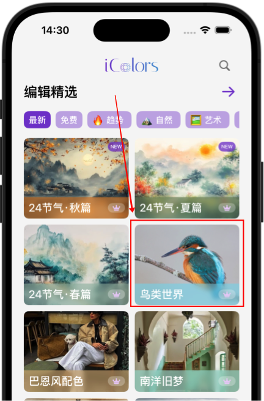

如果是一个 1600\*800 的图片，明显就有点大材小用了，所以我们可以把图片缩小为 800\*400，清晰度也是足够的。这样调整过后，大小直接能变为原来的约 1/4！

另外，在调整到合理尺寸之后，我们可以利用图片压缩工具进行进一步压缩。比如使用 ImageOptim 这个工具，就能轻松压缩，绝大多数情况至少能压缩个 30% 以上，部分情况 80% 都是有可能的：

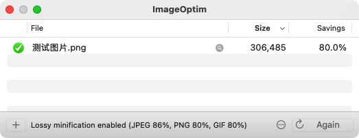

这一步之前我是已经做过一些优化处理，对于图片比较多的情况，轻松优化 20+ MB 也是很有可能的。

### 3 移除未使用的图片

这一点很好理解，有一些第三方工具可以通过代码扫描来检测未使用的图片。但是我试用之后发现，检测并不完全精准，因为有一些图片是需要进行一定运算，或者根据动态图片名来匹配使用的，这些边界情况通常没有办法被完全考虑到。

因此，对于独立 app 可以手动检查一遍即可。

### 4 一些其他的建议

还有一些我没有用到，但是实际上很有用的方向，我罗列在这里，大家可以参考一下：

- **使用 WebP 格式**：iOS 16+ 原生支持 `WebP`，比 PNG/JPEG 更小。

- **去掉不必要的 3x/2x 资源**：如果 1x 设备不再支持，可以只保留 `@2x` 和 `@3x`。

- **避免动态颜色占用空间**：如果 `Assets.xcassets` 里有动态颜色（`Dark Mode` 适配的 `Color Set`），但 App 实际没有用到，可以删除这些颜色

## 第三步：优化 Plugins/XXXExtension.appex

`Plugins` 文件夹中有一个 `.appex` 文件，这个文件是**小组件（Widget）扩展**。在 SwiftUI 项目中，如果有**小组件（WidgetKit）**，Xcode 会自动创建一个 App Extension，它会被打包到 `Plugins/XXXWidgetExtension.appex` 里面。

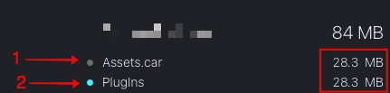

也就是说这里 `Plugins` 主要是 App Widget 组件所占用的空间。当我最先看到这部分我有点震惊，因为我的 Widget 其实功能非常简单，几乎没有什么复杂代码，也没有什么资源，为什么会这么占据空间？

于此同时，我发现 `Plugins` 文件夹大小和 `Assets.car` 大小一模一样，因此我开始猜测是不是主工程里的资源文件被直接打包进了 Widget 之中。

当我仔细检查主工程的 Assets 文件，果然发现他也被引入了 Widget 之中：

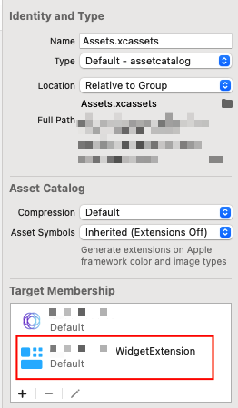

因为我的 Widget 中其实没有用到其中任何的图片资源，因此果断直接删除！试验了一下，完全正常运行。如果有部分图片资源，是也需要在 Widget 中使用的，那么 Widget 其实有自己的 Assets 文件夹，将需要使用的资源复制一份过去即可。

于是，重新打包后发现，就这么水灵灵地省下了 **27.8MB**（我为什么没有早点发现这个…）：

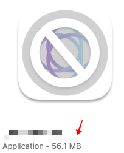

## 第四步：优化 .ttf 文件

显而易见，这是字体文件，同时由于是中文字体包，所以每个中文字体的大小也比普通英文字体包要更大！当然最好的办法是不引入这样的字体包，那么一共就两种办法：

1. 说服自己/设计师，不需要这个字体……不过这其实是一种权宜之计，毕竟是降低产品质量的一种做法，于此同时其实已经尽量在控制不要使用过多的字体种类了，少量的字体其实也难免必要。
2. 不使用字体文件，在少数需要文字的地方用图片代替。当所用字体范围不大、文字内容固定时，可以采取这样的方法，不过显然绝大多数时候都不适用。

那么只剩一种方法了，就是上云存储，我们将其存储在阿里云 oss 上，在 app 启动后空闲时进行下载即可。方法和本地图片上云是类似的，这里就不再赘述了。

最终将这两个 ttf 字体文件放在云端后，又是 15+ MB 的节省。

## 第五步：优化 Unix Executable File 可执行文件

Unix Executable File（可执行文件）就是主程序二进制文件，是由项目编译而成。

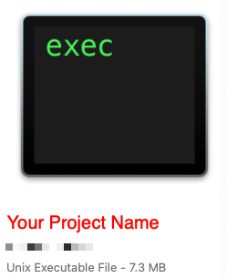

通常也会占体积的较大一部分。通常它的大小和代码数量、代码复杂度直接相关，但是与此同时也与编译方式、项目架构方式等有一定关系。

不过一般来说，独立 app 不像大型 app，代码本身量级有限，费劲折腾编译级别的优化属实有点没必要。因此我们只关注一些代码层面的有效优化即可。

### 1 重复代码优化

很多时候我们在开发过程中，为了图方便就直接将部分代码，甚至部分库直接复制一下，然后略作修改。而没有做适当的提取和融合，导致有很多重复的代码，这部分其实需要开发人员自己去优化。

尤其是一些不规范的开发行为，会将一些第三方库代码中的代码直接拷贝过来使用，这里通常会引入非常多的无用代码！

### 2 针对 Widget 进行代码层面优化

在前面图片资源优化的过程中，我们已经知道了，Widget 的包大小是单独计算的，也就意味着如果一份代码是主 app 和 widget 共用，那么这部分代码的体积就会被计算两份。

因此，如果有一些复杂的库（比如网络库等），在 Widget 上只被用了很少一部分，那么最好将这部分复制到 Widget 中单独使用，然后去掉 Widget 对网络库的依赖，从而减少包大小。

### 一些其他建议

- **检查打包时 CPU 架构选项设置**：现在通常来讲，我们只需要打包支持 arm64 架构的包即可，一般其他架构是用于适配旧的机型或者模拟器使用的，我们在打包时需要避免误选。正常情况 Xcode 中的打包选项就已经是最佳配置了，不过我们还是可以顺带检查一下：确保 **Xcode → Build Settings → Architectures** 选择的是 **Standard Architectures (arm64)**

- **移除未使用的代码**：这个也是系统默认配置好了的，在确保 **Build Settings** 中 **Dead Code Stripping**，设为 YES

## 总结

对于一个小型独立 app 来讲，包大小的优化的空间其实是很大的。通常来讲，将图片字体资源放到云端，以及处理 Widget 资源共享问题，这两点就已经能有非常明显的效果了。从我自己的优化经历而言，整体将包大小降低了一半以上，难度不大、效果很好。

希望这篇文章能对你有所帮助！