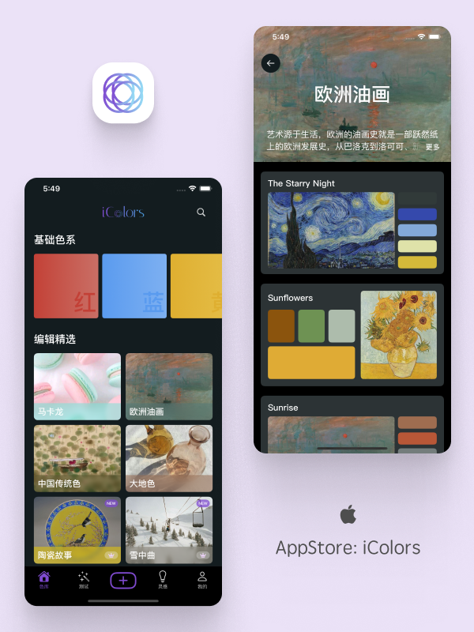
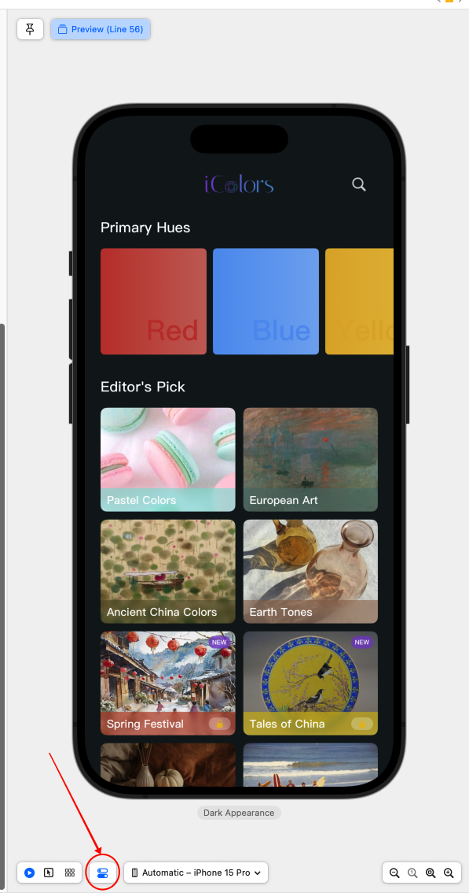
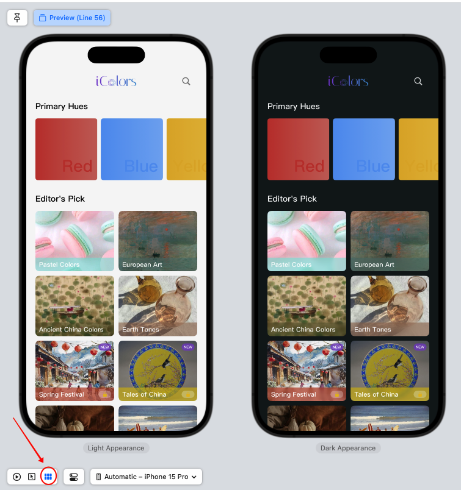
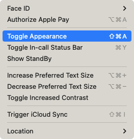
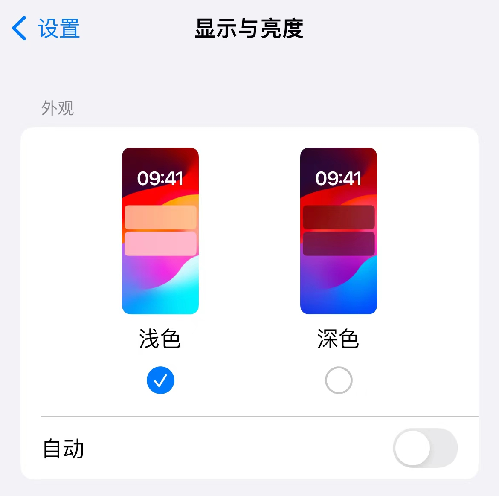
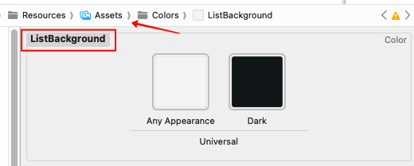
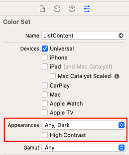
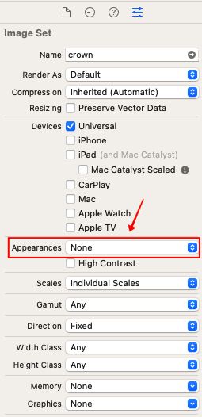
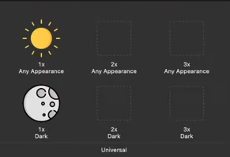
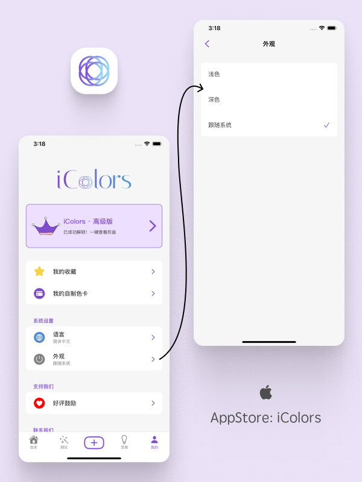

# 独立 App 适配深色模式

> 关于我：大厂摸鱼 + 业余独立开发，之后会输出深度技术文章 + 独立开发技巧
>
> 我的往期技术文章合集：[RickeyBoy - Gitbub](https://link.juejin.cn/?target=https%3A%2F%2Fgithub.com%2FRickeyBoy%2FRickey-iOS-Notes)
>
> 我的独立开发 App：[iColors - 设计灵感 配色助手](https://link.juejin.cn/?target=https%3A%2F%2Fapps.apple.com%2Fapp%2Fid6448422065)
>
> iColors 详细介绍：[iColors色彩灵感App: 精选配色，图片取色，还有免费四季型人测试！ ](https://www.douban.com/group/topic/302111433/)


独立 app 适配深色模式是一个事半功倍的事情，本文我将以我自己的独立 app：「iColors」 为例，详细讲解适配深色模式的各个步骤。

适配深色模式并不困难，按照文章的步骤来绝对没有问题！感兴趣 or 觉得有用的朋友可以点赞收藏。要是觉得非常有用，可以去 App Store 下载一下我的 App，点个五星好评哈哈！

实际效果图示：

| 浅色模式                                 | 深色模式                                 |
| ---------------------------------------- | ---------------------------------------- |
|  |  |


# 🤔 为什么适配深色模式

深色模式推出以来，基本上所有的 App 都需要考虑深色模式的适配问题了。

在不做适配的情况下，深色模式几乎就是无法正常使用的，会有各种 UI 展示问题，而目前深色模式用户量其实不小，比如 iColors 第一个版本上线是没有适配深色模式的，结果第一天就遇到来自深色模式用户的抱怨哈哈。

因此，为了避免因为没有适配深色模式而直接损失用户，甚至招致差评，所以最好还是适配一下深色模式，哪怕第一版没有那么精细也没有关系。


# 📱 第零步：学会如何调试深色模式

在一切开始之前，先要学会如何测试深色模式，这样才能比较方便地进行调试和适配。

### 在 Canvas 中调试

最直接的方式就是通过下面这个按钮，选择让 Preview 呈现 Dark Mode：



但是实际上还有一个大招，Canvas 已经为我们提供了适配深色模式更巧妙的办法：


选出来之后可以直接看到对比图，效果如下，是不是非常方便。这也是我目前最常使用的调试方便，充分利用 SwiftUI 的特性，边写边看实际效果。



### 在模拟器中调试

只需要在模拟器的导航栏中选择 Features，在下拉菜单中选择 Toggle Appearance 即可方便的切换



### 在真机中调试

在设置中切换就可以了，这个相信大家都很熟悉。只不过真机每次切换的流程及速度没有模拟器和 Preview 中那么快那么方便，因此我一般在适配深色模式时，不会使用真机进行调试。




# 🎨 第一步：颜色适配深色模式

### 配置颜色

首先我们需要做的是对颜色进行适配。简单来讲比如浅色模式下背景使用白色，深色模式下背景使用黑色；浅色模式下标题使用黑色，深色模式下标题使用白色等。

逻辑很容易理解，那么如何实现呢？方法有不少，我目前觉得最合理的方法是在 Assets 中直接添加 Color Set。具体步骤如下：

1. 选中 Assets，点击 "+" 或者右键空白处，可以添加 Color Set
2. 系统会默认创建一个颜色，可以修改其名字
3. 根据你的需要，修改 Any Appearance & Dark 的颜色，分别代表浅色模式和深色模式会使用的颜色



比如上图这是我所设置的一个叫做 ListBackground 的颜色，主要用于列表背景色。浅色模式时，列表会使用接近于白色的底色，而深色模式时会使用接近黑色的背景。

### Appearances 的三个模式

需要注意的是，这里默认的两个颜色分别叫做 Any Appearance 和 Dark。为什么不是 Light 和 Dark？因为其实除了 Light 和 Dark，其实还有一种情况，就是还有某些不支持深色模式的设备！



我们打开 Inspectors 看板，在里面找到 Appearances，就能发现玄机，其实他一共有三个模式：

- None：只有一个颜色选项，不论什么情况下都用这个颜色
- Any, Dark：两个颜色选项，Dark 代表深色模式下的颜色，Any 代表其他情况
- Any, Light, Dark：三个颜色选项，Light 和 Dark 分别代表浅色模式和深色模式，Any 代表剩下的情况，也就是不支持深色模式的设备上采用的颜色！

### 使用颜色

为了方便的在 App 中使用预定义的、支持深色模式的 Color Set，我们只需要为 Color 新增一个拓展即可：

```swiftui
extension Color {
  static let ListBackground = Color("ListBackground")
}
```

这样我们就可以使用定义的背景颜色 ListBackground，像下面这样：

```swiftui
SomeView()
	.background(Color.ListBackground)
```


## 🌄 第二步：图片适配深色模式

和 Color Set 类似，图片也可以通过这样的方式适配深色模式。

1. 选中 Assets，点击 "+" 或者右键空白处，可以添加 Image Set
2. 系统会默认创建一个图片，我们可以修改其名字
3. 默认图片是只有一种样式，我们需要打开 Inspectors 看板，在里面找到 Appearances，将其修改为 "Any, Dark"



这样，我们就获得了 6 个格子，支持上传两张图片了。根据提示，放入对应的图片即可。比如下面 Any 中放入太阳图案，在浅色模式下会显示；Dark 中放入月球图案，在深色模式下会显示：



在代码中使用时无需考虑深浅色状态，直接像普通图片一样直接使用就行了，非常简单：

```swiftui
Image("name")
```


## ⚙️ 第三步：深色模式选择页面

在 iColors 中，我为 App 内部的深浅模式选择设置了一个单独的页面，用户可以手动选择外观是浅色还是深色，亦或是跟随系统。具体的表现如下图所示：



当然，这一步并不是必须的。如果本着独立 App 一切从简的思路来说，不要这个设置页面也没问题，相当于是默认给用户一种选择——跟随系统。系统选择什么外观，App 内获取到，直接使用就行了。

不过我觉得增加一个设置页面更为方便和灵活，开发成本也不大，因此我最终还是做了这么一个页面。

具体要如何实现呢？首先我们需要定义一个枚举类型，代表集中不同的外观情况：

```swiftui
enum SchemeType: Int, Identifiable, CaseIterable {
    var id: Self { self }
    case light
    case dark
    case system
  
    /// 获取系统对应的 ColorScheme，用于设置
    var SystemColorScheme: ColorScheme? {
        switch self {
        case .light:
            return .light
        case .dark:
            return .dark
        case .system:
            // 返回 nil 代表不做单独处理
            return nil
        }
    }
}
```

我们需要通过 SystemColorScheme，来实现系统的外观类型，和我们自定义的枚举类型是可以一一对应上的。也就是说现在 SchemeType 是我们自定义的类型，而 ColorScheme 是系统的类型。

SchemeType.system 代表"跟随系统"，而 ColorScheme == nil 代表没有对外观进行额外的设置，即不做处理。

有了 SchemeType 的类型，下一步我们就可以方便地写一个选择页面了：

```swiftui
body {
  ...
  ForEach(SchemeType.allCases) { item in
      SelectionView(...)
  }
}
```


## 🕹️ 第四步：全局管理

到现在基本上就是万事俱备只欠东风了，剩下需要做的就是增加全局的环境变量，用作统一管理。我们按照下面的方式定义一个 ObservableObject 即可：

```swiftui
final class ColorSchemeState : ObservableObject {
    @AppStorage("systemColorSchemeValue") private var currentSchemeValue: Int = SchemeType.system.rawValue
    
    /// App's Selected Color Scheme
    var currentScheme: SchemeType {
        get {
            return SchemeType(rawValue: currentSchemeValue) ?? .system
        }
        set {
            currentSchemeValue = newValue.rawValue
        }
    }
}
```

这里来稍微解释一下 ColorSchemeState：

1. 首先我们通过 @AppStorage 声明了一个变量 currentSchemeValue 来记录外观颜色主题的选择，同时在 UserDefaults 中同步存储，可以记录用户的选择。
2. currentScheme 是公开的计算属性，提供给外部来获取当前的外观主题
3. 由于 ColorSchemeState 是一个 ObservableObject，当颜色方案改变时，相关的 UI 可以自动更新

接下来，我们只需要在 App 初始化时做两件事即可：

1. 将 colorSchemeState 作为全局环境变量设置进去
2. 通过 preferredColorScheme 设置默认外观颜色主题

```swiftui
@main
struct XXXApp: App {
  // ... 省略部分内容
  @StateObject var colorSchemeState = ColorSchemeState()
  
  WindowGroup {
    MainView()
    // ... 省略部分内容
    	.preferredColorScheme(colorSchemeState.currentScheme.SystemColorScheme)
    	.environmentObject(colorSchemeState)
  }
}
```

如果我们想要在某个具体的页面获取颜色主题信息，甚至于改变外观的选择，通过这样的方式就行了：

```swiftui
@EnvironmentObject var colorSchemeState: ColorSchemeState
colorSchemeState.currentScheme = ...
```

这样，我们整体的全局管理框架就已经搭建完成了！！

