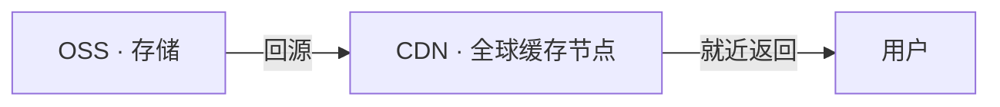
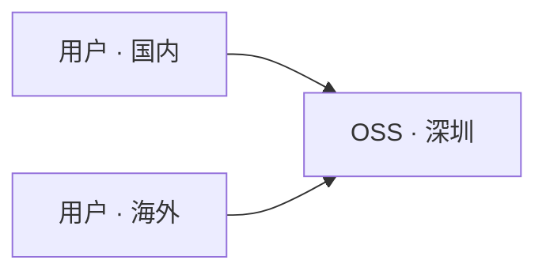
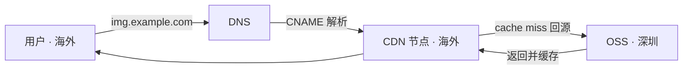
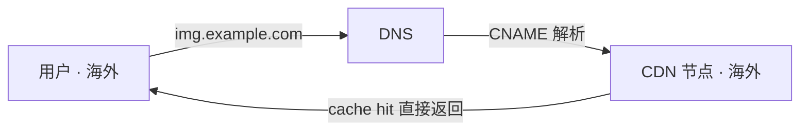

# 独立 App 配置阿里云 CDN 记录

独立 App 图片加速：从 OSS 直连到 CDN 的迁移记录。

## ⚠️ 背景：为什么要做这件事

我的独立 App 里有大量色组图片，存储在阿里云 OSS（深圳节点）。之前图片 URL 是这样的：

```
https://your-bucket.oss-cn-shenzhen.aliyuncs.com/color-group/example-image.jpg
```

一直没出什么问题，但最近发现了一个规律：**国内用户加载图片很流畅，但国外用户明显慢很多**。

原因其实很简单——所有用户，不管在哪里，都要跑去深圳的 OSS 拿图片。国内用户到深圳延迟低，自然快；国外用户跨洋传输，当然慢。

所以这次做了一件事：**给图片加上 CDN 加速**。

---

## 📚 相关概念

### OSS 是什么

OSS（Object Storage Service，对象存储服务）是阿里云提供的云存储服务，可以理解为一个"云端硬盘"——你把文件（图片、视频、文档等）上传上去，它给你一个 URL，任何人通过这个 URL 就能下载或查看文件。

和传统服务器上的文件存储相比，OSS 的优势在于：

- **容量无限**：不需要提前规划磁盘大小，用多少算多少
- **高可靠**：数据自动多副本存储，不用担心硬盘坏了丢数据
- **按量计费**：存储费用和请求次数都是用多少付多少

我的大量图片就存在阿里云 OSS 的深圳节点上。每张图片有一个类似这样的访问地址：

`https://your-bucket.oss-cn-shenzhen.aliyuncs.com/color-group/example-image.jpg`

其中 `your-bucket` 是存储桶名称，`oss-cn-shenzhen` 表示深圳节点。

> 如何配置阿里云 OSS 可以参考：[独立 App 使用阿里云 OSS 的基础配置](https://github.com/RickeyBoy/Rickey-iOS-Notes/blob/master/Notes/iColorsDevelopment/%E7%8B%AC%E7%AB%8B%20App%20%E4%BD%BF%E7%94%A8%E9%98%BF%E9%87%8C%E4%BA%91%20OSS%20%E7%9A%84%E5%9F%BA%E7%A1%80%E9%85%8D%E7%BD%AE.md)

### CDN 是什么

CDN（Content Delivery Network，内容分发网络）是一个分布在全球各地的缓存节点网络。核心思路是：

> 把内容缓存到离用户最近的节点，让用户从"最近的服务器"拿数据，而不是每次都跑去源站。

加了 CDN 之后的访问路径变成这样：

```
用户（UK）→ CDN 节点（英国）→ 命中缓存，直接返回
                             ↓ 首次未命中（cache miss）
                           OSS（深圳）→ 回源取图 → 缓存到节点
```

第一个访问某张图的用户还是要等回源，但之后同一地区的所有用户都走缓存，速度质的飞跃。**缓存是按文件、按节点存储的，跟设备无关**——A 设备触发缓存后，B 设备访问同一张图也能命中。

### OSS 和 CDN 的关系

OSS 是**存储**，CDN 是**分发**。两者是互补关系：



- OSS 负责保存原始文件，是"唯一真实来源"（source of truth）
- CDN 负责把文件高效地分发给全球用户，OSS 作为 CDN 的**回源站**

这意味着文件只需要存一份，CDN 自动负责缓存和分发。原来的 OSS URL 永远有效，CDN 只是提供了一条更快的访问路径。

### CNAME 是什么

CNAME（Canonical Name）是 DNS 的一种记录类型，作用是**把一个域名指向另一个域名**。

比如这次配置的：

```
img.example.com  →  img.example.com.w.cdngslb.com
```

用户访问 `img.example.com` 时，DNS 会告诉浏览器"去找 `img.example.com.w.cdngslb.com`"，后者是阿里云 CDN 的接入域名，CDN 再根据用户位置选择最近的节点返回内容。整个过程对用户完全透明。

### SSL 证书是什么

HTTPS 需要 SSL 证书来证明"你确实是 `img.example.com` 的拥有者"，同时加密传输内容。

iOS App 默认强制要求 HTTPS（ATS，App Transport Security），所以这一步不能跳过。

证书是跟域名绑定的——之前 OSS 原始域名的证书是阿里云帮你配好的，换了自己的域名之后，证书需要自己申请。

---

## 🔀 请求路径对比

**加 CDN 之前**，所有用户无论在哪里，都直接访问深圳 OSS：



**加 CDN 之后 · 首次访问（cache miss）**，请求经 DNS CNAME 解析到最近节点，节点没有缓存则回源 OSS，取回后缓存到节点：



**加 CDN 之后 · 再次访问（cache hit）**，节点已有缓存，直接返回，不再访问 OSS：



同一地区只有第一次访问某张图时才会回源，之后都命中缓存直接返回。

---

## 📊 实测数据

在 UK 网络下对比同一张图片（约 120 KB）：

| 访问方式 | 耗时 | 说明 |
|---------|------|------|
| OSS 直连（深圳） | 3.74s | 每次都跨洋回源 |
| CDN 首次访问（cache miss） | 2.68s | 需要先回源，但节点在欧洲更近 |
| CDN 命中缓存（cache hit） | **0.14s** | 直接从英国节点返回 |

命中缓存后快了将近 **27 倍**。对 App 用户来说，首次打开色组时可能稍慢（第一个用户触发缓存），之后所有用户都是极速加载。

---

## ⚙️ 配置过程

### 一、申请 SSL 证书（Let's Encrypt）

没有选择购买阿里云的 SSL 证书（免费版只有 90 天，且需要手动续期；付费版自动续期要 270 元/次），而是用 **Let's Encrypt** + **acme.sh**。

**Let's Encrypt** 是由非营利组织 ISRG 运营的免费证书颁发机构（CA），资金来自 Mozilla、Google、Meta 等企业赞助。它的目标是消除 HTTPS 的经济门槛——2015 年上线后，直接推动全网 HTTPS 覆盖率从约 40% 升到 80% 以上。

**acme.sh** 是一个纯 Shell 脚本实现的 ACME 协议客户端，用来自动向 Let's Encrypt 申请和续期证书。支持通过 DNS API 验证域名归属，不需要在服务器上部署 web 服务。

这套方案的优势：

- 完全免费
- 有效期 90 天，acme.sh 会自动添加 cron 任务每天检查并续期
- 全球主流设备均信任

**安装 acme.sh：**

```bash
curl https://get.acme.sh | sh -s email=your@email.com
source ~/.zshrc  # 或重启终端
```

**用阿里云 DNS API 自动完成域名验证并申请证书：**

```bash
export Ali_Key="your_access_key_id"
export Ali_Secret="your_access_key_secret"

acme.sh --issue --dns dns_ali -d img.example.com
```

> acme.sh 在验证域名归属时，会自动调用阿里云 DNS API 临时添加一条 TXT 记录，验证完成后自动删除，全程无需手动操作。

证书文件生成在 `~/.acme.sh/img.example.com_ecc/` 目录下：

```
img.example.com.cer    # 域名证书
img.example.com.key    # 私钥
fullchain.cer          # 完整证书链（上传到 CDN 用这个）
```

### 二、在阿里云 CDN 控制台添加加速域名

> **前提条件**：你需要有一个自己的域名（如 `example.com`）。如果加速区域包含中国大陆，域名必须完成 ICP 备案，否则阿里云 CDN 不允许接入。仅加速海外则不需要备案。（但是都用阿里云了肯定是支持国内对不对...）

进入 **CDN 控制台 → 域名管理 → 添加域名**，配置如下：

| 配置项 | 值 |
|--------|-----|
| 加速域名 | `img.example.com` |
| 源站类型 | OSS 域名 |
| 源站地址 | `your-bucket.oss-cn-shenzhen.aliyuncs.com` |
| 加速区域 | 全球 |
| 业务类型 | 图片小文件 |

添加完成后，在 **HTTPS 配置** 里上传刚才申请的证书（`fullchain.cer` 和 `.key` 文件内容）。

另外配置了**月流量封顶（100 GB）**，防止被恶意刷量导致费用失控。

### 三、配置 DNS CNAME

CDN 控制台会生成一个 CNAME 接入地址，格式类似：

```
img.example.com.w.cdngslb.com
```

在阿里云云解析 DNS 添加一条记录：

| 主机记录 | 类型 | 记录值 |
|---------|------|--------|
| img | CNAME | img.example.com.w.cdngslb.com |

DNS 记录生效通常需要 10～30 分钟（TTL 决定）。

### 四、验证是否生效

```bash
# 验证 HTTP
curl -I "http://img.example.com/path/to/image.jpg"
# 期望：HTTP/1.1 200 OK

# 验证 HTTPS
curl -I "https://img.example.com/path/to/image.jpg"
# 期望：HTTP/1.1 200 OK

# 验证缓存命中（连续跑两次，第二次应该出现 X-Cache: HIT）
curl -o /dev/null -s -w "time: %{time_total}s\n" "https://img.example.com/path/to/image.jpg"
```

响应头里的 `X-Cache: HIT TCP_MEM_HIT` 说明命中了 CDN 缓存。

### 五、更新代码中的 URL

代码里维护了一份图片 URL 映射表，把所有 URL 的域名部分批量替换成 CDN 域名：

```
// 替换前
https://your-bucket.oss-cn-shenzhen.aliyuncs.com/color-group/image.jpg

// 替换后
https://img.example.com/color-group/image.jpg
```

路径部分完全不变，只是换了域名。用 `sed` 一条命令批量完成，不需要手动逐条修改。

---

## 几个值得注意的点

**旧版本 App 完全不受影响**：OSS 上的文件和原始 URL 永久有效，不会失效。新版本走 CDN，老版本继续走 OSS 直连，两套 URL 并存，互不干扰。

**证书续期**：acme.sh 安装时会自动注册 cron 任务，每天自动检查并续期。唯一需要手动操作的是：续期后把新证书重新上传到阿里云 CDN 控制台（每 90 天一次，5 分钟的事）。

**DNS 免费版够用**：阿里云 DNS 免费版没有海外节点，可能有人担心国外用户的域名解析慢。实际上 DNS 解析只在第一次建立连接时发生，耗时是毫秒级，对图片加载速度的影响可以忽略不计，不需要升级付费版。
